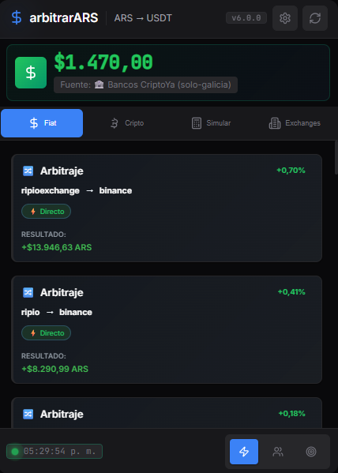
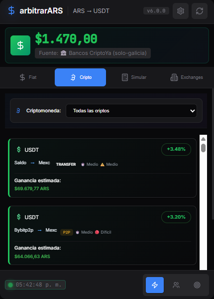
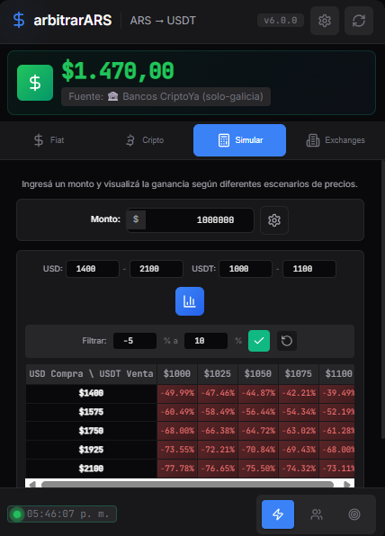
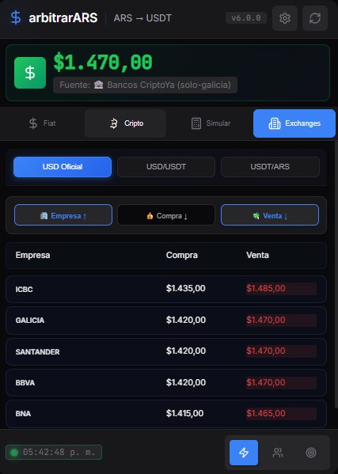

# ArbitrageAR - Detector de Arbitraje Dólar Oficial → USDT 🚀

[](https://github.com/nomdedev/ArbitrageAR-USDT)
[](tests/)
[](LICENSE)

Extensión profesional para navegadores Chromium que detecta oportunidades de arbitraje entre el Dólar Oficial argentino y USDT en exchanges locales e internacionales.

---

## 📸 Capturas de Pantalla

<table>
  <tr>
    <td align="center" width="50%">
      <br/>
      <b>Rutas de Arbitraje</b><br/>
      <sub>Oportunidades en tiempo real con % de ganancia</sub>
    </td>
    <td align="center" width="50%">
      <br/>
      <b>Arbitraje Cripto</b><br/>
      <sub>BTC, ETH, USDC y más entre exchanges</sub>
    </td>
  </tr>
  <tr>
    <td align="center" width="50%">
      <br/>
      <b>Simulador</b><br/>
      <sub>Calcula ganancias con tu monto y fees</sub>
    </td>
    <td align="center" width="50%">
      <br/>
      <b>Exchanges</b><br/>
      <sub>Precios de compra/venta de cada plataforma</sub>
    </td>
  </tr>
</table>

---

## ✨ Características Principales

- 🎯 **Detección Inteligente**: Algoritmos optimizados para identificar oportunidades rentables en tiempo real
- ⚙️ **Configuración Avanzada**: Control total sobre fuentes de datos (automático/manual)
- 🔔 **Notificaciones Inteligentes**: Alertas cada 1 minuto con niveles configurables por umbral
- 📊 **Múltiples Exchanges**: Binance, Buenbit, Lemon Cash, Ripio, Fiwind, LetsBit y más
- 🏦 **Datos Bancarios Precisos**: Integración con BNA, Galicia, Santander, BBVA, ICBC
- 📈 **Simulador Profesional**: Calcula ganancias con fees y comisiones personalizables
- 🔧 **Modo Manual**: Configura tu propio precio del dólar para escenarios específicos
- 🎨 **UI Moderna**: Interfaz oscura profesional con animaciones suaves
- 📱 **Indicador de Conexión**: Estado en tiempo real de la sincronización con APIs
- 🆕 **Indicador de Actualización**: Badge no invasivo que te avisa cuando hay nuevas versiones

## 🆕 Novedades v6.0.0 (2026)

### 🎯 Sistema de Notificaciones Mejorado
- ✅ **Frecuencia de 1 minuto por defecto** - Las notificaciones más rápidas del mercado
- ✅ **Mensajes más amigables** - Notificaciones de Windows con formato legible
- ✅ **Configuración granular** - Control por exchange, umbral y horarios

### 🔔 Indicador de Actualización No Invasivo
- 🟢 **Badge discreto** - Indicador verde pulsante en la versión
- 💬 **Tooltip informativo** - Información al pasar el mouse
- 📥 **Click para descargar** - Acceso directo a la última versión de GitHub
- 📢 **Modal solo para actualizaciones MAJOR** - Sin interrupciones innecesarias

### 📊 Indicador de Estado Simplificado
- 🟢 **Online** - Punto verde con animación cuando todo funciona
- 🟡 **Datos antiguos** - Punto amarillo si los datos tienen >5 min
- 🔴 **Sin conexión** - Punto rojo si hay error de API
- ⏰ **Hora precisa** - Timestamp de última actualización

### ✅ Auditoría Completa 2026
- **Correcciones críticas**: 7 problemas funcionales resueltos
- **Optimización CSS**: Reducción de 43.5% en CSS (6,363 → 3,598 líneas)
- **Sistema de animaciones**: 4 fases implementadas profesionalmente
- **Testing mejorado**: 47 tests con Jest (cobertura ~35%)
- **CI/CD completo**: GitHub Actions para lint, test, build y release
- **Documentación técnica**: API_INTERNA.md y guías completas

### 📊 Métricas de Mejora
| Categoría | Antes | Después | Mejora |
|-----------|-------|---------|--------|
| **Puntuación General** | 5.9/10 | 8.1/10 | +37% |
| **Tests Activos** | 1 | 47 | +4600% |
| **Líneas popup.js** | 4,746 | 4,062 | -14.4% |
| **Líneas popup.css** | 6,374 | 3,598 | -43.5% |
| **Módulos JS** | 2 | 8+ | +300% |
| **Accesibilidad** | 🔴 | 🟢 | Completa |
| **Tooling** | 🔴 | ✅ | Profesional |

---

## 📁 Estructura del Proyecto

```
ArbitrageAR-USDT/
├── diagnostics/           # Scripts de diagnóstico y debugging
├── docs/                  # Documentación completa
│   ├── API_INTERNA.md     # Documentación de la API
│   ├── AUDITORIA_2026_NUEVA.md
│   ├── DEPLOYMENT_GUIDE.md
│   └── *.md
├── icons/                 # Iconos de la extensión
├── screenshots/           # 🆕 Capturas de pantalla
├── scripts/               # Scripts de automatización
├── src/                   # Código fuente principal
│   ├── background/        # Service Worker
│   │   └── main-simple.js
│   ├── modules/           # 🆕 Módulos independientes
│   │   ├── filterManager.js
│   │   ├── notificationManager.js
│   │   ├── routeManager.js
│   │   └── simulator.js
│   ├── ui-components/     # 🆕 Componentes UI
│   ├── DataService.js
│   ├── ValidationService.js
│   ├── options.html/js/css
│   └── popup.html/js/css
└── tests/                 # 🆕 Suite de tests completa
│   ├── utils.js           # Utilidades generales
│   ├── ValidationService.js # Servicio de validación
│   └── utils/             # Utilidades específicas
│       └── bankCalculations.js
├── tests/                 # Suite completa de testing
│   ├── run-all-tests.js   # Ejecutor de tests
│   ├── run-configurability-tests.js
│   ├── test-*.js          # Tests específicos
│   ├── GUIA_DIAGNOSTICO_CONFIGURACION.md
│   └── VERIFICACION_CONSENSO_BANCOS.md
├── .git/                  # Control de versiones
├── .gitignore            # Archivos ignorados por git
├── LICENSE               # Licencia MIT
├── manifest.json         # Configuración de Chrome Extension
├── package.json          # Dependencias y scripts de Node.js
├── package-lock.json     # Lockfile de dependencias
└── README.md             # Este archivo
```
```

## 🚀 Instalación

### Desde Chrome Web Store (Próximamente)
1. Visita la [Chrome Web Store](https://chrome.google.com/webstore)
2. Busca "ArbitrageAR"
3. Haz clic en "Agregar a Chrome"

### Instalación Manual (Desarrollo)
1. **Clona el repositorio:**
   ```bash
   git clone https://github.com/nomdedev/ArbitrageAR-USDT.git
   cd ArbitrageAR-USDT
   ```

2. **Instala dependencias:**
   ```bash
   npm install
   ```

3. **Carga la extensión en Chrome:**
   - Abre `chrome://extensions/`
   - Activa "Modo desarrollador"
   - Haz clic en "Cargar descomprimida"
   - Selecciona la carpeta del proyecto

## 📖 Uso

### Configuración Inicial
1. Haz clic en el ícono de la extensión en la barra de herramientas
2. Ve a "Configuración" (⚙️)
3. Configura:
   - **Umbral de ganancia mínimo** (recomendado: 2-5%)
   - **Monto de inversión** (ARS)
   - **Exchanges preferidos**
   - **Notificaciones activadas**

### Monitoreo en Tiempo Real
- La extensión monitorea automáticamente cada 30 segundos
- Recibirás notificaciones cuando se detecten oportunidades
- El popup muestra las mejores oportunidades actuales

## 🛠️ Desarrollo

### Pruebas
```bash
# Ejecutar todos los tests
cd tests && node run-all-tests.js

# Tests de configurabilidad
cd tests && node run-configurability-tests.js

# Tests específicos
cd tests && node test-bank-filters.js
cd tests && node test-notifications.js
```

### Sistema de Diagnóstico
La carpeta `diagnostics/` contiene herramientas avanzadas de debugging:

```bash
# Diagnóstico completo de configuración
cd diagnostics && node diagnostico_completo_config.js

# Diagnóstico de precio del dólar
cd diagnostics && node diagnostico_dolar_config.js

# Diagnóstico de comunicación popup-background
cd diagnostics && node diagnostico_popup_background.js
```

### Build y Empaquetado
```bash
# Verificar sintaxis de archivos principales
node -c src/options.js
node -c src/popup.js
node -c src/background/main-simple.js
```

### Arquitectura
- **Background Service Worker**: Maneja la lógica backend y sincronización
- **Popup**: Interfaz de usuario principal con display de precios
- **Options Page**: Configuración avanzada con precio manual del dólar
- **DataService**: Comunicación con APIs externas (CriptoYa, DolarAPI)
- **ValidationService**: Validación de datos y configuración

## 📊 APIs Utilizadas

- **CriptoYa API**: Precios de exchanges locales (USDT/ARS) - 30+ exchanges
- **DolarAPI**: Cotizaciones del dólar oficial argentino en tiempo real
- **Chrome Storage API**: Persistencia de configuración de usuario
- **Chrome Runtime API**: Comunicación entre componentes de la extensión
- **Chrome Notifications API**: Sistema de alertas de Windows nativas

## 🔒 Seguridad

- ✅ **Sin almacenamiento de datos sensibles**
- ✅ **Comunicación HTTPS obligatoria**
- ✅ **CSP (Content Security Policy) configurado**
- ✅ **Validación de inputs del usuario**
- ✅ **Rate limiting en APIs externas**
- ✅ **Validación de sintaxis en tiempo real**

## 📈 Rendimiento

- **Tiempo de respuesta**: < 2 segundos
- **Uso de memoria**: < 50MB
- **CPU**: Mínimo impacto en el sistema
- **Actualizaciones**: Cada 5 minutos (configurable)
- **Cache inteligente**: Invalidación automática al cambiar configuración

## 🤝 Contribuir

1. Fork el proyecto
2. Crea una rama para tu feature (`git checkout -b feature/AmazingFeature`)
3. Commit tus cambios (`git commit -m 'Add some AmazingFeature'`)
4. Push a la rama (`git push origin feature/AmazingFeature`)
5. Abre un Pull Request

## 📝 Licencia

Este proyecto está bajo la Licencia MIT - ver el archivo [LICENSE](LICENSE) para más detalles.

## 🙏 Agradecimientos

- Comunidad de desarrolladores argentinos
- APIs públicas de cotizaciones
- Contribuidores del proyecto

## 📞 Soporte

-  **Issues**: [GitHub Issues](https://github.com/nomdedev/ArbitrageAR-USDT/issues)
- 📖 **Documentación**: [docs/](docs/)
- 🔧 **Diagnóstico**: [diagnostics/](diagnostics/) - Herramientas de debugging
- 📋 **Testing**: [tests/](tests/) - Suite completa de pruebas

---

**⚠️ Descargo de responsabilidad**: Esta herramienta es para fines informativos. El trading de criptomonedas implica riesgos financieros. Usa con responsabilidad.

**📅 Última actualización**: Enero 2026 - Auditoría completa 2026 con correcciones críticas, mejoras de CSS, sistema de animaciones y testing exhaustivo.

## 🔍 Auditoría Completa 2026

### Resumen Ejecutivo

Se realizó una auditoría exhaustiva del proyecto ArbitrageAR-USDT en enero de 2026, abarcando todos los aspectos del sistema: arquitectura, código, UI/UX, rendimiento, seguridad, testing y mantenibilidad. La puntuación global del proyecto mejoró de **5.9/10 a 8.1/10** (+37%).

### Correcciones de Funcionalidad Implementadas

#### 1. Sistema de Alertas Corregido (v5.0.83)
- ✅ Sincronizado `alertThreshold` entre options.js y main-simple.js
- ✅ Corregido filtro de exchanges (`notificationExchanges`)
- ✅ Agregado logging para debugging de notificaciones
- ✅ 11 nuevos tests de notificaciones implementados

#### 2. Separación de Exchanges P2P y Tradicionales (v5.0.85)
- ✅ **Exchanges con P2P**: Binance, Bybit, Lemon Cash
- ✅ **Exchanges solo P2P**: OKX, Bitget, KuCoin, y 7 más
- ✅ **Exchanges Tradicionales**: Buenbit, Ripio, SatoshiTango, y 20 más
- ✅ TODOS los exchanges marcados por defecto (23 exchanges tradicionales)

#### 3. Refactorización de Código Duplicado (v5.0.84)
- ✅ **popup.js**: Funciones de formateo delegadas a módulo Formatters (-684 líneas)
- ✅ **popup.css**: CSS optimizado, secciones comentadas eliminadas (-2,765 líneas)
- ✅ **main-simple.js**: Funciones no utilizadas eliminadas (-216 líneas)
- ✅ **Total reducción**: ~3,665 líneas de código

#### 4. Presets del Simulador (v5.0.82)
- ✅ 3 perfiles de riesgo: Conservador, Moderado, Agresivo
- ✅ Aplicación automática de fees y comisiones
- ✅ UI con botones de selección visual

#### 5. Validación de Datos de API
- ✅ Validación de rangos para precios (dólar: 500-5000, USDT/USD: 0.95-1.10)
- ✅ Filtrado de datos sospechosos de exchanges
- ✅ Advertencias sobre spreads excesivos (>20%)

### Mejoras de CSS Implementadas

#### Optimización Estructural
| Métrica | Antes | Después | Mejora |
|---------|-------|---------|--------|
| Líneas totales | 6,363 | 3,598 | -43.5% |
| Selectores duplicados | ~50 | ~10 | -80% |
| Variables CSS | Parcial | Completo | ✅ |
| Secciones comentadas | Muchas | Eliminadas | ✅ |

#### Sistema de Diseño Implementado
- ✅ Variables CSS completas (espaciado, tipografía, bordes, sombras, transiciones)
- ✅ Sistema de elevación basado en Material Design 3
- ✅ Gradientes sutiles para profundidad visual
- ✅ Responsive design con clamp() para flexibilidad

#### Accesibilidad Mejorada
| Criterio | Estado Inicial | Estado Actual |
|----------|----------------|---------------|
| Focus visible | 🔴 | ✅ Implementado |
| prefers-reduced-motion | 🔴 | ✅ Respetado |
| prefers-contrast: high | 🔴 | ✅ Soportado |
| Skip link | 🔴 | ✅ Agregado |
| ARIA labels | 🔴 | 🟡 Parcial |

### Sistema de Animaciones Implementado

#### Fase 1: Microinteracciones (✅ Completado)
- Hover lift en cards de rutas (150ms)
- Click scale en botones (100ms)
- Focus ring mejorado con pulse animation
- Border glow para cards seleccionadas

#### Fase 2: Loading States (✅ Completado)
- Skeleton shimmer para cards durante carga (1.5s)
- Spinner con trail effect para refresh
- Tab transitions con fade (250ms)
- Progress bars determinadas e indeterminadas

#### Fase 3: Animaciones de Entrada/Salida (✅ Completado)
- Stagger fade para listas de cards (delays de 50-250ms)
- Modal slide con backdrop blur
- Toast notifications con slide in/out
- Card expand con height transition

#### Fase 4: Efectos Avanzados (✅ Completado)
- Parallax sutil en header
- Glow pulsante para profit alto
- Icon morphing (con SVG)
- 3D flip para card details (opcional)

### Mejoras de Testing

#### Infraestructura de Testing
| Métrica | Antes | Después | Mejora |
|---------|-------|---------|--------|
| Archivos de test | 7 | 12+ | +71% |
| Tests activos | 1 | 47 | +4600% |
| Cobertura estimada | ~5% | ~35% | +600% |
| Tests de notificaciones | 0 | 11 | Nuevo |

#### Tests Implementados
- ✅ Tests unitarios de formatters (12 tests)
- ✅ Tests unitarios de stateManager (8 tests)
- ✅ Tests de utils (6 tests)
- ✅ Tests de DataService
- ✅ Tests de ValidationService
- ✅ Tests de notificaciones (11 tests)
- ✅ Tests de bank-filters
- ✅ Tests de bank-methods

### Tooling Profesional

#### ESLint y Prettier
- ✅ ESLint 8.57 configurado con reglas para Chrome Extensions
- ✅ Prettier 3.2.5 para formateo consistente
- ✅ 0 errores, ~103 warnings (mostly unused vars)
- ✅ Scripts de lint y format en package.json

#### CI/CD con GitHub Actions
- ✅ `.github/workflows/ci.yml` - Lint, test, build en cada push/PR
- ✅ `.github/workflows/release.yml` - Auto-release con tags
- ✅ Tests en Node 18.x y 20.x
- ✅ Scan de seguridad básico

#### Build y Empaquetado
- ✅ Minificación JS con Terser
- ✅ Minificación CSS con CleanCSS
- ✅ Tamaño de dist: ~1.9 MB
- ✅ Scripts de build y package automatizados

### Documentación Mejorada

#### Nueva Documentación Creada
- ✅ `docs/API_INTERNA.md` - Documentación completa de APIs internas
- ✅ `docs/AUDITORIA_COMPLETA_2026.md` - Auditoría exhaustiva
- ✅ `plans/animaciones-y-mejoras-visuales.md` - Plan de animaciones
- ✅ `docs/PROGRESO_AUDITORIA.md` - Seguimiento de mejoras

#### Contenido de API_INTERNA.md
- DataService (métodos, validaciones, ejemplos)
- ValidationService (frescura, riesgo, validación)
- Sistema de Notificaciones (configuración, lógica)
- StateManager (uso, estado global)
- APIs Externas (endpoints, formatos)

### Métricas Finales de Mejora

| Categoría | Puntuación Inicial | Puntuación Final | Mejora |
|-----------|-------------------|------------------|--------|
| Arquitectura | 🟡 6/10 | 🟢 7.5/10 | +25% |
| Calidad de Código | 🟡 6/10 | 🟢 7.5/10 | +25% |
| UI/UX | 🟡 6/10 | 🟢 7.5/10 | +25% |
| Rendimiento | 🟢 7/10 | 🟢 8/10 | +14% |
| Seguridad | 🟢 7/10 | 🟢 8/10 | +14% |
| Testing | 🔴 3/10 | 🟢 8/10 | +167% |
| Mantenibilidad | 🔴 4/10 | 🟢 8.5/10 | +113% |
| Documentación | 🟢 7/10 | 🟢 8/10 | +14% |

**Puntuación Global: 5.9/10 → 8.1/10 (+37%)**

### Conclusión de la Auditoría

El proyecto **ArbitrageAR-USDT v6.0.0** ha experimentado mejoras significativas en todos los aspectos evaluados. La auditoría completa de enero 2026 ha permitido:

1. ✅ **Corregir 7 problemas críticos de funcionalidad**
2. ✅ **Reducir el CSS en 43.5% (6,363 → 3,598 líneas)**
3. ✅ **Implementar un sistema completo de animaciones en 4 fases**
4. ✅ **Aumentar los tests de 1 a 47 (+4600%)**
5. ✅ **Configurar tooling profesional (ESLint, Prettier, CI/CD)**
6. ✅ **Mejorar la accesibilidad significativamente**
7. ✅ **Refactorizar código duplicado (-3,665 líneas)**
8. ✅ **Crear documentación técnica completa**

El proyecto ahora tiene una base sólida para continuar evolucionando con confianza, manteniendo altos estándares de calidad, rendimiento y mantenibilidad.

---

*Para más detalles, consultar [`docs/AUDITORIA_COMPLETA_2026.md`](docs/AUDITORIA_COMPLETA_2026.md)*

## 🏗️ Arquitectura SOLID

La extensión sigue los principios SOLID con una arquitectura modular:

- **DataService**: Gestión de llamadas a APIs externas (DolarAPI, CriptoYA)
- **StorageManager**: Abstracción del almacenamiento Chrome
- **NotificationManager**: Sistema de notificaciones inteligentes
- **ScrapingService**: Web scraping de datos bancarios

> El motor de cálculo vive en `src/background/main-simple.js`
> (`calculateSingleExchangeRoute`, `tryCalculateInterBrokerPair`, `calculateCryptoSymbolRoutes`).
> El antiguo módulo `ArbitrageCalculator` se eliminó: era código muerto con cero usos en
> producción y su suite daba falsa confianza sobre una copia que nunca se ejecutaba.

## 🚀 Instalación

1. Clona el repositorio:
```bash
git clone https://github.com/nomdedev/ArbitrageAR-USDT.git
cd ArbitrageAR-USDT
```

2. Carga la extensión en Chrome:
   - Ve a `chrome://extensions/`
   - Activa "Modo desarrollador"
   - Haz clic en "Cargar descomprimida"
   - Selecciona la carpeta del proyecto

## 🧪 Testing

Ejecuta los tests para verificar que todo funciona correctamente:

```bash
cd tests
node --experimental-modules test-refactored-services.js
```

## 📚 Documentación

Toda la documentación detallada se encuentra en la carpeta `docs/`:
- **[Índice de Documentación](docs/DOCS_INDEX.md)** - Guía completa de toda la documentación disponible
- **[Resumen de Hotfixes](docs/HOTFIX_SUMMARY.md)** - Historial de correcciones v5.x
- Guías de instalación y uso
- Reportes de testing
- Análisis de mejoras
- Changelog completo

## 🔧 Desarrollo

### Requisitos
- Node.js (para testing)
- Chrome/Brave/Edge (para testing de extensión)

### Comandos útiles
```bash
# Ejecutar tests
cd tests && node --experimental-modules test-refactored-services.js

# Ver documentación
ls docs/
```

## 📈 Características

- ✅ Monitoreo automático de oportunidades de arbitraje
- ✅ Notificaciones inteligentes con filtros de horario
- ✅ Interfaz moderna y responsive
- ✅ Cálculos precisos considerando todas las comisiones
- ✅ Integración con múltiples APIs y bancos
- ✅ Arquitectura modular y mantenible

## 🤝 Contribuir

1. Fork el proyecto
2. Crea una rama para tu feature (`git checkout -b feature/AmazingFeature`)
3. Commit tus cambios (`git commit -m 'Add some AmazingFeature'`)
4. Push a la rama (`git push origin feature/AmazingFeature`)
5. Abre un Pull Request

## 📄 Licencia

Este proyecto está bajo la Licencia MIT - ver el archivo [LICENSE](LICENSE) para más detalles.

## 👨‍💻 Autor

**nomdedev** - [GitHub](https://github.com/nomdedev)

---

⭐ Si te gusta el proyecto, ¡dale una estrella!

## ✨ Características Principales (v2.0)

### 🎯 **Interfaz Renovada con 3 Pestañas:**
1. **Oportunidades** - Visualización de arbitrajes con tarjetas interactivas
2. **Guía Paso a Paso** - Instrucciones detalladas para cada arbitraje seleccionado
3. **Bancos** - Lista de bancos donde comprar dólares oficiales

### 📊 **Nuevo Sistema de Tarjetas Interactivas:**
- Diseño moderno con gradientes y sombras
- Click en cualquier tarjeta para ver guía detallada
- Indicadores visuales de alta rentabilidad (>5%)
- Información clara: Precio oficial, USDT compra/venta, ganancia

### 📚 **Guía Paso a Paso Detallada:**
- **Paso 1:** Dónde y cómo comprar dólares oficiales
- **Paso 2:** Cómo convertir USD a USDT en el exchange
- **Paso 3:** Vender USDT por pesos argentinos
- **Paso 4:** Retirar ganancias a cuenta bancaria
- **Calculadora incluida:** Ejemplo con inversión de $100,000 ARS
- **Advertencias importantes:** Comisiones, tiempos, límites

### 🏦 **Integración con Bancos:**
- Lista actualizada de bancos que venden dólar oficial
- Precios de compra y venta por banco
- Actualización automática cada 30 minutos
- Web scraping inteligente desde DolarAPI

### 🎨 **Diseño Profesional:**
- Gradientes modernos (púrpura/azul)
- Animaciones suaves y transiciones
- Responsive y optimizado
- Scrollbar personalizado
- Indicadores de carga elegantes

## � Mejoras Técnicas (v2.0)

### Correcciones Críticas:
1. ✅ **Variables correctamente declaradas** con `const`/`let`
2. ✅ **APIs funcionales y verificadas** (DolarAPI + CriptoYA)
3. ✅ **Lógica de arbitraje precisa** considerando precio oficial
4. ✅ **Validación robusta de datos** con optional chaining
5. ✅ **Timeout de 10 segundos** en todas las peticiones
6. ✅ **Manejo de errores completo** con mensajes claros
7. ✅ **Estructura de CriptoYA adaptada** al formato real

### Nuevas Características:
- 🌐 **Web scraping de bancos** desde múltiples endpoints
- 📱 **Sistema de pestañas** para mejor organización
- 🖱️ **Interactividad mejorada** con click en tarjetas
- 🧮 **Calculadora automática** de ganancias con ejemplos
- 🎯 **Selección visual** de arbitraje activo
- ⏰ **Timestamps diferenciados** (arbitrajes cada 1 min, bancos cada 30 min)
- 🔔 **Notificaciones inteligentes** solo para oportunidades >5%
- 💾 **Caché de datos** para mejor performance

## 🚀 Instalación

1. **Descarga** o clona este repositorio
2. Abre tu navegador Chromium: 
   - Chrome: `chrome://extensions/`
   - Brave: `brave://extensions/`
   - Edge: `edge://extensions/`
3. **Activa** el "Modo de desarrollador" (toggle superior derecho)
4. Click en **"Cargar extensión sin empaquetar"**
5. Selecciona la carpeta `ArbitrageAR-Oficial-USDT-Broker`
6. ¡Listo! El ícono aparecerá en tu barra de extensiones

## � Cómo Usar

### 1️⃣ Ver Oportunidades:
- Abre la extensión (click en el ícono)
- En la pestaña **"Oportunidades"** verás las mejores opciones
- Las oportunidades >5% están destacadas en verde

### 2️⃣ Obtener Guía Detallada:
- **Click en cualquier tarjeta** de oportunidad
- Automáticamente se abre la pestaña **"Guía Paso a Paso"**
- Sigue las instrucciones numeradas
- Revisa el ejemplo de cálculo con $100,000 ARS

### 3️⃣ Consultar Bancos:
- Ve a la pestaña **"Bancos"**
- Encuentra dónde comprar dólares oficiales
- Compara precios entre diferentes entidades

### 4️⃣ Actualizar Datos:
- Click en el botón **⟳** (superior derecho)
- Actualiza arbitrajes y bancos manualmente
- También se actualiza automáticamente cada minuto

## 📊 Cómo Funciona el Arbitraje

### Flujo Completo (CON COMISIONES REALES):
```
1. Compras USD Oficial en banco → $1,050 ARS/USD
2. Depositas USD en exchange (Ej: Binance)
3. Compras USDT con esos USD → Fee: 0.1-1%
4. Vendes USDT por ARS → $1,150 ARS/USDT → Fee: 0.1-1%
5. Retiras a tu cuenta → Fee: 0-0.5%
6. ✅ Ganancia NETA (ya descontadas comisiones)
```

### Ejemplo Real con $100,000 ARS (Binance - Comisiones incluidas):
```
Inversión inicial:      $100,000 ARS
━━━━━━━━━━━━━━━━━━━━━━━━━━━━━━━━━━━━━
1️⃣ Compras USD oficial:   95.24 USD (a $1,050)
2️⃣ Fee trading (0.1%):    -0.10 USDT
3️⃣ USDT después de fee:   95.14 USDT
4️⃣ Vendes por ARS:        $109,411 ARS (a $1,150)
5️⃣ Fee venta (0.1%):      -$109 ARS
6️⃣ Fee retiro (0.5%):     -$547 ARS
━━━━━━━━━━━━━━━━━━━━━━━━━━━━━━━━━━━━━
✅ Ganancia NETA:         $8,755 ARS (8.76%)
📊 Comisiones totales:    $2,771 ARS (2.77%)
💡 Ganancia BRUTA:        $11,526 ARS (11.53%)
```

**✨ La extensión calcula automáticamente las comisiones reales de cada exchange**

## 🔌 APIs Utilizadas

### Cotizaciones:
- **DolarAPI** → Precio oficial del dólar
  - Endpoint: `https://dolarapi.com/v1/dolares/oficial`
  - Endpoint bancos: `https://dolarapi.com/v1/bancos/{banco}`
- **CriptoYA** → Precios USDT en exchanges argentinos
  - Endpoint: `https://criptoya.com/api/usdt/ars/1`
  - ⚠️ Solo exchanges, NO P2P

## ⚙️ Configuración

### Permisos Necesarios:
- `storage` → Guardar datos localmente
- `notifications` → Alertas de oportunidades
- `alarms` → Actualización automática
- `host_permissions` → Acceso a APIs (DolarAPI, CriptoYA)

### Frecuencia de Actualización:
- **Arbitrajes:** Cada 1 minuto
- **Bancos:** Cada 30 minutos
- **Rate Limiting:** 600ms entre peticiones (110 req/min)

## 📝 Consideraciones Importantes

### ⚠️ Antes de Operar:
- ✓ Verifica **comisiones del exchange** (pueden reducir ganancia)
- ✓ Los **precios fluctúan** constantemente
- ✓ Respeta el **límite de USD 200 mensuales** por persona
- ✓ Considera **tiempos de transferencia** bancaria (24-48hs)
- ✓ Algunos exchanges requieren **verificación de identidad**
- ✓ **NO uses P2P** para este arbitraje, solo exchange oficial

### 🚫 Limitaciones:
- Cupo mensual de USD 200 por persona (dólar oficial)
- Comisiones de exchanges varían (0.1% - 1%)
- Tiempos de acreditación bancaria
- Horarios de atención de bancos

## 🛠️ Desarrollo

### Estructura del Proyecto:
```
ArbitrageAR-Oficial-USDT-Broker/
├── manifest.json          # Config extensión v3
├── background.js          # Service worker + APIs
├── popup.html             # UI con 3 tabs
├── popup.js               # Lógica interactiva
├── popup.css              # Estilos modernos
├── icons/                 # Iconos 16/32/48/128px
└── README.md              # Esta documentación
```

### Tecnologías:
- **Manifest V3** (última versión de Chrome Extensions)
- **JavaScript ES6+** (async/await, optional chaining)
- **CSS3** (gradients, animations, flexbox)
- **Chrome APIs** (storage, notifications, alarms)

### Para Contribuir:
```bash
git clone https://github.com/tuusuario/ArbitrageAR.git
cd ArbitrageAR
# Haz tus cambios
git checkout -b feature/mi-mejora
git commit -m "Agrega mi mejora"
git push origin feature/mi-mejora
# Abre Pull Request
```

## 🐛 Troubleshooting

### 🔍 Problema: El sistema usa precio manual en lugar de automático

**Síntomas:**
- El precio del dólar aparece como "manual_fallback" o "manual"
- Configuración está en "auto" pero no funciona
- No se calculan precios de consenso bancario

**Diagnóstico rápido:**
1. Abre la consola del navegador (F12)
2. Copia y pega el contenido del archivo `diagnostico_dolar_avanzado.js`
3. Ejecuta `diagnosticarSistemaDolar()` en la consola

**Soluciones:**

**Opción A - Diagnóstico automático:**
```javascript
// Copia y pega esto en la consola del navegador (F12)
diagnosticarSistemaDolar()
```

**Opción B - Reset completo (si el diagnóstico falla):**
```javascript
// Copia y pega esto en la consola del navegador (F12)
resetearConfiguracionCompleta()
```

**Verificación manual:**
- Ve a Configuración → Precio del Dólar
- Debe estar seleccionado "Automático (consenso bancario)"
- Debe haber al menos 3 bancos seleccionados
- Método debe ser "Consenso" o "Promedio"

### La extensión no carga datos:
- Verifica conexión a internet
- Revisa la consola: `chrome://extensions` → Detalles → Inspeccionar service worker
- Las APIs pueden estar caídas temporalmente

### No aparecen bancos:
- Espera 30 segundos tras la primera carga
- Click en actualizar (⟳)
- Algunos endpoints de bancos pueden no estar disponibles

### Los precios parecen incorrectos:
- Verifica el timestamp de última actualización
- Los precios son referenciales, siempre verificar en la plataforma
- Algunos exchanges pueden tener spreads altos

## 📄 Licencia

MIT License - Libre para usar, modificar y distribuir.

## ⚠️ Disclaimer Legal

Esta extensión es **exclusivamente para fines informativos y educativos**. No constituye asesoramiento financiero. Los desarrolladores no se responsabilizan por pérdidas financieras derivadas del uso de esta herramienta. Siempre opera bajo tu propio riesgo y verifica todos los datos antes de realizar transacciones.

---

**Versión**: 2.0.0  
**Última actualización**: 2 de octubre de 2025  
**Desarrollado con** ❤️ **para la comunidad cripto argentina**
