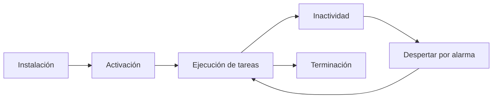

# 📚 APRENDIZAJE DE PROGRAMACIÓN - ArbitrageAR-USDT

**Fecha:** 25 de Febrero de 2026  
**Nivel:** Intermedio (conocimientos básicos de JavaScript)  
**Objetivo:** Entender y poder modificar la extensión ArbitrageAR

---

## 🎯 PLAN DE APRENDIZAJE

### Módulo 1: Fundamentos de Extensiones de Chrome
- ¿Qué es una extensión de navegador?
- Manifest V3 vs V2
- Service Worker vs Background Pages
- Permisos y seguridad

### Módulo 2: JavaScript Moderno para Extensiones
- Módulos ES6
- Async/Await
- Manipulación del DOM
- Eventos y comunicación

### Módulo 3: APIs y Comunicación
- Fetch API
- Chrome APIs (storage, runtime, alarms)
- Comunicación entre componentes
- Manejo de errores

### Módulo 4: Arquitectura del Proyecto
- Patrones de diseño utilizados
- Separación de responsabilidades
- Estado global y local
- Módulos especializados

### Módulo 5: Sistema de Arbitraje
- Lógica matemática
- Cálculo de comisiones
- Procesamiento de datos financieros
- Optimización de rutas

---

## 🚀 MÓDULO 1: FUNDAMENTOS DE EXTENSIONES DE CHROME

### ¿Qué es una Extensión de Navegador?

Una extensión es un **pequeño programa** que modifica o mejora la funcionalidad del navegador. Piénsalo como una "app" que vive dentro de Chrome.

**Analogía:** Es como tener un asistente personal que vive en tu navegador y te ayuda con tareas específicas.

### Estructura Básica de una Extensión

Toda extensión necesita estos archivos mínimos:

```json
// manifest.json - El "DNI" de tu extensión
{
  "manifest_version": 3,
  "name": "Mi Extensión",
  "version": "1.0.0",
  "description": "Descripción de lo que hace",
  "permissions": ["storage", "activeTab"],
  "background": {
    "service_worker": "background.js"
  },
  "action": {
    "default_popup": "popup.html"
  }
}
```

### Manifest V3: La Versión Moderna

**¿Por qué V3?**
- 🔒 **Más segura**: Menos permisos automáticos
- ⚡ **Más rápida**: Service Worker en lugar de páginas background
- 🛡️ **Mejor aislamiento**: Cada componente corre en su propio contexto

**Diferencias clave:**

| Característica | Manifest V2 | Manifest V3 |
|---------------|---------------|---------------|
| Background | `background.scripts` | `background.service_worker` |
| Permisos | Más automáticos | Declaración explícita |
| Ejecución | Páginas persistentes | Service Worker efímero |

---

## 🔧 SERVICE WORKER: EL CEREBRO DE LA EXTENSIÓN

### ¿Qué es un Service Worker?

Es un **script que corre en segundo plano** con un ciclo de vida específico:

```javascript
// Se activa cuando se necesita
chrome.runtime.onInstalled.addListener(() => {
  console.log('Extensión instalada');
});

// Se duerme cuando no hay trabajo
chrome.alarms.onAlarm.addListener(() => {
  // Se despierta para hacer algo
});
```

**Características clave:**
- **Efímero**: No está siempre corriendo
- **Event-driven**: Se activa por eventos
- **Aislado**: No acceso directo al DOM
- **Potente**: Puede hacer tareas en background

### Ciclo de Vida del Service Worker



---

## 📱 LA INTERFAZ: POPUP.HTML

### ¿Cómo funciona el popup?

Es la **ventana que aparece** cuando haces clic en el ícono de la extensión:

```html
<!-- popup.html -->
<!DOCTYPE html>
<html>
<head>
  <title>Mi Extensión</title>
  <link rel="stylesheet" href="styles.css">
</head>
<body>
  <h1>¡Hola Mundo!</h1>
  <button id="actionBtn">Haz clic</button>
  <script src="popup.js"></script>
</body>
</html>
```

**Puntos importantes:**
- **Contexto aislado**: Corre en su propio sandbox
- **Acceso limitado**: No puede acceder directamente a páginas web
- **Comunicación**: Debe usar `chrome.runtime.sendMessage`

---

## 🔄 COMUNICACIÓN ENTRE COMPONENTES

### Mensajería Básica

```javascript
// popup.js - Enviar mensaje al Service Worker
chrome.runtime.sendMessage(
  { action: "getData", type: "prices" },
  (response) => {
    console.log("Respuesta:", response);
  }
);

// background.js - Recibir mensaje
chrome.runtime.onMessage.addListener((request, sender, sendResponse) => {
  if (request.action === "getData") {
    // Procesar la solicitud
    sendResponse({ data: "datos procesados" });
  }
});
```

### Patrón Request-Response

```javascript
// 1. Popup envía solicitud
const request = {
  action: "calculateArbitrage",
  params: { amount: 1000, exchanges: ["buenbit", "lemon"] }
};

// 2. Service Worker recibe y procesa
chrome.runtime.onMessage.addListener(async (request, sender, sendResponse) => {
  try {
    const result = await processRequest(request);
    sendResponse({ success: true, data: result });
  } catch (error) {
    sendResponse({ success: false, error: error.message });
  }
});
```

---

## 💾 ALMACENAMIENTO: CHROME STORAGE API

### ¿Cómo guardar datos persistentes?

```javascript
// Guardar datos
chrome.storage.local.set({
  userPreferences: {
    theme: "dark",
    notifications: true
  },
  lastUpdate: Date.now()
});

// Leer datos
chrome.storage.local.get(["userPreferences", "lastUpdate"], (result) => {
  const preferences = result.userPreferences || {};
  const lastUpdate = result.lastUpdate || 0;
  
  console.log("Preferencias:", preferences);
  console.log("Última actualización:", new Date(lastUpdate));
});

// Storage asíncrono con promesas
const getData = async (keys) => {
  return new Promise((resolve) => {
    chrome.storage.local.get(keys, (result) => resolve(result));
  });
};

// Uso moderno
const data = await getData(["userSettings"]);
```

---

## 🎯 EJERCICIO PRÁCTICO 1: Tu Primera Extensión

Vamos a crear una extensión simple para entender estos conceptos:

### Paso 1: Crear manifest.json

```json
{
  "manifest_version": 3,
  "name": "Mi Primera Extensión",
  "version": "1.0.0",
  "description": "Una extensión simple para aprender",
  "permissions": ["storage", "activeTab"],
  "background": {
    "service_worker": "background.js"
  },
  "action": {
    "default_popup": "popup.html",
    "default_icon": {
      "16": "icon16.png",
      "48": "icon48.png",
      "128": "icon128.png"
    }
  }
}
```

### Paso 2: Crear background.js

```javascript
// background.js
console.log("Service Worker iniciado");

// Almacenar contador
let visitCount = 0;

chrome.runtime.onInstalled.addListener(() => {
  chrome.storage.local.set({ visitCount: 0 });
  console.log("Extensión instalada");
});

chrome.runtime.onMessage.addListener((request, sender, sendResponse) => {
  if (request.action === "getCount") {
    chrome.storage.local.get(["visitCount"], (result) => {
      sendResponse({ count: result.visitCount || 0 });
    });
  }
});

chrome.action.onClicked.addListener((tab) => {
  visitCount++;
  chrome.storage.local.set({ visitCount });
  console.log("Popup abierto:", visitCount, "veces");
});
```

### Paso 3: Crear popup.html

```html
<!DOCTYPE html>
<html>
<head>
  <title>Mi Primera Extensión</title>
  <style>
    body {
      width: 300px;
      font-family: Arial, sans-serif;
      padding: 20px;
    }
    button {
      background: #007bff;
      color: white;
      border: none;
      padding: 10px;
      border-radius: 5px;
      cursor: pointer;
    }
  </style>
</head>
<body>
  <h2>🚀 Mi Primera Extensión</h2>
  <p>Esta es tu primera extensión de Chrome</p>
  
  <div>
    <strong>Veces abierto:</strong>
    <span id="count">Cargando...</span>
  </div>
  
  <button id="refreshBtn">Actualizar Contador</button>
  
  <script src="popup.js"></script>
</body>
</html>
```

### Paso 4: Crear popup.js

```javascript
// popup.js
document.addEventListener('DOMContentLoaded', () => {
  const countElement = document.getElementById('count');
  const refreshBtn = document.getElementById('refreshBtn');
  
  // Obtener contador del storage
  chrome.storage.local.get(["visitCount"], (result) => {
    countElement.textContent = result.visitCount || 0;
  });
  
  // Botón de actualizar
  refreshBtn.addEventListener('click', () => {
    chrome.storage.local.set({ visitCount: 0 }, () => {
      countElement.textContent = "0";
      console.log("Contador reiniciado");
    });
  });
});
```

---

## 🧪 PROBANDO TU PRIMERA EXTENSIÓN

### Paso 1: Cargar la extensión en Chrome

1. Abre Chrome y ve a `chrome://extensions/`
2. Activa "Modo desarrollador"
3. Haz clic en "Cargar descomprimida"
4. Selecciona la carpeta de tu extensión
5. ¡Listo! Tu extensión debería aparecer en la barra de herramientas

### Paso 2: Verificar funcionamiento

1. Haz clic en el ícono de tu extensión
2. Debería aparecer el popup con el contador
3. Haz clic en "Actualizar Contador"
4. Cierra y vuelve a abrir - el contador debería persistir

---

## 📋 RESUMEN DEL MÓDULO 1

### ✅ Conceptos Aprendidos

1. **Estructura de Extensión**: manifest.json + popup + background
2. **Service Worker**: Cerebro que corre en segundo plano
3. **Comunicación**: chrome.runtime.sendMessage() y onMessage
4. **Storage**: chrome.storage.local para datos persistentes
5. **Ciclo de Vida**: Instalación → Activación → Ejecución

### 🎯 Próximo Módulo

En el siguiente módulo vamos a ver:
- **JavaScript Moderno**: Async/Await, módulos ES6
- **Manejo de DOM**: Manipulación del popup
- **Eventos Avanzados**: Tipos diferentes de eventos
- **Depuración**: Cómo debugear extensiones

---

**¿Listo para continuar con el Módulo 2? Cuando termines tu primera extensión, avísame y pasamos a JavaScript Moderno para Extensiones.**