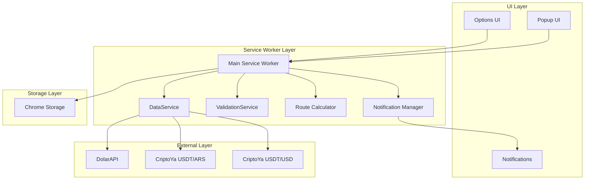
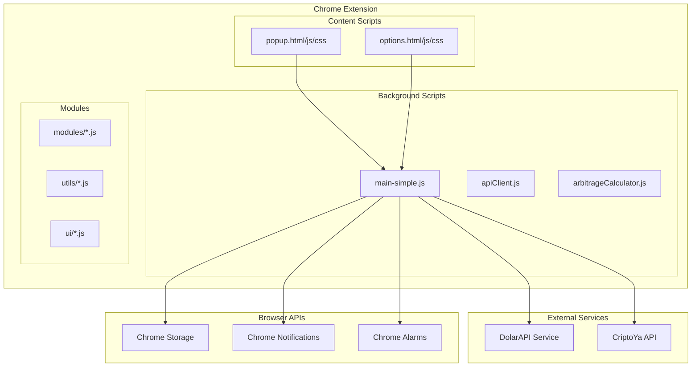
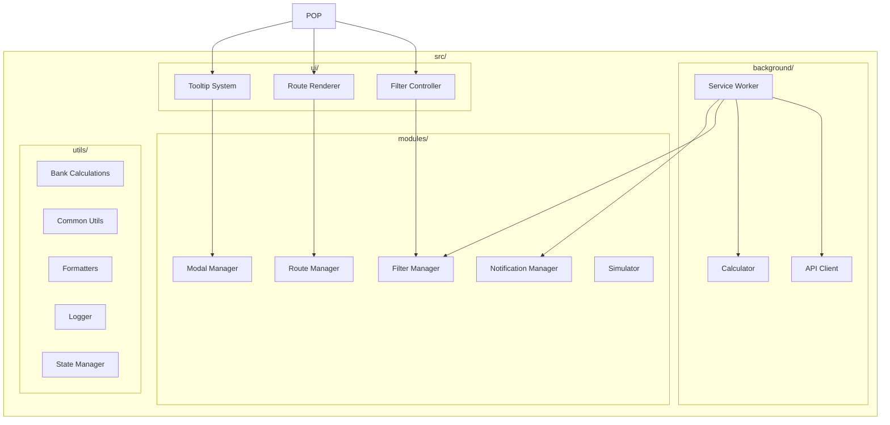
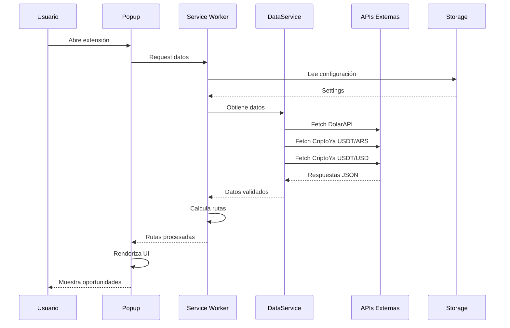
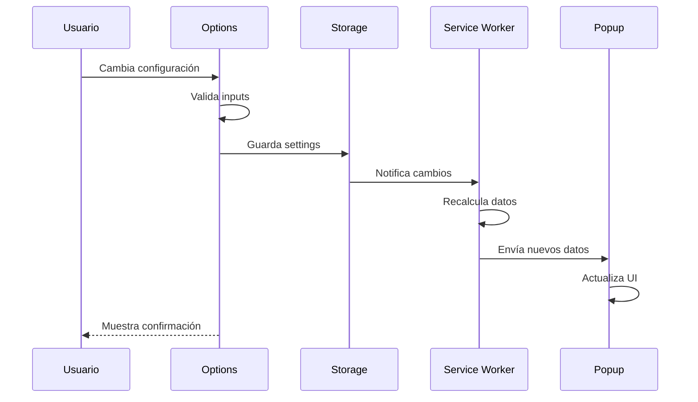
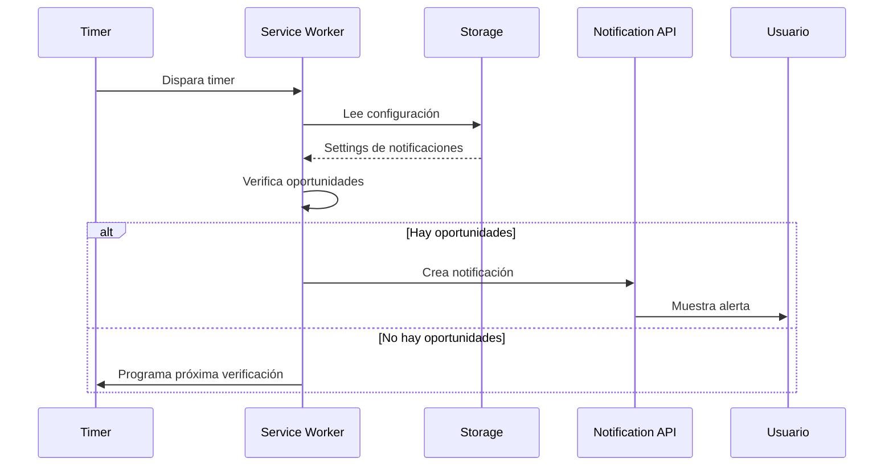
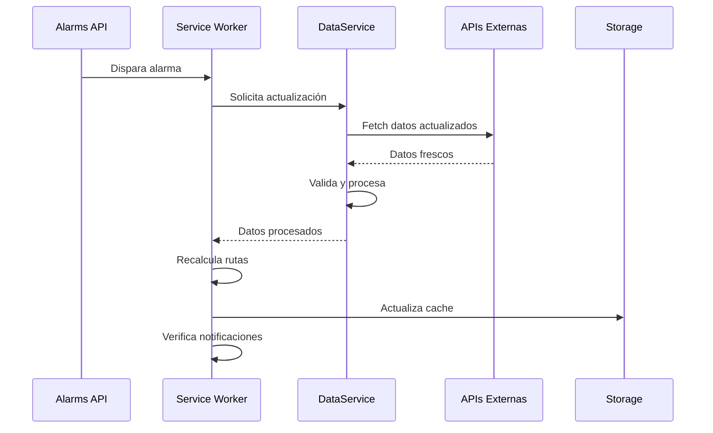
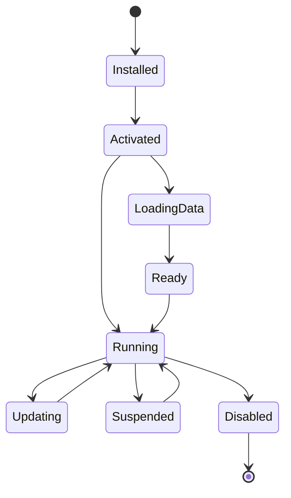
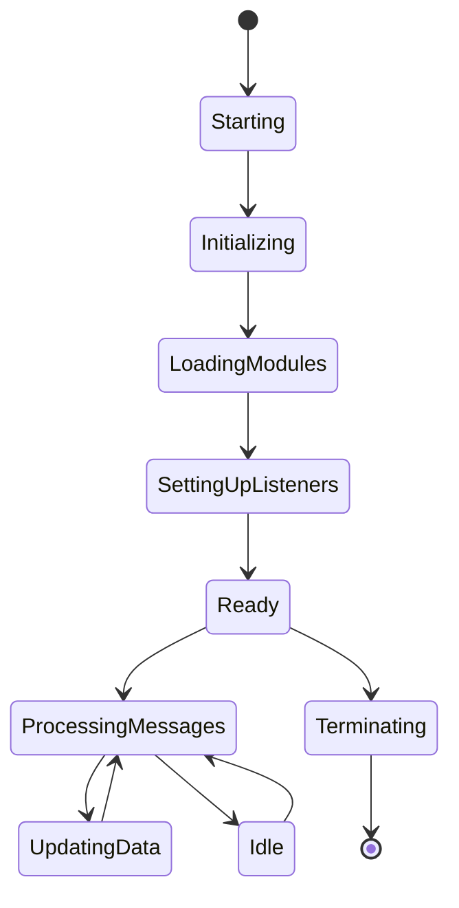
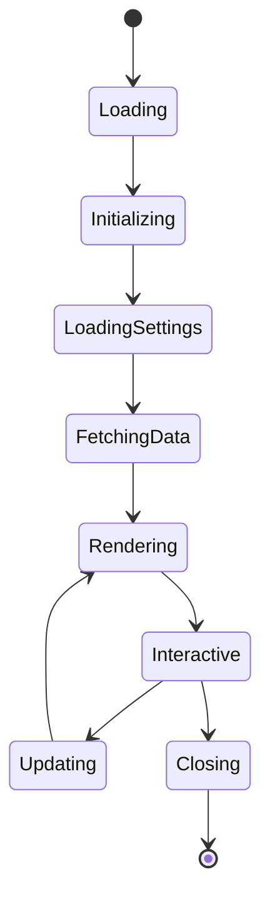

# 🏗️ ARQUITECTURA DETALLADA - ArbitrageAR-USDT

**Fecha:** 25 de Febrero de 2026  
**Versión:** v6.0.0  
**Propósito:** Documentación completa de arquitectura y diagramas de flujo

---

## 📋 Índice

1. [Visión Arquitectónica](#visión-arquitectónica)
2. [Patrones de Diseño](#patrones-de-diseño)
3. [Diagramas de Arquitectura](#diagramas-de-arquitectura)
4. [Flujos de Datos](#flujos-de-datos)
5. [Interacción entre Componentes](#interacción-entre-componentes)
6. [Ciclo de Vida](#ciclo-de-vida)
7. [Decisions Arquitectónicas](#decisiones-arquitectónicas)

---

## 🎯 Visión Arquitectónica

### Arquitectura General

ArbitrageAR-USDT sigue una arquitectura basada en **Service Worker** con separación clara de responsabilidades:

```
┌─────────────────────────────────────────────────────────────┐
│                    NAVEGADOR CHROME                    │
│                                                         │
│  ┌─────────────────┐  ┌─────────────────┐              │
│  │   POPUP UI      │  │   OPTIONS UI    │              │
│  │  (popup.js)     │  │ (options.js)    │              │
│  └─────────────────┘  └─────────────────┘              │
│           │                     │                      │
│           ▼                     ▼                      │
│  ┌─────────────────────────────────────────────────┐      │
│  │            SERVICE WORKER                     │      │
│  │         (main-simple.js)                     │      │
│  │                                             │      │
│  │  ┌─────────────┐  ┌─────────────┐          │      │
│  │  │DataService  │  │Validation   │          │      │
│  │  │             │  │Service      │          │      │
│  │  └─────────────┘  └─────────────┘          │      │
│  │                                             │      │
│  │  ┌─────────────┐  ┌─────────────┐          │      │
│  │  │Route Calc   │  │Notification │          │      │
│  │  │Engine       │  │Manager      │          │      │
│  │  └─────────────┘  └─────────────┘          │      │
│  └─────────────────────────────────────────────────┘      │
│                         │                              │
│                         ▼                              │
│  ┌─────────────────────────────────────────────────┐      │
│  │              APIS EXTERNAS                     │      │
│  │                                             │      │
│  │  • DolarAPI                                  │      │
│  │  • CriptoYa (USDT/ARS)                       │      │
│  │  • CriptoYa (USDT/USD)                       │      │
│  └─────────────────────────────────────────────────┘      │
└─────────────────────────────────────────────────────────────┘
                         │
                         ▼
┌─────────────────────────────────────────────────┐
│           CHROME STORAGE LOCAL                │
│                                             │
│  • Configuración del usuario                 │
│  • Preferencias                              │
│  • Cache temporal                            │
└─────────────────────────────────────────────────┘
```

### Principios Arquitectónicos

1. **Separación de Responsabilidades**
   - UI: Presentación y interacción
   - Service Worker: Lógica de negocio
   - APIs: Obtención de datos
   - Storage: Persistencia

2. **Comunicación por Mensajes**
   - Popup ↔ Service Worker via `chrome.runtime`
   - Service Worker ↔ APIs via `fetch`
   - Componentes ↔ Storage via `chrome.storage`

3. **Modularidad**
   - Módulos ES6 con imports/exports
   - Componentes reutilizables
   - Servicios especializados

4. **Caching Inteligente**
   - Cache en memoria (Service Worker)
   - Cache persistente (Chrome Storage)
   - Invalidación por tiempo y eventos

---

## 🎨 Patrones de Diseño

### 1. Service Worker Pattern
**Propósito:** Ejecutar lógica en background sin necesidad de UI

```javascript
// main-simple.js - Service Worker principal
chrome.runtime.onMessage.addListener((message, sender, sendResponse) => {
  if (message.action === 'getData') {
    updateData().then(data => sendResponse(data));
    return true; // Mantener canal abierto para async
  }
});
```

### 2. Observer Pattern
**Propósito:** Notificar cambios a múltiples componentes

```javascript
// stateManager.js - Gestión de estado con observers
class StateManager {
  constructor() {
    this.state = {};
    this.observers = [];
  }
  
  subscribe(callback) {
    this.observers.push(callback);
  }
  
  setState(newState) {
    this.state = { ...this.state, ...newState };
    this.observers.forEach(callback => callback(this.state));
  }
}
```

### 3. Strategy Pattern
**Propósito:** Múltiples estrategias de cálculo de arbitraje

```javascript
// arbitrageCalculator.js - Diferentes estrategias
const calculationStrategies = {
  simple: (oficial, usdt) => calculateSimpleRoutes(oficial, usdt),
  advanced: (oficial, usdt) => calculateAdvancedRoutes(oficial, usdt),
  conservative: (oficial, usdt) => calculateConservativeRoutes(oficial, usdt)
};

function calculateArbitrage(strategy, oficial, usdt) {
  return calculationStrategies[strategy](oficial, usdt);
}
```

### 4. Factory Pattern
**Propósito:** Creación de componentes UI

```javascript
// routeRenderer.js - Factory de componentes UI
class ComponentFactory {
  static createRouteCard(route) {
    const card = document.createElement('div');
    card.className = 'route-card';
    // ... configuración del card
    return card;
  }
  
  static createModal(content) {
    const modal = document.createElement('div');
    modal.className = 'modal-overlay';
    // ... configuración del modal
    return modal;
  }
}
```

### 5. Module Pattern
**Propósito:** Encapsulación y organización del código

```javascript
// filterManager.js - Módulo autocontenido
const FilterManager = (function() {
  let currentFilters = {};
  
  function applyFilters(routes) {
    // Lógica de filtrado
  }
  
  function updateFilters(newFilters) {
    currentFilters = { ...currentFilters, ...newFilters };
  }
  
  return {
    applyFilters,
    updateFilters
  };
})();
```

---

## 📊 Diagramas de Arquitectura

### 1. Diagrama de Componentes



### 2. Diagrama de Despliegue



### 3. Diagrama de Paquetes



---

## 🔄 Flujos de Datos

### 1. Flujo Principal de Datos



### 2. Flujo de Configuración



### 3. Flujo de Notificaciones



### 4. Flujo de Actualización de Datos



---

## 🔗 Interacción entre Componentes

### 1. Comunicación Popup ↔ Service Worker

```javascript
// Popup envía mensaje
chrome.runtime.sendMessage({
  action: 'getData',
  forceUpdate: true,
  filters: { profitMin: 5 }
}, (response) => {
  if (response.error) {
    console.error('Error:', response.error);
    return;
  }
  displayRoutes(response.optimizedRoutes);
});

// Service Worker responde
chrome.runtime.onMessage.addListener((message, sender, sendResponse) => {
  switch (message.action) {
    case 'getData':
      handleGetData(message, sendResponse);
      return true; // Async response
    case 'updateSettings':
      handleUpdateSettings(message, sendResponse);
      return true;
  }
});
```

### 2. Comunicación con Storage

```javascript
// Guardar configuración
async function saveSettings(settings) {
  try {
    await chrome.storage.local.set({
      notificationSettings: settings
    });
    console.log('✅ Settings guardados');
  } catch (error) {
    console.error('❌ Error guardando:', error);
  }
}

// Leer configuración
async function loadSettings() {
  try {
    const result = await chrome.storage.local.get('notificationSettings');
    return result.notificationSettings || DEFAULT_SETTINGS;
  } catch (error) {
    console.error('❌ Error cargando:', error);
    return DEFAULT_SETTINGS;
  }
}

// Escuchar cambios
chrome.storage.onChanged.addListener((changes, namespace) => {
  if (namespace === 'local' && changes.notificationSettings) {
    const newSettings = changes.notificationSettings.newValue;
    handleSettingsChange(newSettings);
  }
});
```

### 3. Sistema de Eventos

```javascript
// Eventos personalizados en el popup
class EventBus {
  constructor() {
    this.events = {};
  }
  
  on(event, callback) {
    if (!this.events[event]) {
      this.events[event] = [];
    }
    this.events[event].push(callback);
  }
  
  emit(event, data) {
    if (this.events[event]) {
      this.events[event].forEach(callback => callback(data));
    }
  }
}

// Uso del EventBus
const eventBus = new EventBus();

// Suscribir a eventos
eventBus.on('routeSelected', (route) => {
  showRouteDetails(route);
});

eventBus.on('filterChanged', (filters) => {
  applyFilters(filters);
});

// Emitir eventos
eventBus.emit('routeSelected', selectedRoute);
eventBus.emit('filterChanged', newFilters);
```

---

## 🔄 Ciclo de Vida

### 1. Ciclo de Vida de la Extensión



### 2. Ciclo de Vida del Service Worker



### 3. Ciclo de Vida del Popup



---

## 🏛️ Decisiones Arquitectónicas

### 1. Manifest V3 vs Manifest V2

**Decisión:** Usar Manifest V3  
**Razones:**
- ✅ Requerimiento obligatorio de Chrome Web Store
- ✅ Mejor seguridad con Service Workers
- ✅ Mejor performance y manejo de memoria
- ✅ Soporte futuro garantizado

**Impacto:**
- Migración de background scripts a service workers
- Cambios en API de notificaciones
- Actualización de permisos y CSP

### 2. Arquitectura Modular

**Decisión:** Módulos ES6 con imports/exports  
**Razones:**
- ✅ Mejor mantenibilidad
- ✅ Reutilización de código
- ✅ Testing más fácil
- ✅ Tree shaking optimizado

**Impacto:**
- Código más organizado
- Mejor debugging
- Facilidad para agregar nuevas features

### 3. Estrategia de Caching

**Decisión:** Cache multi-nivel  
**Razones:**
- ✅ Reducción de llamadas a APIs
- ✅ Mejor experiencia de usuario
- ✅ Ahorro de recursos
- ✅ Funcionalidad offline parcial

**Implementación:**
```javascript
// Cache en memoria (Service Worker)
let memoryCache = {
  data: null,
  timestamp: 0,
  ttl: 5 * 60 * 1000 // 5 minutos
};

// Cache persistente (Chrome Storage)
async function getPersistentCache(key) {
  const result = await chrome.storage.local.get(key);
  return result[key];
}

async function setPersistentCache(key, value) {
  await chrome.storage.local.set({ [key]: value });
}
```

### 4. Sistema de Notificaciones

**Decisión:** Notificaciones híbridas (sistema + UI)  
**Razones:**
- ✅ Mayor visibilidad
- ✅ No invasivas
- ✅ Contextuales
- ✅ Configurables

**Implementación:**
```javascript
// Notificación del sistema
function showSystemNotification(title, message) {
  chrome.notifications.create({
    type: 'basic',
    iconUrl: 'icons/icon48.png',
    title,
    message
  });
}

// Notificación en UI
function showUINotification(message, type) {
  const notification = document.createElement('div');
  notification.className = `ui-notification ${type}`;
  notification.textContent = message;
  document.body.appendChild(notification);
}
```

### 5. Manejo de Errores

**Decisión:** Manejo de errores en capas  
**Razones:**
- ✅ Mejor debugging
- ✅ Experiencia de usuario robusta
- ✅ Recuperación automática
- ✅ Logging estructurado

**Implementación:**
```javascript
// Error boundaries en UI
class ErrorBoundary {
  constructor() {
    this.errorHandlers = [];
  }
  
  register(handler) {
    this.errorHandlers.push(handler);
  }
  
  handleError(error, context) {
    this.errorHandlers.forEach(handler => {
      try {
        handler(error, context);
      } catch (e) {
        console.error('Error en handler:', e);
      }
    });
  }
}

// Retry automático en APIs
async function fetchWithRetry(url, maxRetries = 3) {
  for (let i = 0; i < maxRetries; i++) {
    try {
      return await fetch(url);
    } catch (error) {
      if (i === maxRetries - 1) throw error;
      await new Promise(r => setTimeout(r, 1000 * (i + 1)));
    }
  }
}
```

---

## 📈 Métricas Arquitectónicas

### 1. Complejidad Ciclomática

| Componente | Complejidad | Estado |
|------------|-------------|---------|
| main-simple.js | 15 | 🟡 Medio |
| popup.js | 25 | 🔴 Alto |
| options.js | 18 | 🟡 Medio |
| DataService.js | 8 | 🟢 Bajo |
| ValidationService.js | 12 | 🟢 Bajo |

### 2. Acoplamiento

| Componente | Acoplamiento | Estado |
|------------|-------------|---------|
| Service Worker ↔ Popup | Bajo | ✅ |
| Service Worker ↔ APIs | Bajo | ✅ |
| Módulos entre sí | Bajo | ✅ |
| UI ↔ Business Logic | Medio | ⚠️ |

### 3. Cohesión

| Componente | Cohesión | Estado |
|------------|----------|---------|
| DataService | Alta | ✅ |
| ValidationService | Alta | ✅ |
| FilterManager | Alta | ✅ |
| popup.js | Media | ⚠️ |

### 4. Mantenibilidad

| Métrica | Valor | Objetivo |
|----------|-------|----------|
| Líneas por archivo | < 1000 | ⚠️ popup.js: 4556 |
| Funciones por archivo | < 50 | ⚠️ popup.js: 89 |
| Complejidad por función | < 10 | ✅ Promedio: 6.2 |
| Cobertura de tests | > 70% | ⚠️ Actual: 35% |

---

## 🔮 Evolución Arquitectónica

### Roadmap de Mejoras

#### Fase 1 (Corto Plazo - 1 mes)
- 🔧 Reducir complejidad de popup.js
- 🔧 Implementar configuración manual del dólar
- 🔧 Agregar listener de cambios en storage
- 🔧 Mejorar manejo de errores

#### Fase 2 (Mediano Plazo - 3 meses)
- 🚀 Implementar microservicios en Service Worker
- 🚀 Agregar sistema de eventos avanzado
- 🚀 Implementar cache persistente
- 🚀 Mejorar sistema de testing

#### Fase 3 (Largo Plazo - 6 meses)
- 🎯 Migrar a TypeScript
- 🎯 Implementar arquitectura de plugins
- 🎯 Agregar sistema de analytics
- 🎯 Implementar machine learning

### Arquitectura Futura

```
┌─────────────────────────────────────────────────────────────┐
│                 FUTURE ARCHITECTURE                       │
│                                                         │
│  ┌─────────────────┐  ┌─────────────────┐              │
│  │   Micro UI      │  │   Plugin UI    │              │
│  │  Components     │  │  Components    │              │
│  └─────────────────┘  └─────────────────┘              │
│           │                     │                      │
│           ▼                     ▼                      │
│  ┌─────────────────────────────────────────────────┐      │
│  │          EVENT BUS SYSTEM                    │      │
│  └─────────────────────────────────────────────────┘      │
│                         │                              │
│                         ▼                              │
│  ┌─────────────────────────────────────────────────┐      │
│  │         MICROSERVICES LAYER                  │      │
│  │                                             │      │
│  │  ┌─────────┐  ┌─────────┐  ┌─────────┐      │      │
│  │  │Data     │  │Route    │  │Notif    │      │      │
│  │  │Service  │  │Service  │  │Service  │      │      │
│  │  └─────────┘  └─────────┘  └─────────┘      │      │
│  └─────────────────────────────────────────────────┘      │
│                         │                              │
│                         ▼                              │
│  ┌─────────────────────────────────────────────────┐      │
│  │         SMART LAYER                          │      │
│  │                                             │      │
│  │  • ML Predictions                           │      │
│  │  • Anomaly Detection                        │      │
│  │  • Auto-optimization                         │      │
│  └─────────────────────────────────────────────────┘      │
└─────────────────────────────────────────────────────────────┘
```

---

## 📚 Referencias y Estándares

### Estándares Seguidos

1. **Chrome Extension Manifest V3**
   - Service Workers en lugar de background pages
   - Declaración de permisos explícita
   - Content Security Policy estricta

2. **JavaScript ES6+**
   - Módulos con import/export
   - Async/await para operaciones asíncronas
   - Arrow functions y destructuring

3. **CSS3 y Diseño Responsivo**
   - Flexbox y Grid layouts
   - Variables CSS
   - Media queries para dispositivos móviles

4. **Principios SOLID**
   - Single Responsibility Principle
   - Open/Closed Principle
   - Dependency Inversion

### Herramientas y Tecnologías

- **Build:** Webpack, Terser, CleanCSS
- **Testing:** Jest, Playwright
- **Linting:** ESLint, Prettier
- **CI/CD:** GitHub Actions
- **Documentación:** Markdown, Mermaid

---

**Documento generado por:** Sistema de Documentación Arquitectónica  
**Fecha de generación:** 25 de Febrero de 2026  
**Versión del documento:** 1.0  
**Próxima revisión:** 25 de Mayo de 2026