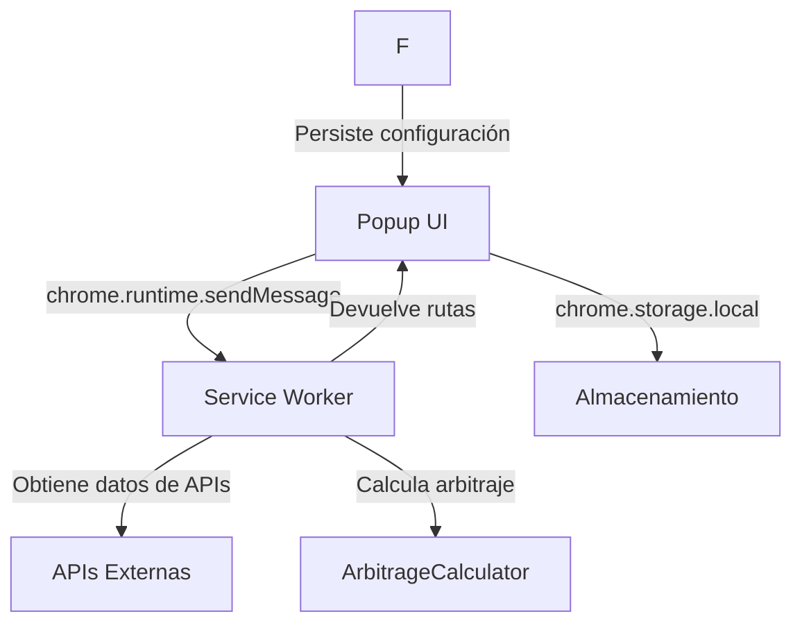
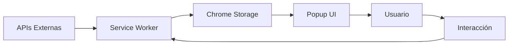

# 🏗️ ARQUITECTURA DEL PROYECTO - ArbitrageAR-USDT

**Fecha:** 25 de Febrero de 2026  
**Nivel:** Intermedio  
**Objetivo:** Entender por qué el proyecto está organizado así

---

## 🎯 ¿POR QUÉ ESTA ORGANIZADO ASÍ?

### El Principio Fundamental: **Separación de Responsabilidades**

El proyecto ArbitrageAR sigue un principio clave del software moderno: **cada componente tiene una responsabilidad específica y clara**.

**Analogía:** Piensa en un restaurante gourmet:
- **Cocina** (Service Worker): Prepara los ingredientes (datos)
- **Meseros** (Módulos): Sirven los platos (interfaz)
- **Bodega** (Storage): Guarda los ingredientes
- **Recetas** (Cálculos): Definen cómo preparar los platos

---

## 📁 ESTRUCTURA EXPLICADA

### 1. **Raíz del Proyecto**: Configuración Esencial

```bash
ArbitrageAR-USDT/
├── 📄 manifest.json          # "DNI" de la extensión
├── 📄 package.json           # Dependencias y scripts
├── 📄 README.md             # Documentación principal
└── 🔧 .eslintrc.json       # Reglas de código
```

**¿Por qué estos archivos en la raíz?**
- **Acceso inmediato**: Son los primeros archivos que lee Chrome
- **Configuración global**: Definen cómo funciona todo el proyecto
- **Identidad del proyecto**: manifest.json es lo que identifica a la extensión

### 2. **src/**: El Corazón del Código

```bash
src/
├── background/           # "Cerebro" - Segundo plano
├── modules/            # "Componentes especializados"
├── ui/                 # "Interfaz de usuario"
├── ui-components/       # "Bloques reutilizables de UI"
└── utils/              # "Herramientas auxiliares"
```

**¿Por qué esta separación?**

#### **background/** - El Motor
```javascript
// main-simple.js - El Service Worker principal
// apiClient.js - Cliente para APIs externas
// arbitrageCalculator.js - Motor matemático
```
**Responsabilidad:** Obtener datos, calcular, procesar en segundo plano

#### **modules/** - Componentes Especializados
```javascript
// filterManager.js - Gestor de filtros
// modalManager.js - Gestor de ventanas emergentes
// notificationManager.js - Sistema de alertas
// routeManager.js - Gestor de rutas de arbitraje
// simulator.js - Calculadora de ganancias
```
**Responsabilidad:** Cada módulo maneja UNA cosa específica

#### **ui/** - Interfaz Principal
```javascript
// popup.js - Controlador principal del popup
// routeRenderer.js - Renderiza rutas en pantalla
// filterController.js - Controla filtros de UI
```
**Responsabilidad:** Lo que ve el usuario

#### **ui-components/** - Bloques Reutilizables
```css
/* design-system.css - Variables globales, colores */
/* header.css - Encabezado consistente */
/* exchange-card.css - Tarjetas de exchanges */
/* tabs.css - Sistema de pestañas */
```
**Responsabilidad:** Componentes visuales reutilizables

#### **utils/** - Herramientas Auxiliares
```javascript
// stateManager.js - Gestión de estado global
// formatters.js - Formateo de números, fechas
// logger.js - Sistema de registro
// commonUtils.js - Funciones utilitarias
```
**Responsabilidad:** Funciones que usan múltiples componentes

---

## 🔄 FLUJO DE COMUNICACIÓN

### ¿Cómo se comunican los componentes?



**¿Por qué este flujo?**
1. **Seguridad**: El popup no puede acceder directamente a APIs externas
2. **Performance**: El Service Worker puede procesar en background
3. **Persistencia**: Chrome Storage guarda datos entre sesiones

---

## 🎨 PATRONES DE DISEÑO UTILIZADOS

### 1. **Módulo Pattern**: Cada archivo es un módulo

```javascript
// filterManager.js
const FilterManager = (() => {
  // Estado privado
  let activeFilters = {};
  
  // Métodos públicos
  const applyFilters = (routes) => { /* ... */ };
  const updateFilters = (newFilters) => { /* ... */ };
  
  // Interfaz pública
  return {
    init: (userSettings) => { /* ... */ },
    applyFilters,
    updateFilters
  };
})();

// Uso en popup.js
window.FilterManager.init(userSettings);
const filteredRoutes = FilterManager.applyFilters(routes);
```

**Ventajas:**
- **Encapsulamiento**: El estado está privado
- **Namespace**: No contamina el scope global
- **Reutilizable**: Se puede usar en múltiples lugares

### 2. **Observer Pattern**: Para cambios en estado

```javascript
// stateManager.js
const StateManager = (() => {
  const listeners = [];
  
  const notifyListeners = (key, newValue) => {
    listeners.forEach(listener => listener(key, newValue));
  };
  
  return {
    set: (key, value) => {
      // Guardar en storage
      // Notificar a todos los listeners
      notifyListeners(key, value);
    },
    subscribe: (listener) => {
      listeners.push(listener);
    }
  };
})();
```

**Ventajas:**
- **Desacoplamiento**: Componentes no necesitan conocerse entre sí
- **Reactividad**: Los componentes reaccionan a cambios automáticamente

### 3. **Factory Pattern**: Para crear componentes

```javascript
// routeRenderer.js
const RouteRenderer = (() => {
  const createRouteCard = (route) => {
    // Crea tarjeta HTML para una ruta
  };
  
  const createEmptyState = (message) => {
    // Crea estado vacío
  };
  
  return {
    renderRoutes: (routes) => {
      // Renderiza todas las rutas
    }
  };
})();
```

**Ventajas:**
- **Consistencia**: Todas las tarjetas se ven igual
- **Mantenimiento**: Cambiar el diseño es más fácil
- **Testing**: Se puede testear cada factory por separado

---

## 📊 SISTEMA DE ESTADO

### ¿Cómo maneja el proyecto el estado?

```javascript
// Estado global sincronizado
let currentData = null;
let allRoutes = [];

// StateManager centralizado
window.StateManager = {
  set: (key, value) => {
    // Guarda en Chrome Storage + notifica
  },
  get: (key) => {
    // Lee de Chrome Storage
  },
  subscribe: (callback) => {
    // Suscribe a cambios
  }
};
```

**¿Por qué este sistema?**

1. **Single Source of Truth**: Un solo lugar para el estado
2. **Persistencia**: Los datos sobreviven a recargas
3. **Reactividad**: Los componentes se actualizan automáticamente
4. **Debugging**: Fácil seguir los cambios de estado

---

## 🔄 CICLO DE VIDA DE DATOS

### ¿Cómo viajan los datos en el sistema?



1. **Obtención**: Service Worker obtiene datos de APIs
2. **Procesamiento**: Calcula arbitraje y optimiza rutas
3. **Almacenamiento**: Guarda en Chrome Storage
4. **Presentación**: Popup lee y muestra al usuario
5. **Interacción**: Usuario hace clic o filtra
6. **Retroalimentación**: Los cambios vuelven al Service Worker

---

## 🛡️ SEGURIDAD EN LA ARQUITECTURA

### 1. **Principio de Menor Privilegio**

```javascript
// popup.js - No acceso directo a APIs
chrome.runtime.sendMessage({ action: 'getData' });

// background.js - Sí tiene acceso a APIs
chrome.runtime.onMessage.addListener((request) => {
  if (request.action === 'getData') {
    fetch('https://api.com/data') // ✅ Permitido
  }
});
```

**¿Por qué?**
- **Superficie de ataque reducida**: Solo el Service Worker expone APIs
- **Aislamiento**: El popup no puede hacer peticiones directamente
- **Control centralizado**: Todo el acceso a APIs pasa por un punto

### 2. **Validación de Datos**

```javascript
// En cada capa
const validateRoute = (route) => {
  if (!route.broker || !route.profitPercentage) {
    throw new Error('Datos inválidos');
  }
  return true;
};
```

---

## 🎯 BENEFICIOS DE ESTA ARQUITECTURA

### 1. **Mantenibilidad**
- **Fácil encontrar**: Cada cosa tiene su lugar
- **Cambios localizados**: Modificar filtros no afecta cálculos
- **Testing unitario**: Cada módulo se puede testear independiente

### 2. **Escalabilidad**
- **Nuevos exchanges**: Solo agregar al apiClient.js
- **Nuevos filtros**: Solo agregar al filterManager.js
- **Nuevas UI**: Reutilizar componentes existentes

### 3. **Colaboración**
- **Trabajo en paralelo**: Varios desarrolladores en diferentes módulos
- **Menos conflictos**: Cambios en módulos diferentes no chocan
- **Code review más fácil**: Revisar módulos pequeños vs archivos gigantes

### 4. **Performance**
- **Lazy loading**: Cargar solo lo necesario
- **Background processing**: Cálculos sin bloquear UI
- **Cache inteligente**: No recalcular si no hay cambios

---

## 🧪 EJERCICIO PRÁCTICO: Analizar la Arquitectura

### Ejercicio 1: Identificar Responsabilidades

**Instrucción:** Mira estos archivos y di qué responsabilidad tiene cada uno:

```javascript
// src/background/main-simple.js
chrome.runtime.onMessage.addListener((request, sender, sendResponse) => {
  if (request.action === 'getArbitrages') {
    // ¿Qué hace aquí?
  }
});

// src/modules/filterManager.js
const FilterManager = (() => {
  const applyFilters = (routes) => {
    // ¿Cuál es su responsabilidad?
  };
  return { applyFilters };
})();

// src/utils/stateManager.js
const StateManager = (() => {
  const set = (key, value) => {
    // ¿Qué gestiona?
  };
  return { set, get, subscribe };
})();
```

**Respuestas:**
- `main-simple.js`: **Comunicación** y orquestación del background
- `filterManager.js`: **Filtrado** de rutas según criterios
- `stateManager.js`: **Gestión de estado** centralizado

### Ejercicio 2: Seguir el Flujo de Datos

**Instrucción:** Traza el camino de una ruta de arbitraje desde API hasta UI:

1. ¿Dónde se obtienen los precios del dólar?
2. ¿Dónde se calcula el arbitraje?
3. ¿Dónde se guardan los resultados?
4. ¿Dónde se muestran al usuario?

**Mapa del flujo:**
```
APIs Externas → apiClient.js → arbitrageCalculator.js → Chrome Storage → popup.js → UI
```

---

## 📋 RESUMEN

### ✅ Conceptos Clave Entendidos

1. **Separación de Responsabilidades**: Cada componente tiene su propósito
2. **Modularidad**: Código organizado en módulos reutilizables
3. **Comunicación por Eventos**: Componentes no se llaman directamente
4. **Estado Centralizado**: StateManager como single source of truth
5. **Seguridad por Capas**: Service Worker como puerta de enlace a APIs
6. **Patrones de Diseño**: Module, Observer, Factory patterns

### 🎯 Próximos Pasos

En el siguiente módulo vamos a profundizar en:
- **Service Worker**: Implementación y mejores prácticas
- **JavaScript Moderno**: Async/Await, módulos ES6
- **APIs Chrome**: Storage, Runtime, Alarms

---

**¿Quieres profundizar en algún aspecto específico de esta arquitectura antes de continuar?**