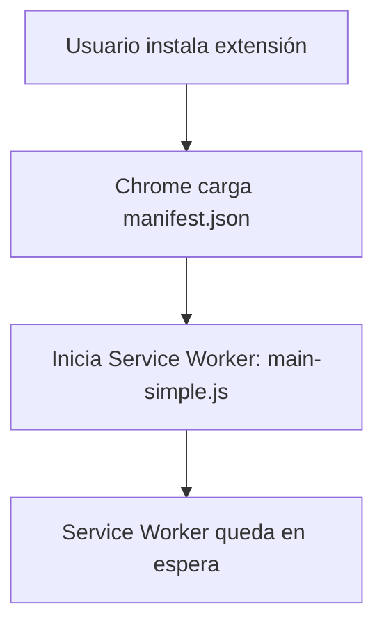
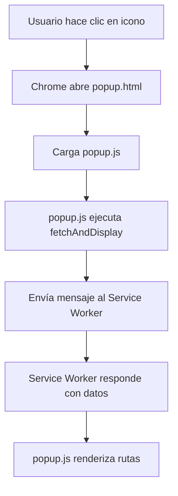
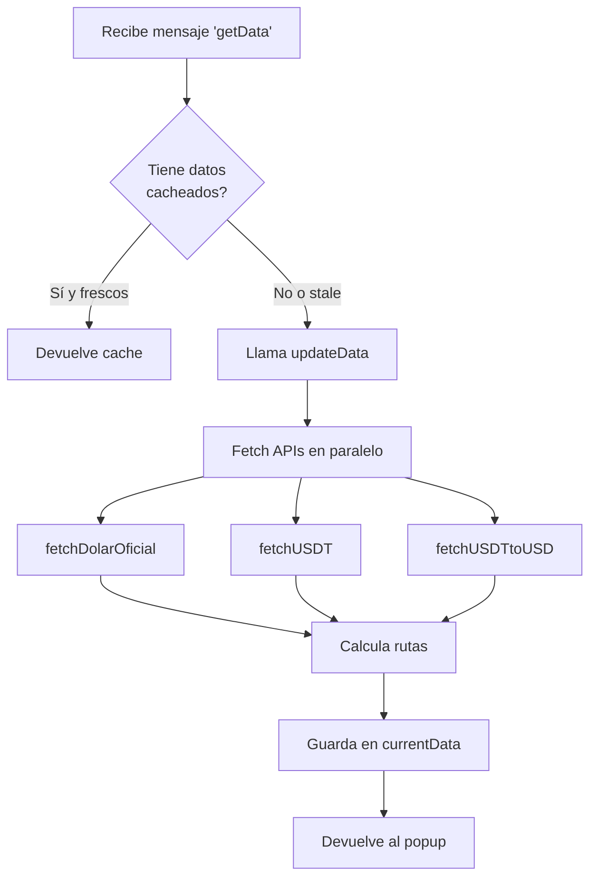
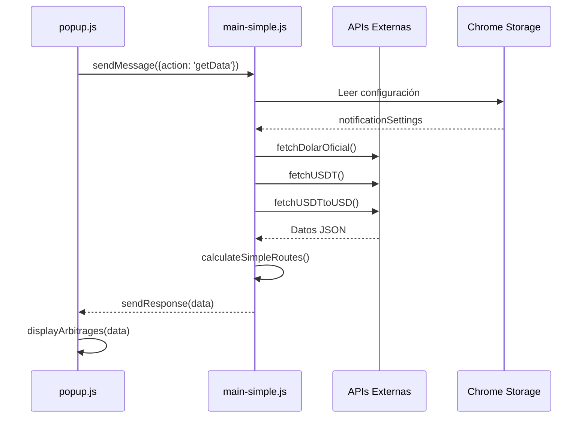

# 📐 Arquitectura Técnica - ArbitrARS

> **Versión:** 5.0.48  
> **Fecha:** 12 de octubre de 2025  
> **Autor:** Sistema de Documentación ArbitrARS

---

## 📋 Índice

1. [Visión General](#-visión-general)
2. [Arquitectura de la Extensión](#-arquitectura-de-la-extensión)
3. [Flujo de Datos Completo](#-flujo-de-datos-completo)
4. [Componentes Principales](#-componentes-principales)
5. [APIs Externas](#-apis-externas)
6. [Sistema de Cálculo de Arbitraje](#-sistema-de-cálculo-de-arbitraje)
7. [Sistema de Almacenamiento](#-sistema-de-almacenamiento)
8. [Comunicación Entre Componentes](#-comunicación-entre-componentes)
9. [Problemas Conocidos y Soluciones](#-problemas-conocidos-y-soluciones)

---

## 🎯 Visión General

**ArbitrARS** es una extensión de navegador (Chrome/Edge/Brave) basada en **Manifest V3** que detecta oportunidades de arbitraje entre:
- **Dólar Oficial Argentino** (precio de compra en bancos)
- **USDT** (Tether) en exchanges locales de criptomonedas

### Concepto de Arbitraje

```
Paso 1: Comprar USD oficial en banco     → $1.030 ARS por USD
Paso 2: Convertir USD → USDT (1:1 aprox)
Paso 3: Vender USDT en exchange local    → $1.150 ARS por USDT
Ganancia neta: $120 ARS por USD (≈11.6%)
```

---

## 🏗️ Arquitectura de la Extensión

### Estructura Manifest V3

```
ArbitrARS/
├─ manifest.json              # Configuración de la extensión
├─ src/
│  ├─ background/
│  │  └─ main-simple.js       # Service Worker (background)
│  ├─ popup.html              # UI principal (ventana emergente)
│  ├─ popup.js                # Lógica del popup
│  ├─ popup.css               # Estilos del popup
│  ├─ options.html            # UI de configuración
│  ├─ options.js              # Lógica de opciones
│  └─ options.css             # Estilos de opciones
└─ icons/                     # Iconos de la extensión
```

### Componentes Clave

| Componente | Tipo | Función |
|------------|------|---------|
| `main-simple.js` | Service Worker | Obtiene datos de APIs, calcula rutas, mantiene estado |
| `popup.js` | Frontend | Renderiza UI, interactúa con usuario |
| `options.js` | Frontend | Gestiona configuración del usuario |
| `chrome.storage.local` | Storage API | Persiste configuración entre sesiones |

---

## 🔄 Flujo de Datos Completo

### 1. Inicio de la Extensión



**Código en `main-simple.js`:**

```javascript
// Línea 7: Service worker se inicia
console.log('🔧 [BACKGROUND] Iniciando service worker...');

// Línea 173-177: Estado global inicial
let currentData = null;
let lastUpdate = null;
```

### 2. Usuario Abre el Popup



**Código en `popup.js`:**

```javascript
// Línea 410: Evento DOMContentLoaded
document.addEventListener('DOMContentLoaded', async () => {
  console.log('🚀 Popup.js cargado correctamente');
  await loadUserSettings();
  await fetchAndDisplay();
  // ... más inicializaciones
});

// Línea 452: Función principal
async function fetchAndDisplay(forceUpdate = false, retryCount = 0) {
  // 1. Mostrar loading
  loading.style.display = 'flex';
  
  // 2. Enviar mensaje al background
  chrome.runtime.sendMessage(
    { action: 'getData', forceUpdate },
    (response) => {
      // 3. Recibir datos y renderizar
      handleSuccessfulData(response, container);
    }
  );
}
```

### 3. Service Worker Obtiene Datos



**Código en `main-simple.js`:**

```javascript
// Línea 234-265: Listener de mensajes
chrome.runtime.onMessage.addListener((message, sender, sendResponse) => {
  if (message.action === 'getData') {
    const forceUpdate = message.forceUpdate;
    
    // Si no hay datos o fuerza actualización
    if (!currentData || forceUpdate) {
      updateData().then(data => {
        sendResponse(data || currentData);
      });
      return true; // Mantiene canal abierto para async
    } else {
      // Devuelve cache
      sendResponse({
        ...currentData,
        usingCache: true
      });
      return false; // Respuesta síncrona
    }
  }
});

// Línea 181-226: Función updateData
async function updateData() {
  // 1. Fetch todas las APIs en paralelo
  const [oficial, usdt, usdtUsd] = await Promise.all([
    fetchDolarOficial(),
    fetchUSDT(),
    fetchUSDTtoUSD()
  ]);
  
  // 2. Validar datos
  if (!oficial || !usdt) {
    log('❌ Faltan datos básicos');
    return null;
  }
  
  // 3. Calcular rutas (ASYNC!)
  const optimizedRoutes = await calculateSimpleRoutes(oficial, usdt, usdtUsd);
  
  // 4. Construir objeto de respuesta
  const data = {
    oficial,
    usdt,
    usdtUsd,
    optimizedRoutes,
    arbitrages: optimizedRoutes,
    lastUpdate: Date.now(),
    error: null,
    usingCache: false
  };
  
  // 5. Guardar en memoria
  currentData = data;
  lastUpdate = data.lastUpdate;
  
  return data;
}
```

---

## 🧩 Componentes Principales

### 1. Service Worker (`main-simple.js`)

**Responsabilidades:**
- ✅ Obtener datos de APIs externas
- ✅ Calcular todas las rutas de arbitraje
- ✅ Cachear datos en memoria
- ✅ Responder a mensajes del frontend
- ✅ Ejecutar actualizaciones automáticas

**Funciones Clave:**

| Función | Línea | Propósito |
|---------|-------|-----------|
| `fetchWithRateLimit()` | 22-42 | Rate limiting para evitar baneos |
| `fetchDolarOficial()` | 44-56 | Obtiene precio USD oficial |
| `fetchUSDT()` | 58-60 | Obtiene precios USDT/ARS |
| `fetchUSDTtoUSD()` | 62-64 | Obtiene cotización USDT/USD |
| `calculateSimpleRoutes()` | 73-168 | Calcula todas las rutas |
| `updateData()` | 181-226 | Orquesta actualización completa |

**Estado Global:**

```javascript
let currentData = null;  // Datos actuales
let lastUpdate = null;   // Timestamp última actualización
```

### 2. Frontend Popup (`popup.js`)

**Responsabilidades:**
- ✅ Renderizar UI de rutas
- ✅ Aplicar filtros del usuario
- ✅ Mostrar detalles de cada ruta
- ✅ Gestionar simulaciones
- ✅ Abrir configuración

**Funciones Clave:**

| Función | Línea | Propósito |
|---------|-------|-----------|
| `fetchAndDisplay()` | 452-620 | Obtiene y muestra datos |
| `displayArbitrages()` | 1047-1175 | Renderiza lista de rutas |
| `showRouteDetails()` | 1229-1498 | Modal con detalles completos |
| `applyUserPreferences()` | 625-650 | Filtra según configuración |
| `loadUserSettings()` | 268-293 | Carga config desde storage |

**Estado Global:**

```javascript
let currentData = null;        // Datos del background
let selectedArbitrage = null;  // Ruta seleccionada
let userSettings = null;       // Configuración del usuario
let currentFilter = 'no-p2p';  // Filtro activo
let allRoutes = [];            // Cache de rutas sin filtrar
```

### 3. Configuración (`options.js`)

**Responsabilidades:**
- ✅ Cargar configuración guardada
- ✅ Guardar cambios del usuario
- ✅ Validar inputs
- ✅ Mostrar/ocultar secciones según opciones

**Estructura de Configuración:**

```javascript
const DEFAULT_SETTINGS = {
  // Notificaciones
  notificationsEnabled: true,
  alertType: 'all',
  customThreshold: 5,
  soundEnabled: true,
  
  // Rutas
  showNegativeRoutes: true,
  preferSingleExchange: false,
  defaultSimAmount: 1000000,
  maxRoutesDisplay: 20,
  profitThreshold: 1.0,
  
  // Fees personalizados
  extraTradingFee: 0,
  extraWithdrawalFee: 0,
  extraTransferFee: 0,
  bankCommissionFee: 0,
  
  // Configuración del dólar
  dollarPriceSource: 'auto',  // 'auto' | 'manual'
  manualDollarPrice: 950,
  preferredBank: 'mediana',   // 'mediana' | 'promedio' | 'nacion' | etc.
  
  // Bancos
  showBestBankPrice: false,
  selectedBanks: []
};
```

---

## 🌐 APIs Externas

### 1. DolarAPI - Dólar Oficial

**Endpoint:**
```
GET https://dolarapi.com/v1/dolares/oficial
```

**Respuesta:**
```json
{
  "moneda": "USD",
  "casa": "oficial",
  "nombre": "Oficial",
  "compra": 1030.5,
  "venta": 1070.5,
  "fechaActualizacion": "2025-10-12T14:30:00.000Z"
}
```

**Código (`main-simple.js` línea 44-56):**
```javascript
async function fetchDolarOficial() {
  const data = await fetchWithRateLimit('https://dolarapi.com/v1/dolares/oficial');
  if (data && typeof data.compra === 'number' && typeof data.venta === 'number') {
    return {
      ...data,
      source: 'dolarapi_oficial',
      timestamp: Date.now()
    };
  }
  return null;
}
```

### 2. CriptoYa - Precios USDT/ARS

**Endpoint:**
```
GET https://criptoya.com/api/usdt/ars/1
```

**Respuesta:**
```json
{
  "binance": {
    "ask": 1150.25,
    "totalAsk": 1150.25,
    "bid": 1145.50,
    "totalBid": 1145.50,
    "time": 1728745800
  },
  "buenbit": {
    "ask": 1152.00,
    "bid": 1148.00,
    "time": 1728745800
  },
  // ... más exchanges
}
```

**Código (`main-simple.js` línea 58-60):**
```javascript
async function fetchUSDT() {
  return await fetchWithRateLimit('https://criptoya.com/api/usdt/ars/1');
}
```

### 3. CriptoYa - Cotización USDT/USD

**Endpoint:**
```
GET https://criptoya.com/api/usdt/usd/1
```

**Respuesta:** Similar a USDT/ARS pero en dólares

**Uso:** Detectar paridades rotas o problemas de liquidez

---

## 🧮 Sistema de Cálculo de Arbitraje

### Función `calculateSimpleRoutes()`

**Ubicación:** `main-simple.js` líneas 73-168

**Entradas:**
- `oficial`: Objeto con precio oficial del dólar
- `usdt`: Objeto con precios USDT/ARS de todos los exchanges
- `usdtUsd`: Objeto con precios USDT/USD

**Proceso Paso a Paso:**

#### 1. Obtener Configuración del Usuario

```javascript
// Línea 86-93
const result = await chrome.storage.local.get('notificationSettings');
const userSettings = result.notificationSettings || {};
initialAmount = userSettings.defaultSimAmount || 1000000;
```

#### 2. Por Cada Exchange, Calcular Ganancia

```javascript
// Línea 100-167: Loop por cada exchange
for (const [exchangeName, data] of Object.entries(usdt)) {
  processedCount++;
  
  // VALIDACIÓN: Saltar si no tiene precio de venta
  if (!data?.bid || typeof data.bid !== 'number' || data.bid <= 0) {
    skippedCount++;
    continue;
  }
  
  // PASO 1: Comprar USD oficial
  const officialPrice = oficial.compra;  // Ej: $1030
  const usdAmount = initialAmount / officialPrice;  // Ej: $1M / 1030 = 970.87 USD
  
  // PASO 2: Convertir USD → USDT (paridad 1:1)
  const usdtAmount = usdAmount;  // 970.87 USDT
  
  // PASO 3: Vender USDT en exchange por ARS
  const sellPrice = data.bid;  // Ej: $1150 (precio de compra del exchange)
  const finalARS = usdtAmount * sellPrice;  // 970.87 * 1150 = $1,116,500.50
  
  // PASO 4: Calcular ganancia bruta
  const profit = finalARS - initialAmount;  // $1,116,500.50 - $1,000,000 = $116,500.50
  const profitPercent = (profit / initialAmount) * 100;  // 11.65%
  
  // PASO 5: Aplicar fees estimados
  const fees = estimateFees(exchangeName, usdtAmount, userSettings);
  const netProfit = profit - fees;
  const netPercent = (netProfit / initialAmount) * 100;
  
  // PASO 6: Crear objeto de ruta
  routes.push({
    exchange: exchangeName,
    buyExchange: 'Banco (USD oficial)',
    sellExchange: exchangeName,
    initialAmount,
    officialPrice,
    usdAmount,
    usdtAmount,
    sellPrice,
    finalAmount: finalARS,
    profit,
    profitPercent,
    fees,
    netProfit,
    netPercent,
    risk: calculateRisk(exchangeName, profitPercent),
    timestamp: Date.now()
  });
}
```

#### 3. Ordenar Rutas por Ganancia

```javascript
// Línea 164: Ordenar descendente por ganancia neta
routes.sort((a, b) => b.netPercent - a.netPercent);

// Línea 168: Limitar a 50 mejores
return routes.slice(0, 50);
```

### Estimación de Fees

**Fees Considerados:**
1. **Trading Fee:** Comisión del exchange (0.1% - 1%)
2. **Withdrawal Fee:** Costo de retiro de USDT
3. **Transfer Fee:** Costo de transferencia bancaria
4. **Bank Commission:** Comisión del banco por compra USD

**Código (conceptual):**
```javascript
function estimateFees(exchange, usdtAmount, settings) {
  const tradingFee = usdtAmount * 0.001; // 0.1% default
  const withdrawalFee = settings.extraWithdrawalFee || 0;
  const transferFee = settings.extraTransferFee || 0;
  const bankFee = settings.bankCommissionFee || 0;
  
  return tradingFee + withdrawalFee + transferFee + bankFee;
}
```

### Cálculo de Riesgo

**Factores:**
- 🟢 **Bajo:** Exchanges tier-1 (Binance, Buenbit)
- 🟡 **Medio:** Exchanges medianos con historial
- 🔴 **Alto:** Exchanges pequeños o P2P

---

## 💾 Sistema de Almacenamiento

### Chrome Storage Local

**API Usada:** `chrome.storage.local`

**Datos Almacenados:**

```javascript
// Estructura completa en storage
{
  "notificationSettings": {
    // Todas las configuraciones del usuario
    notificationsEnabled: true,
    alertType: 'all',
    dollarPriceSource: 'auto',
    manualDollarPrice: 950,
    preferredBank: 'mediana',
    // ... más configuraciones
  }
}
```

**Operaciones:**

#### Lectura
```javascript
const result = await chrome.storage.local.get('notificationSettings');
const settings = result.notificationSettings || DEFAULT_SETTINGS;
```

#### Escritura
```javascript
await chrome.storage.local.set({ 
  notificationSettings: newSettings 
});
```

#### Escucha de Cambios
```javascript
chrome.storage.onChanged.addListener((changes, namespace) => {
  if (namespace === 'local' && changes.notificationSettings) {
    const oldSettings = changes.notificationSettings.oldValue;
    const newSettings = changes.notificationSettings.newValue;
    
    // Reaccionar a cambios
    if (oldSettings.manualDollarPrice !== newSettings.manualDollarPrice) {
      console.log('Precio manual cambió, recalcular...');
      updateData();
    }
  }
});
```

---

## 📡 Comunicación Entre Componentes

### Modelo de Mensajería

**Chrome Extensions Manifest V3 usa:**
- `chrome.runtime.sendMessage()` - Frontend → Background
- `chrome.runtime.onMessage.addListener()` - Background escucha

### Flujo Completo



### Tipos de Mensajes

#### 1. `getData` - Obtener Datos

**Request:**
```javascript
chrome.runtime.sendMessage(
  { 
    action: 'getData', 
    forceUpdate: false 
  },
  (response) => {
    console.log(response.optimizedRoutes);
  }
);
```

**Response:**
```javascript
{
  oficial: { compra: 1030, venta: 1070, ... },
  usdt: { binance: {...}, buenbit: {...}, ... },
  usdtUsd: { binance: {...}, ... },
  optimizedRoutes: [ 32 rutas ordenadas ],
  arbitrages: [ mismo que optimizedRoutes ],
  lastUpdate: 1728745800000,
  error: null,
  usingCache: false
}
```

#### 2. `getBankRates` - Obtener Precios Bancarios

**Estado:** ❌ NO IMPLEMENTADO en `main-simple.js`

**Solución Temporal:** Mostrar mensaje informativo

---

## 🐛 Problemas Conocidos y Soluciones

### 1. ❌ Configuración de Dólar Manual No Se Aplica

**Problema:**
El usuario configura un precio manual en `options.html`, pero el background **siempre** usa DolarAPI.

**Causa Raíz:**
`updateData()` siempre llama `fetchDolarOficial()` sin verificar `dollarPriceSource`.

**Ubicación del Bug:**
`main-simple.js` línea 185-190

**Código Actual (Buggy):**
```javascript
const [oficial, usdt, usdtUsd] = await Promise.all([
  fetchDolarOficial(),  // ❌ SIEMPRE llama API
  fetchUSDT(),
  fetchUSDTtoUSD()
]);
```

**Solución Requerida:**
```javascript
// 1. Leer configuración ANTES de fetch
const settingsResult = await chrome.storage.local.get('notificationSettings');
const userSettings = settingsResult.notificationSettings || {};

// 2. Decidir fuente del precio
let oficial;
if (userSettings.dollarPriceSource === 'manual') {
  // Usar precio manual
  oficial = {
    compra: userSettings.manualDollarPrice || 950,
    venta: userSettings.manualDollarPrice || 950,
    source: 'manual',
    timestamp: Date.now()
  };
} else {
  // Usar API
  oficial = await fetchDolarOficial();
}

// 3. Continuar con resto de fetches
const [usdt, usdtUsd] = await Promise.all([
  fetchUSDT(),
  fetchUSDTtoUSD()
]);
```

### 2. ❌ Botón "Recalcular" No Funciona

**Problema:**
El botón pide un precio pero no recalcula con ese valor.

**Causa:**
La funcionalidad requiere implementación modular que no existe en `main-simple.js`.

**Solución Temporal:**
Mostrar mensaje informativo y redirigir a configuración.

**Código Actual (`popup.js` línea 1886-1910):**
```javascript
async function showRecalculateDialog() {
  const currentPrice = currentData?.oficial?.compra || 1000;
  
  const customPrice = prompt(
    '💵 Ingresa el precio del dólar para referencia:\n\n' +
    `Precio actual: $${currentPrice.toFixed(2)}\n\n` +
    'Nota: El recálculo usa el precio configurado en opciones.',
    currentPrice.toFixed(2)
  );

  if (customPrice && !isNaN(customPrice) && parseFloat(customPrice) > 0) {
    const price = parseFloat(customPrice);
    
    // ❌ NO recalcula realmente
    alert(`💡 Precio de referencia: $${price.toFixed(2)}\n\nPara cambiar el precio del dólar, usa el botón ⚙️ Configuración.`);
    
    // Solo refresca
    fetchAndDisplay();
  }
}
```

### 3. ✅ Rutas No Se Mostraban (Resuelto v5.0.47)

**Problema:**
Background calculaba 32 rutas pero popup recibía 0.

**Causa:**
`calculateSimpleRoutes()` es async pero se llamaba sin `await`.

**Fix Aplicado:**
```javascript
// ANTES (buggy):
const optimizedRoutes = calculateSimpleRoutes(oficial, usdt, usdtUsd);
// optimizedRoutes era una Promise, no un Array

// DESPUÉS (correcto):
const optimizedRoutes = await calculateSimpleRoutes(oficial, usdt, usdtUsd);
// optimizedRoutes es un Array con 32 rutas
```

### 4. 🔄 Storage Changes No Disparan Recálculo

**Problema:**
Cambiar configuración en `options.html` no actualiza datos en popup abierto.

**Solución Requerida:**
Implementar listener en `main-simple.js`:

```javascript
chrome.storage.onChanged.addListener((changes, namespace) => {
  if (namespace === 'local' && changes.notificationSettings) {
    const newSettings = changes.notificationSettings.newValue;
    const oldSettings = changes.notificationSettings.oldValue;
    
    // Detectar cambios críticos
    if (
      newSettings.dollarPriceSource !== oldSettings.dollarPriceSource ||
      newSettings.manualDollarPrice !== oldSettings.manualDollarPrice ||
      newSettings.preferredBank !== oldSettings.preferredBank
    ) {
      console.log('⚙️ Configuración cambió, actualizando datos...');
      updateData(); // Forzar recálculo
    }
  }
});
```

---

## 📊 Diagrama de Arquitectura Final

```
┌──────────────────────────────────────────────────────────────┐
│                        USUARIO                                │
└──────────────────────────────────────────────────────────────┘
                           │
                           ▼
┌──────────────────────────────────────────────────────────────┐
│                    CHROME BROWSER                             │
│                                                               │
│  ┌────────────────┐  ┌────────────────┐  ┌──────────────┐   │
│  │  popup.html    │  │ options.html   │  │  Service     │   │
│  │  popup.js      │◄─┤ options.js     │  │  Worker      │   │
│  │  popup.css     │  │ options.css    │  │  (BG)        │   │
│  └────────────────┘  └────────────────┘  └──────────────┘   │
│         │                    │                    │          │
│         ▼                    ▼                    ▼          │
│  ┌─────────────────────────────────────────────────────┐    │
│  │        chrome.runtime & chrome.storage API          │    │
│  └─────────────────────────────────────────────────────┘    │
│                           │                                  │
└───────────────────────────┼──────────────────────────────────┘
                            │
                            ▼
               ┌────────────────────────┐
               │   chrome.storage.local │
               │   (Persist Config)     │
               └────────────────────────┘
                            │
                            ▼
               ┌────────────────────────┐
               │    EXTERNAL APIs       │
               │                        │
               │  • DolarAPI            │
               │  • CriptoYa USDT/ARS   │
               │  • CriptoYa USDT/USD   │
               └────────────────────────┘
```

---

## 🎓 Conclusiones

### Fortalezas del Diseño
✅ Arquitectura clara con separación de responsabilidades  
✅ Caching eficiente en service worker  
✅ Rate limiting para evitar baneos de API  
✅ Configuración persistente del usuario  
✅ UI responsive y clara  

### Áreas de Mejora
🔧 Implementar respeto a configuración manual del dólar  
🔧 Agregar listener de cambios en storage  
🔧 Implementar funcionalidad real de "recalcular"  
🔧 Agregar manejo de errores más robusto  
🔧 Implementar notificaciones push cuando aparezcan rutas rentables  

---

**Documento generado por:** ArbitrARS Documentation System  
**Última actualización:** 12 de octubre de 2025  
**Versión de la extensión:** 5.0.48
