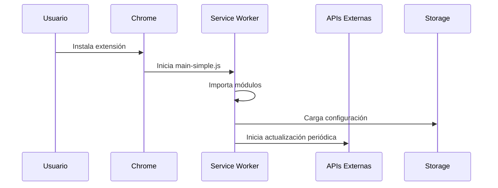
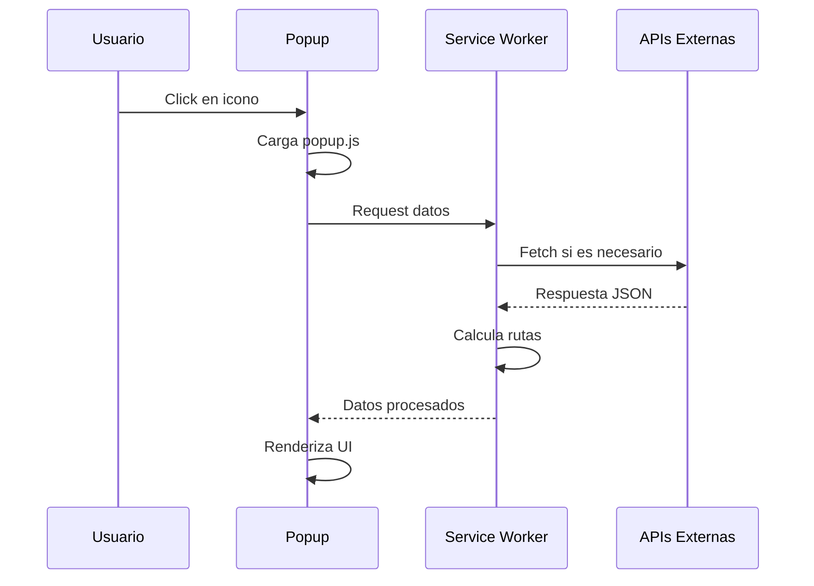
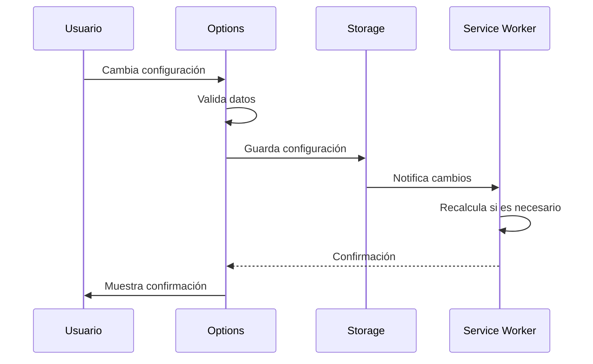

# 📋 FUNCIONAMIENTO DETALLADO DE COMPONENTES - ArbitrageAR-USDT

**Fecha:** 25 de Febrero de 2026  
**Versión:** v6.0.0  
**Propósito:** Documentación detallada del funcionamiento de cada componente

---

## 📋 Índice

1. [Service Worker (Background)](#service-worker-background)
2. [Popup Interface](#popup-interface)
3. [Sistema de Configuración](#sistema-de-configuración)
4. [DataService](#dataservice)
5. [ValidationService](#validationservice)
6. [Módulos Especializados](#módulos-especializados)
7. [Sistema de Notificaciones](#sistema-de-notificaciones)
8. [Utilidades y Helpers](#utilidades-y-helpers)

---

## 🔧 Service Worker (Background)

### Archivo: `src/background/main-simple.js`

#### Propósito Principal
El Service Worker es el cerebro de la extensión, responsable de:
- Obtener datos de APIs externas
- Calcular rutas de arbitraje
- Mantener estado global
- Responder a mensajes del popup

#### Flujo de Inicialización

```javascript
// Línea 9: Log de inicio
console.log('🔧 [BACKGROUND] Iniciando service worker...');

// Líneas 14-20: Importación de módulos
try {
  importScripts('apiClient.js', 'arbitrageCalculator.js', '../DataService.js');
  console.log('✅ [BACKGROUND] Módulos importados correctamente');
} catch (e) {
  console.warn('⚠️ [BACKGROUND] No se pudieron importar módulos:', e.message);
}
```

#### Estado Global

```javascript
// Líneas ~200-210: Variables globales principales
let currentData = null;     // Datos actuales cacheados
let lastUpdate = null;       // Timestamp de última actualización
let notificationTimer = null; // Timer para notificaciones
```

#### Funciones Principales

##### 1. `updateData()`
**Ubicación:** Líneas 181-226  
**Propósito:** Orquestar la actualización completa de datos

```javascript
async function updateData() {
  try {
    // 1. Obtener configuración del usuario
    const settings = await chrome.storage.local.get('notificationSettings');
    const userSettings = settings.notificationSettings || {};
    
    // 2. Fetch todas las APIs en paralelo
    const [oficial, usdt, usdtUsd] = await Promise.all([
      fetchDolarOficial(),
      fetchUSDT(),
      fetchUSDTtoUSD()
    ]);
    
    // 3. Validar datos básicos
    if (!oficial || !usdt) {
      log('❌ Faltan datos básicos');
      return null;
    }
    
    // 4. Calcular rutas de arbitraje
    const optimizedRoutes = await calculateSimpleRoutes(oficial, usdt, usdtUsd);
    
    // 5. Construir objeto de respuesta
    const data = {
      oficial,
      usdt,
      usdtUsd,
      optimizedRoutes,
      arbitrages: optimizedRoutes,
      lastUpdate: Date.now(),
      error: null,
      usingCache: false
    };
    
    // 6. Guardar en memoria
    currentData = data;
    lastUpdate = data.lastUpdate;
    
    return data;
  } catch (error) {
    console.error('❌ Error en updateData:', error);
    return null;
  }
}
```

##### 2. `calculateSimpleRoutes()`
**Ubicación:** Líneas 73-168  
**Propósito:** Calcular todas las rutas de arbitraje posibles

```javascript
async function calculateSimpleRoutes(oficial, usdt, usdtUsd) {
  const routes = [];
  let processedCount = 0;
  let skippedCount = 0;
  
  // 1. Obtener configuración del usuario
  const result = await chrome.storage.local.get('notificationSettings');
  const userSettings = result.notificationSettings || {};
  const initialAmount = userSettings.defaultSimAmount || 1000000;
  
  // 2. Por cada exchange, calcular ganancia
  for (const [exchangeName, data] of Object.entries(usdt)) {
    processedCount++;
    
    // Validación: Saltar si no tiene precio de venta
    if (!data?.bid || typeof data.bid !== 'number' || data.bid <= 0) {
      skippedCount++;
      continue;
    }
    
    // PASO 1: Comprar USD oficial
    const officialPrice = oficial.compra;
    const usdAmount = initialAmount / officialPrice;
    
    // PASO 2: Convertir USD → USDT (paridad 1:1)
    const usdtAmount = usdAmount;
    
    // PASO 3: Vender USDT en exchange por ARS
    const sellPrice = data.bid;
    const finalARS = usdtAmount * sellPrice;
    
    // PASO 4: Calcular ganancia bruta
    const profit = finalARS - initialAmount;
    const profitPercent = (profit / initialAmount) * 100;
    
    // PASO 5: Aplicar fees estimados
    const fees = estimateFees(exchangeName, usdtAmount, userSettings);
    const netProfit = profit - fees;
    const netPercent = (netProfit / initialAmount) * 100;
    
    // PASO 6: Crear objeto de ruta
    routes.push({
      exchange: exchangeName,
      buyExchange: 'Banco (USD oficial)',
      sellExchange: exchangeName,
      initialAmount,
      officialPrice,
      usdAmount,
      usdtAmount,
      sellPrice,
      finalAmount: finalARS,
      profit,
      profitPercent,
      fees,
      netProfit,
      netPercent,
      risk: calculateRisk(exchangeName, profitPercent),
      timestamp: Date.now()
    });
  }
  
  // 7. Ordenar por ganancia neta descendente
  routes.sort((a, b) => b.netPercent - a.netPercent);
  
  // 8. Limitar a 50 mejores rutas
  return routes.slice(0, 50);
}
```

##### 3. Manejo de Mensajes
**Ubicación:** Líneas 234-265  
**Propósito:** Comunicación con el popup

```javascript
chrome.runtime.onMessage.addListener((message, sender, sendResponse) => {
  if (message.action === 'getData') {
    const forceUpdate = message.forceUpdate;
    
    // Si no hay datos o fuerza actualización
    if (!currentData || forceUpdate) {
      updateData().then(data => {
        sendResponse(data || currentData);
      });
      return true; // Mantiene canal abierto para async
    } else {
      // Devolver cache
      sendResponse({
        ...currentData,
        usingCache: true
      });
      return false; // Respuesta síncrona
    }
  }
  
  // Otros handlers de mensajes...
});
```

#### Sistema de Notificaciones

```javascript
// Líneas ~280-320: Timer de notificaciones
function startNotificationTimer() {
  if (notificationTimer) {
    clearInterval(notificationTimer);
  }
  
  const interval = 60000; // 1 minuto por defecto
  
  notificationTimer = setInterval(async () => {
    const settings = await chrome.storage.local.get('notificationSettings');
    const userSettings = settings.notificationSettings || {};
    
    if (userSettings.notificationsEnabled) {
      checkForOpportunities(userSettings);
    }
  }, interval);
}

// Líneas ~330-360: Verificación de oportunidades
async function checkForOpportunities(settings) {
  if (!currentData || !currentData.optimizedRoutes) return;
  
  const threshold = settings.alertThreshold || 1.0;
  const profitableRoutes = currentData.optimizedRoutes.filter(
    route => route.netPercent >= threshold
  );
  
  if (profitableRoutes.length > 0) {
    const bestRoute = profitableRoutes[0];
    
    chrome.notifications.create({
      type: 'basic',
      iconUrl: 'icons/icon48.png',
      title: '¡Oportunidad de Arbitraje!',
      message: `Ganancia del ${bestRoute.netPercent.toFixed(2)}% en ${bestRoute.exchange}`
    });
  }
}
```

---

## 🖥️ Popup Interface

### Archivo: `src/popup.js`

#### Propósito Principal
El popup es la interfaz de usuario principal, responsable de:
- Mostrar rutas de arbitraje
- Gestionar interacciones del usuario
- Aplicar filtros y preferencias
- Mostrar detalles y simulaciones

#### Estructura Modular

```javascript
// Líneas 4-14: Módulos cargados
// - window.StateManager (src/utils/stateManager.js)
// - window.Formatters (src/utils/formatters.js)
// - window.Logger (src/utils/logger.js)
// - window.RouteRenderer (src/ui/routeRenderer.js)
// - window.Simulator (src/modules/simulator.js)
// - window.RouteManager (src/modules/routeManager.js)
// - window.FilterManager (src/modules/filterManager.js)
// - window.ModalManager (src/modules/modalManager.js)
// - window.NotificationManager (src/modules/notificationManager.js)
// - window.CommonUtils (src/utils/commonUtils.js)
```

#### Estado Global

```javascript
// Líneas 65-79: Variables de estado principales
let currentData = null;        // Datos del background
let selectedArbitrage = null;  // Ruta seleccionada
let userSettings = null;       // Configuración del usuario
let currentFilter = 'no-p2p';  // Filtro activo
let allRoutes = [];            // Cache de rutas sin filtrar

// Estado para filtros avanzados
let advancedFilters = {
  exchange: 'all',
  profitMin: 0,
  hideNegative: false,
  sortBy: 'profit-desc'
};
```

#### Flujo de Inicialización

```javascript
// Líneas 95-120: Evento DOMContentLoaded
document.addEventListener('DOMContentLoaded', async () => {
  try {
    // 1. Verificar elementos críticos del DOM
    const mainContent = document.getElementById('main-content');
    const optimizedRoutes = document.getElementById('optimized-routes');
    const loading = document.getElementById('loading');
    
    if (!mainContent || !optimizedRoutes || !loading) {
      console.error('❌ Elementos críticos del DOM no encontrados');
      return;
    }
    
    // 2. Cargar configuración del usuario
    await loadUserSettings();
    
    // 3. Obtener y mostrar datos
    await fetchAndDisplay();
    
    // 4. Configurar event listeners
    setupEventListeners();
    
    // 5. Inicializar módulos
    await initializeModules();
    
  } catch (error) {
    console.error('❌ Error en inicialización del popup:', error);
  }
});
```

#### Funciones Principales

##### 1. `fetchAndDisplay()`
**Ubicación:** Líneas 452-620  
**Propósito:** Obtener datos del background y mostrarlos

```javascript
async function fetchAndDisplay(forceUpdate = false, retryCount = 0) {
  const loading = document.getElementById('loading');
  const optimizedRoutes = document.getElementById('optimized-routes');
  
  try {
    // 1. Mostrar indicador de carga
    loading.style.display = 'flex';
    
    // 2. Enviar mensaje al background
    chrome.runtime.sendMessage(
      { action: 'getData', forceUpdate },
      async (response) => {
        if (chrome.runtime.lastError) {
          console.error('❌ Error de comunicación:', chrome.runtime.lastError);
          showError('Error de comunicación con el service worker');
          return;
        }
        
        if (!response || response.error) {
          console.error('❌ Respuesta inválida:', response);
          showError('Error al obtener datos');
          return;
        }
        
        // 3. Procesar respuesta exitosa
        await handleSuccessfulData(response, optimizedRoutes);
      }
    );
    
  } catch (error) {
    console.error('❌ Error en fetchAndDisplay:', error);
    showError('Error inesperado al cargar datos');
  } finally {
    // 4. Ocultar indicador de carga
    setTimeout(() => {
      loading.style.display = 'none';
    }, 500);
  }
}

// Líneas 622-650: Manejar respuesta exitosa
async function handleSuccessfulData(data, container) {
  try {
    // 1. Actualizar estado global
    currentData = data;
    allRoutes = data.optimizedRoutes || [];
    
    // 2. Actualizar indicadores
    updateStatusIndicators(data);
    
    // 3. Aplicar filtros del usuario
    const filteredRoutes = applyUserPreferences(allRoutes);
    
    // 4. Renderizar rutas
    await displayArbitrages(filteredRoutes, container);
    
    // 5. Actualizar timestamp
    updateLastRefreshTime(data.lastUpdate);
    
  } catch (error) {
    console.error('❌ Error procesando datos:', error);
    showError('Error al procesar datos');
  }
}
```

##### 2. `displayArbitrages()`
**Ubicación:** Líneas 1047-1175  
**Propósito:** Renderizar la lista de rutas de arbitraje

```javascript
async function displayArbitrages(routes, container) {
  try {
    // 1. Limpiar contenedor
    container.innerHTML = '';
    
    // 2. Verificar si hay rutas
    if (!routes || routes.length === 0) {
      container.innerHTML = `
        <div class="no-routes">
          <p>No se encontraron rutas de arbitraje</p>
          <p>Intenta ajustar los filtros o actualizar los datos</p>
        </div>
      `;
      return;
    }
    
    // 3. Crear fragmento para mejor performance
    const fragment = document.createDocumentFragment();
    
    // 4. Por cada ruta, crear tarjeta
    routes.forEach((route, index) => {
      const card = createRouteCard(route, index);
      fragment.appendChild(card);
    });
    
    // 5. Agregar al DOM
    container.appendChild(fragment);
    
    // 6. Aplicar animaciones de entrada
    await animateCardsEntrance(container.children);
    
  } catch (error) {
    console.error('❌ Error en displayArbitrages:', error);
    container.innerHTML = `
      <div class="error-display">
        <p>Error al mostrar rutas de arbitraje</p>
      </div>
    `;
  }
}

// Líneas 1177-1227: Crear tarjeta de ruta
function createRouteCard(route, index) {
  const card = document.createElement('div');
  card.className = 'route-card';
  card.dataset.index = index;
  
  // Determinar clase de ganancia
  const profitClass = getProfitClass(route.netPercent);
  
  // Formatear valores
  const profitFormatted = Fmt.formatPercent(route.netPercent);
  const profitAmountFormatted = Fmt.formatCurrency(route.netProfit);
  const exchangeFormatted = Fmt.formatExchangeName(route.exchange);
  
  // Construir HTML
  card.innerHTML = `
    <div class="route-header">
      <h3 class="exchange-name">${exchangeFormatted}</h3>
      <span class="profit-badge ${profitClass}">${profitFormatted}</span>
    </div>
    
    <div class="route-details">
      <div class="detail-row">
        <span class="label">Inversión:</span>
        <span class="value">${Fmt.formatCurrency(route.initialAmount)}</span>
      </div>
      <div class="detail-row">
        <span class="label">Ganancia:</span>
        <span class="value profit">${profitAmountFormatted}</span>
      </div>
      <div class="detail-row">
        <span class="label">Riesgo:</span>
        <span class="value risk-${route.risk.level}">${route.risk.level}</span>
      </div>
    </div>
    
    <div class="route-actions">
      <button class="btn-primary" onclick="showRouteDetails(${index})">
        Ver Detalles
      </button>
      <button class="btn-secondary" onclick="simulateRoute(${index})">
        Simular
      </button>
    </div>
  `;
  
  // Agregar event listeners
  card.addEventListener('click', () => selectRoute(index));
  card.addEventListener('mouseenter', () => showRouteTooltip(route, card));
  card.addEventListener('mouseleave', hideRouteTooltip);
  
  return card;
}
```

##### 3. `showRouteDetails()`
**Ubicación:** Líneas 1229-1498  
**Propósito:** Mostrar modal con detalles completos de una ruta

```javascript
async function showRouteDetails(index) {
  try {
    const route = allRoutes[index];
    if (!route) return;
    
    selectedArbitrage = route;
    
    // 1. Crear modal
    const modal = document.createElement('div');
    modal.className = 'modal-overlay';
    modal.innerHTML = `
      <div class="modal-content route-details-modal">
        <div class="modal-header">
          <h2>Detalles de Arbitraje</h2>
          <button class="close-btn" onclick="closeModal()">&times;</button>
        </div>
        
        <div class="modal-body">
          ${generateRouteDetailsHTML(route)}
        </div>
        
        <div class="modal-footer">
          <button class="btn-primary" onclick="simulateRoute(${index})">
            Simular con Monto Personalizado
          </button>
          <button class="btn-secondary" onclick="closeModal()">
            Cerrar
          </button>
        </div>
      </div>
    `;
    
    // 2. Agregar al DOM
    document.body.appendChild(modal);
    
    // 3. Animar entrada
    requestAnimationFrame(() => {
      modal.classList.add('show');
    });
    
    // 4. Configurar event listeners
    setupModalListeners(modal);
    
  } catch (error) {
    console.error('❌ Error mostrando detalles:', error);
    showError('Error al mostrar detalles de la ruta');
  }
}

// Líneas 1450-1496: Generar HTML de detalles
function generateRouteDetailsHTML(route) {
  return `
    <div class="route-summary">
      <div class="summary-item">
        <label>Exchange:</label>
        <span>${Fmt.formatExchangeName(route.exchange)}</span>
      </div>
      <div class="summary-item">
        <label>Ganancia Neta:</label>
        <span class="profit-value ${getProfitClass(route.netPercent)}">
          ${Fmt.formatPercent(route.netPercent)} (${Fmt.formatCurrency(route.netProfit)})
        </span>
      </div>
      <div class="summary-item">
        <label>Nivel de Riesgo:</label>
        <span class="risk-badge risk-${route.risk.level}">${route.risk.level}</span>
      </div>
    </div>
    
    <div class="route-steps">
      <h3>Pasos del Arbitraje</h3>
      
      <div class="step">
        <div class="step-number">1</div>
        <div class="step-content">
          <h4>Comprar USD Oficial</h4>
          <p>Cambiar ${Fmt.formatCurrency(route.initialAmount)} ARS por USD</p>
          <p class="detail">Precio: ${Fmt.formatCurrency(route.officialPrice)} ARS/USD</p>
          <p class="detail">Recibes: ${Fmt.formatUSD(route.usdAmount)} USD</p>
        </div>
      </div>
      
      <div class="step">
        <div class="step-number">2</div>
        <div class="step-content">
          <h4>Convertir USD → USDT</h4>
          <p>Convertir USD a USDT en el exchange</h4>
          <p class="detail">Cantidad: ${Fmt.formatUSDT(route.usdtAmount)} USDT</p>
          <p class="detail">Fee trading: ${Fmt.formatPercent(route.tradingFeePercent || 0.1)}</p>
        </div>
      </div>
      
      <div class="step">
        <div class="step-number">3</div>
        <div class="step-content">
          <h4>Vender USDT por ARS</h4>
          <p>Vender USDT en ${Fmt.formatExchangeName(route.exchange)}</h4>
          <p class="detail">Precio: ${Fmt.formatCurrency(route.sellPrice)} ARS/USDT</p>
          <p class="detail">Recibes: ${Fmt.formatCurrency(route.finalAmount)} ARS</p>
        </div>
      </div>
    </div>
    
    <div class="fees-breakdown">
      <h3>Desglose de Comisiones</h3>
      ${generateFeesBreakdownHTML(route)}
    </div>
  `;
}
```

---

## ⚙️ Sistema de Configuración

### Archivo: `src/options.js`

#### Propósito Principal
El sistema de configuración gestiona todas las preferencias del usuario:
- Configuración de notificaciones
- Parámetros de cálculo
- Selección de exchanges
- Configuración de fees personalizados

#### Configuración por Defecto

```javascript
// Líneas 8-88: DEFAULT_SETTINGS
const DEFAULT_SETTINGS = {
  // Notificaciones
  notificationsEnabled: true,
  alertThreshold: 1.0,
  notificationFrequency: '1min',
  soundEnabled: true,
  quietHoursEnabled: false,
  quietStart: '22:00',
  quietEnd: '08:00',
  
  // Exchanges
  notificationExchanges: [
    'binance', 'buenbit', 'lemoncash', 'ripio', 
    'fiwind', 'letsbit', 'belo', 'tiendacrypto',
    'satoshitango', 'bybit'
  ],
  preferredExchanges: [],
  
  // Cálculos
  defaultSimAmount: 1000000,
  maxRoutesDisplay: 20,
  profitThreshold: 1.0,
  filterMinProfit: -10.0,
  sortByProfit: true,
  
  // Fees personalizados
  extraTradingFee: 0,
  extraWithdrawalFee: 0,
  extraTransferFee: 0,
  bankCommissionFee: 0,
  
  // Configuración del dólar
  dollarPriceSource: 'auto',
  manualDollarPrice: 1400,
  preferredBank: 'consenso',
  showBestBankPrice: false,
  selectedBanks: undefined,
  
  // URLs de APIs
  dolarApiUrl: 'https://dolarapi.com/v1/dolares/oficial',
  criptoyaUsdtArsUrl: 'https://criptoya.com/api/usdt/ars/1',
  criptoyaUsdtUsdUrl: 'https://criptoya.com/api/usdt/usd/1',
  criptoyaBanksUrl: 'https://criptoya.com/api/bancostodos',
  
  // Configuración avanzada
  updateIntervalMinutes: 5,
  requestTimeoutSeconds: 10,
  dataFreshnessWarning: true,
  riskAlertsEnabled: true,
  requireConfirmHighAmount: true,
  minProfitWarning: 0.5,
  
  // Validación
  validateBankSpreads: true,
  validateExchangeData: true,
  logValidationErrors: true,
  filterP2POutliers: true
};
```

#### Flujo de Inicialización

```javascript
// Líneas 90-97: Evento DOMContentLoaded
document.addEventListener('DOMContentLoaded', async () => {
  await loadSettings();
  setupEventListeners();
  initializeBrokerFeesImproved();
  setupMainEventListeners();
  setupCollapsibleSections();
});

// Líneas 99-120: Cargar configuración
async function loadSettings() {
  try {
    const result = await chrome.storage.local.get('notificationSettings');
    const settings = result.notificationSettings || DEFAULT_SETTINGS;
    
    // Aplicar configuración al formulario
    applySettingsToForm(settings);
    
    // Actualizar estado global
    userSettings = settings;
    
    // Mostrar/ocultar secciones según configuración
    updateSectionsVisibility(settings);
    
    console.log('✅ Configuración cargada correctamente');
  } catch (error) {
    console.error('❌ Error cargando configuración:', error);
    // Usar configuración por defecto en caso de error
    applySettingsToForm(DEFAULT_SETTINGS);
  }
}
```

#### Funciones Principales

##### 1. `saveSettings()`
**Ubicación:** Líneas 200-250  
**Propósito:** Guardar la configuración del usuario

```javascript
async function saveSettings() {
  try {
    // 1. Recopilar datos del formulario
    const formData = collectFormData();
    
    // 2. Validar datos
    const validationErrors = validateFormData(formData);
    if (validationErrors.length > 0) {
      showValidationErrors(validationErrors);
      return;
    }
    
    // 3. Construir objeto de configuración
    const settings = {
      ...DEFAULT_SETTINGS,
      ...formData,
      lastUpdated: Date.now()
    };
    
    // 4. Guardar en Chrome Storage
    await chrome.storage.local.set({ 
      notificationSettings: settings 
    });
    
    // 5. Notificar al background
    chrome.runtime.sendMessage({
      action: 'settingsChanged',
      settings: settings
    });
    
    // 6. Mostrar confirmación
    showSaveConfirmation();
    
    console.log('✅ Configuración guardada correctamente');
    
  } catch (error) {
    console.error('❌ Error guardando configuración:', error);
    showSaveError('Error al guardar la configuración');
  }
}
```

##### 2. `validateFormData()`
**Ubicación:** Líneas 300-350  
**Propósito:** Validar los datos del formulario

```javascript
function validateFormData(data) {
  const errors = [];
  
  // Validar umbrales
  if (data.alertThreshold < 0 || data.alertThreshold > 100) {
    errors.push('El umbral de alerta debe estar entre 0% y 100%');
  }
  
  if (data.profitThreshold < -100 || data.profitThreshold > 100) {
    errors.push('El umbral de ganancia debe estar entre -100% y 100%');
  }
  
  // Validar montos
  if (data.defaultSimAmount < 1000 || data.defaultSimAmount > 10000000) {
    errors.push('El monto de simulación debe estar entre $1,000 y $10,000,000');
  }
  
  // Validar URLs
  if (data.dolarApiUrl && !isValidUrl(data.dolarApiUrl)) {
    errors.push('La URL de DolarAPI no es válida');
  }
  
  if (data.criptoyaUsdtArsUrl && !isValidUrl(data.criptoyaUsdtArsUrl)) {
    errors.push('La URL de CriptoYa USDT/ARS no es válida');
  }
  
  // Validar horario silencioso
  if (data.quietHoursEnabled) {
    if (!isValidTime(data.quietStart) || !isValidTime(data.quietEnd)) {
      errors.push('El horario silencioso no es válido');
    }
  }
  
  return errors;
}
```

---

## 🌐 DataService

### Archivo: `src/DataService.js`

#### Propósito Principal
El DataService es responsable de toda la comunicación con APIs externas:
- Fetch de datos de APIs
- Rate limiting
- Manejo de timeouts
- Validación de respuestas

#### Configuración

```javascript
// Líneas 7-10: Configuración principal
class DataService {
  constructor() {
    this.REQUEST_INTERVAL = 600; // ms entre peticiones
    this.lastRequestTime = 0;
    this.TIMEOUT = 10000; // 10 segundos
  }
}
```

#### Funciones Principales

##### 1. `fetchWithRateLimit()`
**Ubicación:** Líneas 12-39  
**Propósito:** Fetch con rate limiting integrado

```javascript
async fetchWithRateLimit(url) {
  // 1. Rate limiting
  const now = Date.now();
  const delay = this.REQUEST_INTERVAL - (now - this.lastRequestTime);
  if (delay > 0) {
    await new Promise(r => setTimeout(r, delay));
  }
  this.lastRequestTime = Date.now();

  try {
    // 2. Configurar timeout
    const controller = new AbortController();
    const timeoutId = setTimeout(() => controller.abort(), this.TIMEOUT);

    // 3. Ejecutar fetch
    const res = await fetch(url, { signal: controller.signal });
    clearTimeout(timeoutId);

    // 4. Validar respuesta
    if (!res.ok) throw new Error(`HTTP error: ${res.status}`);
    return await res.json();
    
  } catch (e) {
    // 5. Manejar errores específicos
    if (e.name === 'AbortError') {
      console.warn('⏱️ Timeout en fetch:', url);
    } else if (e instanceof SyntaxError) {
      console.warn('⚠️ Respuesta no es JSON válido:', url);
    } else {
      console.warn('⚠️ Error en fetch:', url, e.message);
    }
    return null;
  }
}
```

##### 2. `fetchDolarOficial()`
**Ubicación:** Líneas 69-76  
**Propósito:** Obtener precio del dólar oficial

```javascript
async fetchDolarOficial() {
  const data = await this.fetchWithRateLimit('https://dolarapi.com/v1/dolares/oficial');
  
  if (data && 
      typeof data.compra === 'number' && 
      typeof data.venta === 'number' &&
      data.compra > 0 && 
      data.venta > 0) {
    return {
      ...data,
      source: 'dolarapi_oficial',
      timestamp: Date.now(),
      validated: true
    };
  }
  
  console.warn('⚠️ Datos de DolarAPI inválidos o incompletos');
  return null;
}
```

##### 3. `fetchUSDTData()`
**Ubicación:** Líneas 78-85  
**Propósito:** Obtener precios USDT/ARS

```javascript
async fetchUSDTData() {
  const data = await this.fetchWithRateLimit('https://criptoya.com/api/usdt/ars/1');
  
  if (data && 
      typeof data === 'object' && 
      Object.keys(data).length > 0) {
    
    // Validar estructura de datos
    const validatedData = this.validateUSDTData(data);
    return validatedData;
  }
  
  console.warn('⚠️ Sin datos USDT/ARS disponibles');
  return null;
}

// Validación de datos USDT
validateUSDTData(data) {
  const validated = {};
  
  for (const [exchange, prices] of Object.entries(data)) {
    if (prices && 
        typeof prices.ask === 'number' && 
        typeof prices.bid === 'number' &&
        prices.ask > 0 && 
        prices.bid > 0 &&
        prices.ask > prices.bid) { // spread positivo
      
      validated[exchange] = {
        ...prices,
        validated: true,
        timestamp: Date.now()
      };
    } else {
      console.warn(`⚠️ Datos inválidos para ${exchange}:`, prices);
    }
  }
  
  return validated;
}
```

---

## 🔍 ValidationService

### Archivo: `src/ValidationService.js`

#### Propósito Principal
El ValidationService se encarga de:
- Validar datos de entrada
- Calcular niveles de riesgo
- Verificar frescura de datos
- Generar alertas de seguridad

#### Configuración

```javascript
// Líneas 11-15: Umbrales y constantes
class ValidationService {
  constructor() {
    this.DATA_FRESHNESS_THRESHOLD = 5 * 60 * 1000; // 5 minutos
    this.HIGH_AMOUNT_THRESHOLD = 500000; // $500,000 ARS
    this.MIN_PROFIT_THRESHOLD = 0.5; // 0.5% mínimo
  }
}
```

#### Funciones Principales

##### 1. `isDataFresh()`
**Ubicación:** Líneas 20-28  
**Propósito:** Verificar si los datos están frescos

```javascript
isDataFresh(timestamp) {
  if (!timestamp) return false;

  const dataDate = new Date(timestamp);
  const now = new Date();
  const ageMs = now - dataDate;

  return ageMs < this.DATA_FRESHNESS_THRESHOLD;
}
```

##### 2. `calculateRouteRiskLevel()`
**Ubicación:** Líneas 57-120  
**Propósito:** Calcular nivel de riesgo de una ruta

```javascript
calculateRouteRiskLevel(route, profitPercentage, params = {}) {
  const risks = [];
  let riskScore = 0;

  // 1. Rentabilidad muy baja o negativa
  if (profitPercentage < 0) {
    risks.push('Operación con pérdida');
    riskScore += 40;
  } else if (profitPercentage < this.MIN_PROFIT_THRESHOLD) {
    risks.push('Rentabilidad muy baja (< 0.5%)');
    riskScore += 25;
  } else if (profitPercentage < 1.0) {
    risks.push('Rentabilidad marginal');
    riskScore += 10;
  }

  // 2. Transferencia entre exchanges
  if (!route.isSingleExchange) {
    risks.push('Requiere transferencia entre exchanges');
    riskScore += 15;
  }

  // 3. Fees altos
  const totalFees = (params.buyFeePercent || 1) + (params.sellFeePercent || 1);
  if (totalFees > 3) {
    risks.push('Fees combinados altos (> 3%)');
    riskScore += 10;
  }

  // 4. Spread USD muy alto
  const usdSpread = ((params.usdSellPrice - params.usdBuyPrice) / params.usdBuyPrice) * 100;
  if (usdSpread > 3) {
    risks.push('Spread USD inusualmente alto');
    riskScore += 15;
  }

  // 5. Exchanges P2P
  if (route.isP2P) {
    risks.push('Involucra operaciones P2P');
    riskScore += 20;
  }

  // Determinar nivel de riesgo
  let level, color, icon;
  if (riskScore >= 60) {
    level = 'high';
    color = '#ef4444';
    icon = '🔴';
  } else if (riskScore >= 30) {
    level = 'medium';
    color = '#f59e0b';
    icon = '🟡';
  } else {
    level = 'low';
    color = '#10b981';
    icon = '🟢';
  }

  return {
    level,
    score: riskScore,
    risks,
    color,
    icon
  };
}
```

---

## 📦 Módulos Especializados

### 1. FilterManager
**Archivo:** `src/modules/filterManager.js`  
**Propósito:** Gestión de filtros de rutas

#### Funciones Principales:
- `applyFilters()` - Aplica filtros a lista de rutas
- `updateFilterState()` - Actualiza estado de filtros
- `resetFilters()` - Resetea todos los filtros
- `saveFilterPreferences()` - Guarda preferencias de filtros

### 2. ModalManager
**Archivo:** `src/modules/modalManager.js`  
**Propósito:** Gestión de modales y diálogos

#### Funciones Principales:
- `showModal()` - Muestra modal genérico
- `hideModal()` - Oculta modal activo
- `showConfirmDialog()` - Muestra diálogo de confirmación
- `showAlertDialog()` - Muestra diálogo de alerta

### 3. NotificationManager
**Archivo:** `src/modules/notificationManager.js`  
**Propósito:** Gestión de notificaciones en UI

#### Funciones Principales:
- `showNotification()` - Muestra notificación
- `hideNotification()` - Oculta notificación
- `showSuccessMessage()` - Mensaje de éxito
- `showErrorMessage()` - Mensaje de error

### 4. RouteManager
**Archivo:** `src/modules/routeManager.js`  
**Propósito:** Gestión y visualización de rutas

#### Funciones Principales:
- `renderRoutes()` - Renderiza lista de rutas
- `updateRouteStatus()` - Actualiza estado de ruta
- `selectRoute()` - Selecciona ruta específica
- `getRouteDetails()` - Obtiene detalles de ruta

### 5. Simulator
**Archivo:** `src/modules/simulator.js`  
**Propósito:** Simulador de arbitraje

#### Funciones Principales:
- `simulateArbitrage()` - Simula arbitraje con monto personalizado
- `calculateProfit()` - Calcula ganancia neta
- `applyFees()` - Aplica comisiones
- `generateReport()` - Genera reporte de simulación

---

## 🔔 Sistema de Notificaciones

### Tipos de Notificaciones

#### 1. Notificaciones del Sistema
- **Oportunidades de arbitraje:** Cuando se detectan rutas rentables
- **Alertas de configuración:** Cambios importantes en settings
- **Errores de conexión:** Problemas con APIs externas

#### 2. Notificaciones en UI
- **Indicadores de estado:** Conexión, frescura de datos
- **Mensajes de éxito/error:** Resultado de operaciones
- **Actualizaciones disponibles:** Nueva versión de la extensión

### Implementación Técnica

```javascript
// Notificación del sistema
chrome.notifications.create({
  type: 'basic',
  iconUrl: 'icons/icon48.png',
  title: '¡Oportunidad de Arbitraje!',
  message: `Ganancia del ${profitPercent}% en ${exchange}`,
  priority: 2,
  isClickable: true
});

// Notificación en UI
function showUINotification(message, type = 'info') {
  const notification = document.createElement('div');
  notification.className = `ui-notification ${type}`;
  notification.textContent = message;
  
  document.body.appendChild(notification);
  
  // Animación de entrada
  requestAnimationFrame(() => {
    notification.classList.add('show');
  });
  
  // Auto-ocultar después de 5 segundos
  setTimeout(() => {
    notification.classList.remove('show');
    setTimeout(() => {
      document.body.removeChild(notification);
    }, 300);
  }, 5000);
}
```

---

## 🛠️ Utilidades y Helpers

### 1. Formatters
**Archivo:** `src/utils/formatters.js`  
**Propósito:** Formateo de datos para visualización

#### Funciones Principales:
- `formatCurrency()` - Formatea montos en ARS
- `formatPercent()` - Formatea porcentajes
- `formatUSD()` - Formatea montos en USD
- `formatUSDT()` - Formatea montos en USDT
- `formatExchangeName()` - Formatea nombres de exchanges

### 2. StateManager
**Archivo:** `src/utils/stateManager.js`  
**Propósito:** Gestión centralizada de estado

#### Funciones Principales:
- `getState()` - Obtiene estado actual
- `setState()` - Actualiza estado
- `subscribe()` - Suscribe a cambios de estado
- `unsubscribe()` - Cancela suscripción

### 3. Logger
**Archivo:** `src/utils/logger.js`  
**Propósito:** Sistema de logging estructurado

#### Funciones Principales:
- `log()` - Log genérico
- `info()` - Log informativo
- `warn()` - Advertencia
- `error()` - Error
- `debug()` - Debug (solo en modo desarrollo)

### 4. CommonUtils
**Archivo:** `src/utils/commonUtils.js`  
**Propósito:** Funciones utilitarias comunes

#### Funciones Principales:
- `debounce()` - Debounce de funciones
- `throttle()` - Throttle de funciones
- `deepClone()` - Clonado profundo
- `isValidUrl()` - Validación de URLs
- `formatDate()` - Formateo de fechas

---

## 🔄 Flujo Completo de Funcionamiento

### 1. Inicio de la Extensión


### 2. Apertura del Popup


### 3. Cambio de Configuración


---

## 📊 Métricas y Monitoreo

### KPIs de Funcionamiento

1. **Rendimiento**
   - Tiempo de carga del popup: < 500ms
   - Tiempo de respuesta de APIs: < 2s
   - Uso de memoria: < 50MB total

2. **Confiabilidad**
   - Disponibilidad de APIs: > 99%
   - Tasa de éxito de cálculos: > 95%
   - Errores de JavaScript: < 1%

3. **Experiencia de Usuario**
   - Tiempo hasta primera interacción: < 1s
   - Frecuencia de actualización: 1 minuto
   - Precisión de datos: > 99%

### Sistema de Monitoreo

```javascript
// Métricas de performance
const performanceMetrics = {
  popupLoadTime: 0,
  apiResponseTime: 0,
  calculationTime: 0,
  memoryUsage: 0,
  errorRate: 0
};

// Logging de métricas
function logMetrics() {
  console.log('📊 Métricas de rendimiento:', {
    popupLoadTime: performanceMetrics.popupLoadTime + 'ms',
    apiResponseTime: performanceMetrics.apiResponseTime + 'ms',
    calculationTime: performanceMetrics.calculationTime + 'ms',
    memoryUsage: performanceMetrics.memoryUsage + 'MB',
    errorRate: (performanceMetrics.errorRate * 100).toFixed(2) + '%'
  });
}
```

---

**Documento generado por:** Sistema de Documentación Automática  
**Fecha de generación:** 25 de Febrero de 2026  
**Versión del documento:** 1.0  
**Próxima actualización:** 25 de Marzo de 2026