# 💾 SISTEMA DE ESTADO Y ALMACENAMIENTO - ArbitrageAR-USDT

**Fecha:** 25 de Febrero de 2026  
**Nivel:** Intermedio  
**Objetivo:** Entender cómo gestiona ArbitrageAR el estado y el almacenamiento persistente

---

## 🎯 ¿QUÉ ES EL ESTADO EN APLICACIONES?

El **estado** es la "memoria" de la aplicación: todos los datos que necesitan persistir entre sesiones o recargas de la página.

**Analogía:** Piensa en el estado como la **memoria RAM** de una computadora:
- **Memoria Volátil**: Variables en JavaScript (se pierden al recargar)
- **Almacenamiento Persistente**: Chrome Storage (como el disco duro)

---

## 🗄️ CHROME STORAGE API

### 1. **Tipos de Almacenamiento**

```javascript
// Chrome Storage API
chrome.storage.local    // Local al dispositivo (persistente)
chrome.storage.sync      // Sincronizado entre dispositivos (requiere login)
chrome.storage.session    // Sesión actual (se pierde al cerrar)
```

### 2. **Operaciones Básicas**

```javascript
// Guardar datos
chrome.storage.local.set({
  userPreferences: {
    theme: 'dark',
    notifications: true,
    profitThreshold: 2.0
  }
}, () => {
  console.log('✅ Preferencias guardadas');
});

// Leer datos
chrome.storage.local.get(['userPreferences', 'lastUpdate'], (result) => {
  const preferences = result.userPreferences || {};
  const lastUpdate = result.lastUpdate || null;
  
  console.log('Preferencias cargadas:', preferences);
  console.log('Última actualización:', new Date(lastUpdate));
});

// Leer con async/await
const getData = async (keys) => {
  return new Promise((resolve) => {
    chrome.storage.local.get(keys, resolve);
  });
};

// Uso moderno
const data = await getData(['userSettings', 'routes']);
```

### 3. **Almacenamiento de Objetos Complejos**

```javascript
// Guardar objeto complejo
const settings = {
  exchanges: ['buenbit', 'lemon', 'ripio'],
  notifications: {
    enabled: true,
    types: ['profit', 'warning', 'error']
  },
  ui: {
    theme: 'dark',
    compactView: false
  },
  lastUpdate: Date.now()
};

chrome.storage.local.set({ settings }, () => {
  console.log('Configuración compleja guardada');
});

// Leer objeto completo
chrome.storage.local.get(['settings'], (result) => {
  const loadedSettings = result.settings || {};
  console.log('Configuración cargada:', loadedSettings);
});
```

---

## 🔄 STATE MANAGEMENT EN ARBITRAGEAR

### 1. **Arquitectura del Estado**

ArbitrageAR utiliza un **sistema de estado centralizado** con múltiples capas:

```javascript
// Estructura del State Manager
const StateManager = (() => {
  let state = {};
  let subscribers = [];
  
  // Estado global sincronizado
  const getState = () => ({ ...state });
  
  const setState = (key, value) => {
    const oldValue = state[key];
    state[key] = value;
    
    // Notificar a suscriptores
    subscribers.forEach(callback => {
      callback(value, key, oldValue);
    });
    
    // Guardar en storage
    chrome.storage.local.set({ [key]: value });
    
    // Notificar cambios a otros contextos
    chrome.runtime.sendMessage({
      action: 'stateChanged',
      key,
      value,
      timestamp: Date.now()
    });
  };
  
  const subscribe = (callback) => {
    subscribers.push(callback);
  };
  
  return {
    getState,
    setState,
    subscribe
  };
})();
```

### 2. **Flujo de Sincronización**

```mermaid
graph LR
    A[Usuario interactúa] --> B[Popup UI]
    B -->|chrome.storage.local/set| C[Storage]
    C -->|chrome.runtime.sendMessage| D[Service Worker]
    D -->|Procesa y notifica| E[Background]
    E -->|chrome.runtime.onMessage| F[Popup UI]
    
    F -->|chrome.storage.onChanged| G[Storage]
    G -->|chrome.runtime.sendMessage| D[Service Worker]
```



---

## 📊 PATRONES DE DISEÑO DE ESTADO

### 1. **Observer Pattern**

```javascript
// Observer Pattern para reactividad
class StateObserver {
  constructor() {
    this.listeners = new Map();
  }
  
  subscribe(eventType, callback) {
    if (!this.listeners.has(eventType)) {
      this.listeners.set(eventType, []);
    }
    
    this.listeners.get(eventType).push(callback);
  }
  
  notify(eventType, data) {
    const listeners = this.listeners.get(eventType) || [];
    listeners.forEach(listener => listener(data, eventType));
  }
  
  unsubscribe(eventType, callback) {
    if (this.listeners.has(eventType)) {
      const listeners = this.listeners.get(eventType);
      const index = listeners.indexOf(callback);
      if (index > -1) {
        listeners.splice(index, 1);
      }
    }
  }
}

// Uso en StateManager
const observer = new StateObserver();
observer.subscribe('routeUpdate', (newRoutes) => {
  console.log('🔄 Rutas actualizadas:', newRoutes.length);
});
```

### 2. **Singleton Pattern**

```javascript
// Asegurar una única instancia
const StateManager = (() => {
  let instance = null;
  
  function createInstance() {
    if (!instance) {
      instance = {
        state: {},
        listeners: [],
        getState: () => instance.state,
        setState: (key, value) => {
          const oldValue = instance.state[key];
          instance.state[key] = value;
          instance.notifyListeners(key, value, oldValue);
          chrome.storage.local.set({ [key]: value });
        },
        subscribe: (callback) => {
          instance.listeners.push(callback);
        },
        notifyListeners: (key, value, oldValue) => {
          instance.listeners.forEach(listener => listener(key, value, oldValue));
        }
      };
    }
    
    return createInstance();
  }
  
  return createInstance();
})();
```

---

## 🔧 IMPLEMENTACIÓN AVANZADA

### 1. **State Manager con Validación**

```javascript
class AdvancedStateManager {
  constructor() {
    this.state = {};
    this.validators = new Map();
    this.middleware = [];
    this.subscribers = [];
    this.history = [];
    this.maxHistorySize = 50;
  }
  
  // Validadores de estado
  addValidator(key, validator) {
    this.validators.set(key, validator);
  }
  
  // Middleware para procesamiento
  use(middleware) {
    this.middleware.push(middleware);
  }
  
  // Establecer estado con validación
  setState(key, value) {
    const validator = this.validators.get(key);
    
    if (validator && !validator(value)) {
      const error = new Error(`Validación fallida para ${key}: ${validator(value)}`);
      console.error(error);
      return false;
    }
    
    const oldValue = this.state[key];
    const processedValue = this.processThroughMiddleware(key, value);
    
    this.state[key] = processedValue;
    
    // Guardar en historial
    this.addToHistory(key, oldValue, processedValue);
    
    // Notificar a suscriptores
    this.notifySubscribers(key, processedValue, oldValue);
    
    // Guardar persistentemente
    this.persistState();
    
    return true;
  }
  
  processThroughMiddleware(key, value) {
    let processedValue = value;
    
    // Aplicar middleware en orden
    for (const middleware of this.middleware) {
      processedValue = middleware(key, processedValue);
    }
    
    return processedValue;
  }
  
  addToHistory(key, oldValue, newValue) {
    this.history.unshift({
      key,
      oldValue,
      newValue,
      timestamp: Date.now()
    });
    
    // Mantener tamaño máximo del historial
    if (this.history.length > this.maxHistorySize) {
      this.history = this.history.slice(0, this.maxHistorySize);
    }
  }
  
  persistState() {
    chrome.storage.local.set({ 
      appState: this.state,
      stateHistory: this.history.slice(0, 10) // Guardar últimos 10 cambios
    });
  }
  
  subscribe(callback) {
    this.subscribers.push(callback);
  }
  
  notifySubscribers(key, value, oldValue) {
    this.subscribers.forEach(callback => callback(value, key, oldValue));
  }
}
```

### 2. **Sistema de Estado con Cache**

```javascript
class CachedStateManager {
  constructor(cacheTimeout = 300000) { // 5 minutos
    this.state = {};
    this.cache = new Map();
    this.cacheTimeout = cacheTimeout;
    this.subscribers = [];
  }
  
  get(key) {
    // Verificar cache primero
    if (this.cache.has(key)) {
      const cached = this.cache.get(key);
      const age = Date.now() - cached.timestamp;
      
      if (age < this.cacheTimeout) {
        console.log(`📦 Usando cache para ${key}`);
        return cached.value;
      }
    }
    
    // Si no está en cache, obtener de storage
    return this.getFromStorage(key);
  }
  
  set(key, value) {
    // Actualizar cache
    this.cache.set(key, {
      value,
      timestamp: Date.now()
    });
    
    // Actualizar estado en memoria
    this.state[key] = value;
    
    // Notificar cambios
    this.notifySubscribers(key, value, this.state[key]);
    
    // Guardar en storage (async)
    this.persistToStorage(key, value);
  }
  
  async persistToStorage(key, value) {
    return new Promise((resolve) => {
      chrome.storage.local.set({ [key]: value }, () => {
        resolve();
      });
    });
  }
  
  getFromStorage(key) {
    return new Promise((resolve) => {
      chrome.storage.local.get([key], (result) => {
        resolve(result[key] || null);
      });
    });
  }
  
  // Limpiar cache
  clearCache() {
    this.cache.clear();
    console.log('🗑️ Cache limpiado');
  }
}
```

---

## 🧪 EJERCICIOS PRÁCTICOS

### Ejercicio 1: Implementar un State Manager Simple

**Objetivo:** Crear tu propio sistema de gestión de estado.

```javascript
// mi-state-manager.js
class MiStateManager {
  constructor() {
    this.state = {};
    this.listeners = [];
  }
  
  setState(key, value) {
    const oldValue = this.state[key];
    this.state[key] = value;
    
    // Notificar a todos los listeners
    this.listeners.forEach(listener => listener(value, key, oldValue));
    
    // Guardar en localStorage para persistencia simple
    localStorage.setItem('appState', JSON.stringify(this.state));
    
    console.log(`Estado actualizado: ${key} = ${value}`);
  }
  
  getState() {
    return { ...this.state };
  }
  
  subscribe(callback) {
    this.listeners.push(callback);
  }
  
  loadState() {
    const savedState = localStorage.getItem('appState');
    if (savedState) {
      try {
        this.state = JSON.parse(savedState);
      console.log('Estado cargado desde localStorage');
      } catch (error) {
        console.error('Error cargando estado:', error);
        this.state = {};
      }
    }
  }
  
  saveState() {
    localStorage.setItem('appState', JSON.stringify(this.state));
  }
  
  // Inicializar
  init(initialState = {}) {
    this.state = initialState;
    this.loadState();
    this.notifySubscribers('*', this.state, {});
  }
}

// Uso
const stateManager = new MiStateManager();

// Suscribir a cambios
stateManager.subscribe((newValue, key) => {
  console.log(`Cambio en ${key}:`, newValue);
});

// Actualizar estado
stateManager.setState('userPreferences', { theme: 'dark' });
stateManager.setState('lastUpdate', Date.now());
```

### Ejercicio 2: Integrar con Chrome Storage

**Objetivo:** Modificar el State Manager para usar Chrome Storage.

```javascript
// chrome-state-manager.js
class ChromeStateManager {
  constructor() {
    this.state = {};
    this.listeners = [];
  }
  
  async setState(key, value) {
    const oldValue = this.state[key];
    this.state[key] = value;
    
    // Notificar a suscriptores locales
    this.notifySubscribers(key, value, oldValue);
    
    try {
      // Guardar en Chrome Storage
      await chrome.storage.local.set({ [key]: value });
      console.log(`✅ Estado guardado en Chrome Storage: ${key} = ${value}`);
    } catch (error) {
      console.error('Error guardando estado:', error);
    }
  }
  
  async getState(key) {
    try {
      const result = await chrome.storage.local.get([key]);
      return result[key] || null;
    } catch (error) {
      console.error('Error obteniendo estado:', error);
      return null;
    }
  }
  
  subscribe(callback) {
    this.listeners.push(callback);
  }
  
  notifySubscribers(key, value, oldValue) {
    this.listeners.forEach(listener => listener(value, key, oldValue));
  }
  
  // Inicializar
  async init() {
    // Cargar estado guardado
    const savedState = await this.getState('*');
    if (savedState) {
      this.state = savedState;
      console.log('✅ Estado cargado desde Chrome Storage');
    }
    
    // Notificar estado inicial
    this.notifySubscribers('*', this.state, {});
  }
}

// Uso en popup.js
const stateManager = new ChromeStateManager();

// Cargar estado al iniciar
stateManager.init().then(() => {
  console.log('🚀 State Manager inicializado');
  // Continuar con la aplicación...
});
```

---

## 📋 RESUMEN DEL MÓDULO

### ✅ Conceptos Aprendidos

1. **Chrome Storage API**: Local, Sync, Session
2. **State Management**: Observer Pattern, Singleton, Middleware, Cache
3. **Persistencia**: Datos que sobreviven a recargas
4. **Sincronización**: Comunicación entre contextos
5. **Validación**: Asegurar integridad del estado
6. **Rendimiento**: Cache y optimización

### 🎯 Próximos Pasos

En el siguiente módulo vamos a ver:
- **Buenas Prácticas**: Patrones de diseño y arquitectura
- **Proyecto Final**: Integrar todo lo aprendido en un proyecto completo

---

**¿Quieres implementar el Ejercicio 1 (modificar el popup) o prefieres ver los ejercicios restantes antes de continuar?**