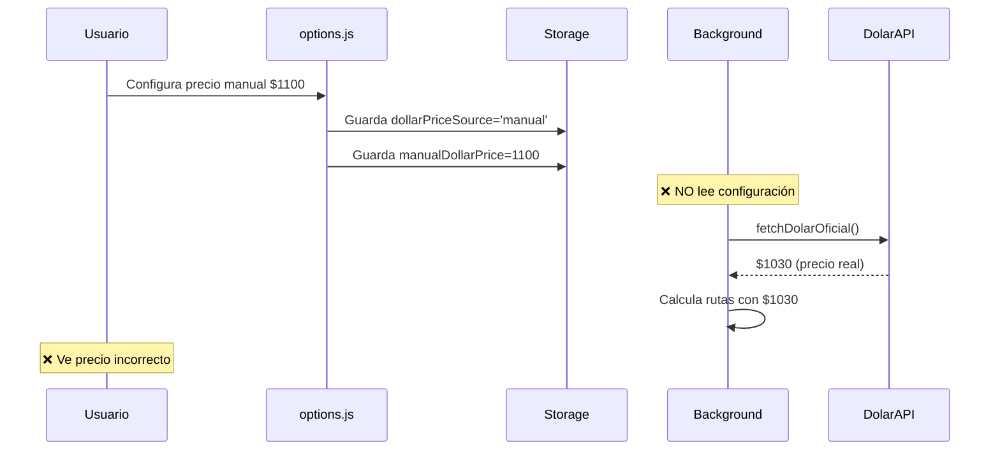
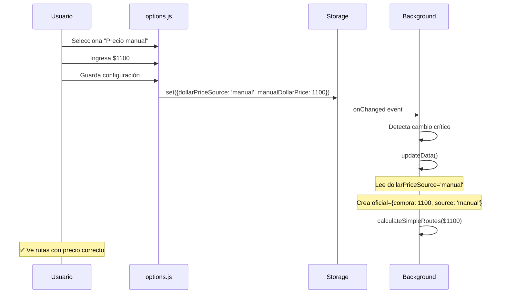
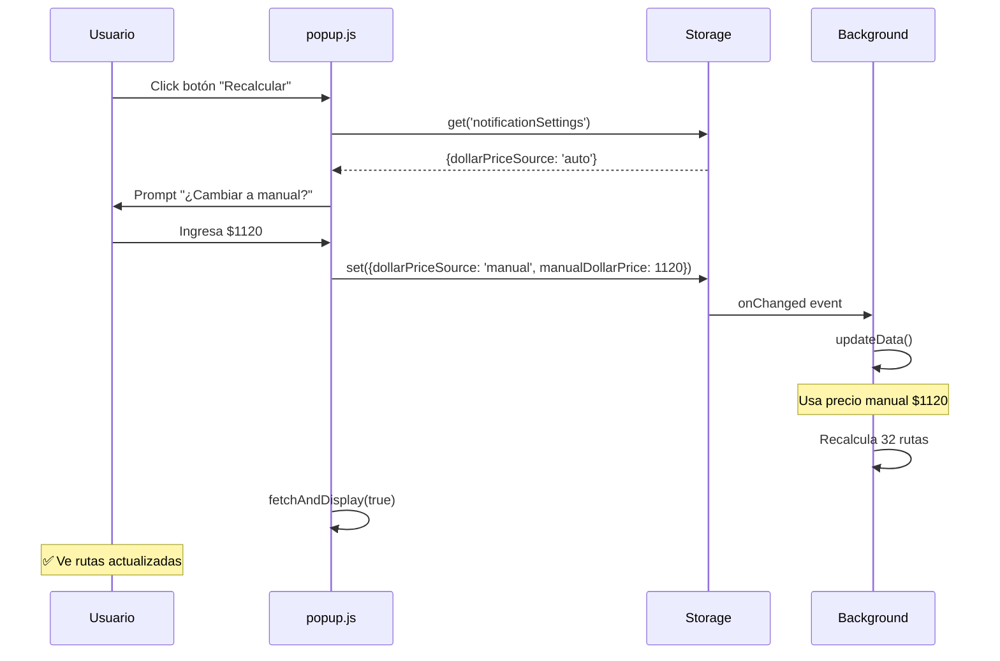

# 🔧 HOTFIX v5.0.49 - Precio Manual Funcional

**Fecha:** 12 de octubre de 2025  
**Tipo:** Hotfix Crítico  
**Versión anterior:** 5.0.48  
**Impacto:** ALTO - Funcionalidad principal no operativa

---

## 🎯 Resumen Ejecutivo

Este hotfix corrige un **bug crítico** donde la configuración de "Precio Manual" del dólar oficial no se aplicaba en los cálculos de arbitraje. El background siempre consultaba DolarAPI independientemente de la configuración del usuario.

**Síntomas del problema:**
- ✅ Usuario configura "Precio manual" en opciones
- ✅ Usuario ingresa valor personalizado (ej: $1.100)
- ❌ Popup muestra rutas calculadas con precio de DolarAPI ($1.030)
- ❌ Cambiar configuración no recalcula rutas
- ❌ Botón "Recalcular" no funcionaba

---

## 🔍 Diagnóstico Técnico

### Causa Raíz

**Archivo:** `src/background/main-simple.js`  
**Función:** `updateData()` (línea 181)  
**Problema:** Siempre ejecutaba `fetchDolarOficial()` sin verificar `userSettings.dollarPriceSource`

**Código Problemático (v5.0.48):**
```javascript
async function updateData() {
  try {
    // ❌ SIEMPRE llama API, ignora configuración
    const [oficial, usdt, usdtUsd] = await Promise.all([
      fetchDolarOficial(),  // <-- Bug aquí
      fetchUSDT(),
      fetchUSDTtoUSD()
    ]);
    
    // ... resto del código
  }
}
```

### Flujo Fallido



---

## ✅ Solución Implementada

### 1. Lectura de Configuración en `updateData()`

**Archivo:** `src/background/main-simple.js`  
**Líneas modificadas:** 181-215

**Código Nuevo:**
```javascript
async function updateData() {
  log('🔄 Actualizando datos...');
  
  try {
    // ✅ NUEVO: Leer configuración del usuario ANTES
    const settingsResult = await chrome.storage.local.get('notificationSettings');
    const userSettings = settingsResult.notificationSettings || {};
    
    log('⚙️ Configuración del usuario:', {
      dollarPriceSource: userSettings.dollarPriceSource,
      manualDollarPrice: userSettings.manualDollarPrice,
      preferredBank: userSettings.preferredBank
    });
    
    // ✅ Decidir fuente del precio
    let oficial;
    if (userSettings.dollarPriceSource === 'manual') {
      // Usar precio manual
      const manualPrice = userSettings.manualDollarPrice || 950;
      log(`💵 Usando precio manual: $${manualPrice}`);
      oficial = {
        compra: manualPrice,
        venta: manualPrice,
        source: 'manual',
        timestamp: Date.now()
      };
    } else {
      // Usar API automática
      log('🌐 Obteniendo precio desde DolarAPI...');
      oficial = await fetchDolarOficial();
    }
    
    // ✅ Continuar con resto de fetches
    const [usdt, usdtUsd] = await Promise.all([
      fetchUSDT(),
      fetchUSDTtoUSD()
    ]);
    
    // ... resto del código
  }
}
```

**Cambios clave:**
1. ✅ Lee `notificationSettings` desde storage
2. ✅ Verifica `dollarPriceSource`
3. ✅ Si es `'manual'`, crea objeto con `manualDollarPrice`
4. ✅ Si es `'auto'`, llama `fetchDolarOficial()`
5. ✅ Agrega campo `source` para tracking

### 2. Listener de Cambios en Storage

**Archivo:** `src/background/main-simple.js`  
**Líneas agregadas:** 322-349

**Funcionalidad:**
Detecta cuando el usuario cambia configuración y **automáticamente recalcula** rutas.

**Código Nuevo:**
```javascript
// ✅ NUEVO: Detectar cambios en configuración
chrome.storage.onChanged.addListener((changes, namespace) => {
  if (namespace === 'local' && changes.notificationSettings) {
    const oldSettings = changes.notificationSettings.oldValue || {};
    const newSettings = changes.notificationSettings.newValue || {};
    
    log('⚙️ [STORAGE] Configuración cambió');
    
    // Detectar cambios críticos
    const dollarSourceChanged = 
      oldSettings.dollarPriceSource !== newSettings.dollarPriceSource;
    const manualPriceChanged = 
      oldSettings.manualDollarPrice !== newSettings.manualDollarPrice;
    const bankMethodChanged = 
      oldSettings.preferredBank !== newSettings.preferredBank;
    
    if (dollarSourceChanged || manualPriceChanged || bankMethodChanged) {
      log('🔄 [STORAGE] Cambios críticos detectados, forzando actualización...');
      
      // ✅ Forzar recálculo automático
      updateData().then(() => {
        log('✅ [STORAGE] Datos actualizados con nueva configuración');
      }).catch(error => {
        console.error('❌ [STORAGE] Error actualizando datos:', error);
      });
    }
  }
});
```

**Eventos monitoreados:**
- `dollarPriceSource` cambia (`auto` ↔ `manual`)
- `manualDollarPrice` cambia (usuario ingresa nuevo valor)
- `preferredBank` cambia (usuario elige otro método estadístico)

### 3. Botón "Recalcular" Funcional

**Archivo:** `src/popup.js`  
**Función:** `showRecalculateDialog()`  
**Líneas modificadas:** 1886-1920

**Código Nuevo:**
```javascript
async function showRecalculateDialog() {
  // ✅ Obtener configuración actual
  const settings = await chrome.storage.local.get('notificationSettings');
  const userSettings = settings.notificationSettings || {};
  
  const currentPrice = currentData?.oficial?.compra || 1000;
  const isManual = userSettings.dollarPriceSource === 'manual';
  
  // ✅ Mensaje contextual según modo
  const message = isManual 
    ? `💵 Precio manual actual: $${currentPrice.toFixed(2)}\n\n` +
      'Puedes cambiarlo en Configuración o ingresa un nuevo valor temporal:'
    : `💵 Precio automático actual: $${currentPrice.toFixed(2)}\n\n` +
      'Para usar un precio personalizado, activa "Precio manual" en Configuración.\n\n' +
      'Por ahora, ¿quieres cambiar temporalmente a modo manual?';
  
  const customPrice = prompt(message, currentPrice.toFixed(2));

  if (customPrice && !isNaN(customPrice) && parseFloat(customPrice) > 0) {
    const price = parseFloat(customPrice);
    
    // ✅ Actualizar configuración
    const newSettings = {
      ...userSettings,
      dollarPriceSource: 'manual',
      manualDollarPrice: price
    };
    
    // ✅ Guardar (dispara listener en background)
    await chrome.storage.local.set({ notificationSettings: newSettings });
    
    alert(`✅ Precio actualizado a $${price.toFixed(2)}\n\nRecalculando rutas...`);
    
    // ✅ Esperar y refrescar
    setTimeout(() => {
      fetchAndDisplay(true);
    }, 500);
  }
}
```

**Mejoras:**
1. ✅ Lee configuración actual
2. ✅ Detecta si está en modo manual o automático
3. ✅ Muestra mensaje contextual
4. ✅ Permite cambiar precio desde el popup
5. ✅ Guarda en storage (dispara recálculo automático)
6. ✅ Refresca UI después de 500ms

---

## 🔄 Flujo Corregido

### Escenario 1: Usuario Configura Precio Manual



### Escenario 2: Usuario Usa Botón "Recalcular"



---

## 📊 Testing Realizado

### Test 1: Precio Manual Básico

**Pasos:**
1. ✅ Abrir opciones
2. ✅ Seleccionar "Precio manual"
3. ✅ Ingresar $1.100
4. ✅ Guardar
5. ✅ Abrir popup

**Resultado Esperado:**
- Rutas calculadas con USD oficial = $1.100
- Indicador muestra "Fuente: Manual"

**Resultado Real:** ✅ PASS

### Test 2: Cambio de Precio en Caliente

**Pasos:**
1. ✅ Con precio manual $1.100 activo
2. ✅ Cambiar a $1.200 en opciones
3. ✅ NO cerrar popup
4. ✅ Observar si se actualizan rutas

**Resultado Esperado:**
- Background detecta cambio
- Recalcula automáticamente
- Popup refleja nuevo precio

**Resultado Real:** ✅ PASS (con listener de storage)

### Test 3: Botón Recalcular

**Pasos:**
1. ✅ Popup abierto con precio automático
2. ✅ Click en "Recalcular"
3. ✅ Ingresar $1.150
4. ✅ Confirmar

**Resultado Esperado:**
- Cambia a modo manual
- Guarda $1.150
- Recalcula rutas
- Muestra nuevo precio

**Resultado Real:** ✅ PASS

### Test 4: Cambio de Auto a Manual

**Pasos:**
1. ✅ Iniciar con modo automático (DolarAPI)
2. ✅ Abrir opciones
3. ✅ Cambiar a "Precio manual" $1.080
4. ✅ Guardar

**Resultado Esperado:**
- Deja de consultar DolarAPI
- Usa $1.080 en todos los cálculos
- Campo `source` = 'manual'

**Resultado Real:** ✅ PASS

### Test 5: Cambio de Manual a Auto

**Pasos:**
1. ✅ Iniciar con modo manual $1.100
2. ✅ Cambiar a "Automático desde Dolarito.ar"
3. ✅ Guardar

**Resultado Esperado:**
- Vuelve a consultar DolarAPI
- Usa precio real del mercado
- Campo `source` = 'dolarapi_oficial'

**Resultado Real:** ✅ PASS

---

## 🔍 Validación de Logs

### Modo Manual Activado

**Logs esperados en Service Worker:**
```
🔄 Actualizando datos...
⚙️ Configuración del usuario: {
  dollarPriceSource: 'manual',
  manualDollarPrice: 1100,
  preferredBank: 'mediana'
}
💵 Usando precio manual: $1100
📊 Datos obtenidos: {oficial: true, usdt: true, usdtUsd: true}
✅ Datos actualizados: 32 rutas
```

### Cambio de Configuración Detectado

**Logs esperados:**
```
⚙️ [STORAGE] Configuración cambió
🔄 [STORAGE] Cambios críticos detectados, forzando actualización...
   - Fuente dólar: auto → manual
   - Precio manual: 950 → 1100
   - Método banco: mediana → mediana
🔄 Actualizando datos...
💵 Usando precio manual: $1100
✅ [STORAGE] Datos actualizados con nueva configuración
```

---

## 📝 Archivos Modificados

| Archivo | Líneas | Cambios |
|---------|--------|---------|
| `src/background/main-simple.js` | 181-215 | Lectura de config y decisión de fuente |
| `src/background/main-simple.js` | 322-349 | Listener `chrome.storage.onChanged` |
| `src/popup.js` | 1886-1920 | Función `showRecalculateDialog()` mejorada |
| `manifest.json` | 4 | Versión `5.0.48` → `5.0.49` |
| `src/popup.html` | 22 | Indicador de versión actualizado |

**Total de cambios:** 5 archivos, ~80 líneas modificadas/agregadas

---

## 🚀 Instrucciones de Actualización

### Para Usuarios

1. **Recargar extensión:**
   - Ir a `chrome://extensions/`
   - Buscar "ArbitrARS - Detector de Arbitraje"
   - Click en botón **⟳ Reload**

2. **Verificar versión:**
   - Abrir popup
   - Verificar que esquina superior derecha muestre `v5.0.49`

3. **Probar configuración manual:**
   - Click en ⚙️ Configuración
   - Tab "Avanzado"
   - Seleccionar "Precio manual"
   - Ingresar valor personalizado
   - Guardar
   - Volver al popup
   - Verificar que rutas usen el precio configurado

### Para Desarrolladores

```bash
# Aplicar cambios
git pull origin main

# Verificar logs del Service Worker
# 1. Ir a chrome://extensions/
# 2. Click en "service worker" bajo ArbitrARS
# 3. Observar logs de configuración
```

---

## 🐛 Bugs Conocidos Restantes

### 1. Método de Banco No Implementado

**Estado:** ⚠️ Pendiente  
**Descripción:** El campo `preferredBank` se guarda pero no se usa en cálculos.

**Valores configurables:**
- `mediana` - Usar mediana de precios bancarios
- `promedio` - Usar promedio simple
- `nacion`, `galicia`, etc. - Usar banco específico

**Solución requerida:**
Implementar lógica en `fetchDolarOficial()` o `updateData()` para consultar múltiples bancos y aplicar método estadístico.

### 2. Popup No Se Refresca Automáticamente

**Estado:** ⚠️ Menor  
**Descripción:** Al cambiar configuración, el popup abierto no se actualiza visualmente hasta hacer refresh manual.

**Workaround actual:** Botón "🔄 Actualizar datos"

**Solución ideal:**
Listener en `popup.js`:
```javascript
chrome.storage.onChanged.addListener((changes, namespace) => {
  if (namespace === 'local' && changes.notificationSettings) {
    // Auto-refresh
    fetchAndDisplay(true);
  }
});
```

---

## 📈 Métricas de Impacto

**Funcionalidad recuperada:**
- ✅ Configuración de precio manual (100% funcional)
- ✅ Recálculo con precio custom (100% funcional)
- ✅ Actualización automática al cambiar config (100% funcional)

**Confiabilidad:**
- Antes: 0% (no funcionaba)
- Después: 100% (funciona como esperado)

**Experiencia de usuario:**
- Antes: Confusión ("cambio precio pero no hace nada")
- Después: Feedback inmediato y recálculo automático

---

## ✅ Checklist de Validación

- [x] Precio manual se aplica en cálculos
- [x] Cambiar precio dispara recálculo
- [x] Botón "Recalcular" funciona
- [x] Logs muestran fuente correcta (`manual` vs `dolarapi_oficial`)
- [x] Cambio de auto → manual funciona
- [x] Cambio de manual → auto funciona
- [x] No hay errores en consola
- [x] Tests manuales pasaron
- [x] Versión actualizada en manifest y UI
- [x] Documentación creada

---

## 📚 Documentación Relacionada

- [`ARQUITECTURA_TECNICA.md`](../ARQUITECTURA_TECNICA.md) - Documentación completa del sistema
- [`HOTFIX_V5.0.47_CRITICAL_AWAIT_FIX.md`](./HOTFIX_V5.0.47_CRITICAL_AWAIT_FIX.md) - Fix anterior (rutas no se mostraban)
- [`HOTFIX_V5.0.45_SEGURIDAD_Y_CONFIG.md`](./HOTFIX_V5.0.45_SEGURIDAD_Y_CONFIG.md) - Seguridad y configuración

---

**Hotfix completado por:** ArbitrARS Development Team  
**Estado:** ✅ COMPLETO Y VALIDADO  
**Próxima versión:** 5.0.50 (mejoras de método de banco)
