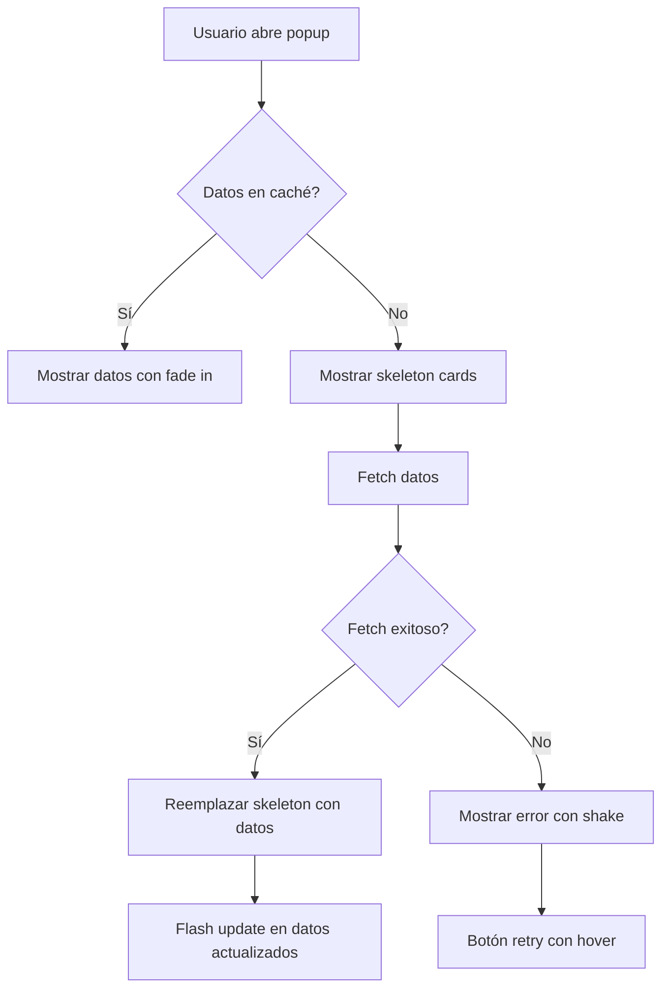
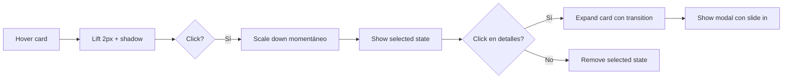
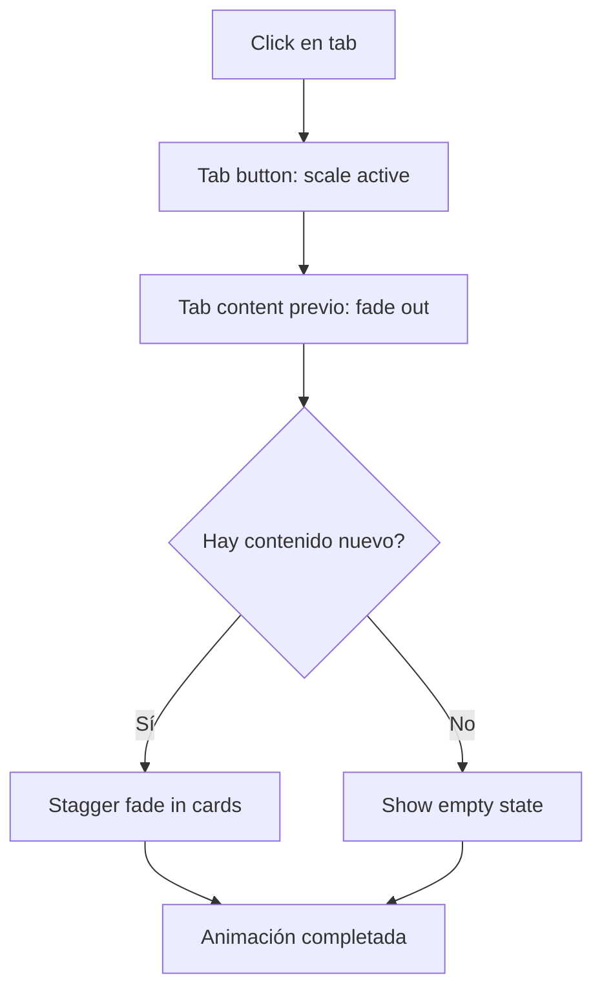

# Plan de Animaciones y Mejoras Visuales
# ArbitrageAR-USDT - Popup Extension

**Fecha:** 2026-01-29  
**Versión:** 1.0  
**Estado:** Planificación

---

## Resumen Ejecutivo

Este plan define las animaciones y mejoras visuales que se implementarán en el popup de ArbitrageAR-USDT para mejorar la experiencia de usuario sin distraer de la funcionalidad principal de trading. El diseño mantiene el estilo GitHub Dark existente mientras añade microinteracciones sutiles y feedback visual significativo.

---

## 1. Investigación: Tipos de Animaciones para Trading/Crypto

### 1.1 Microinteracciones

Las microinteracciones son respuestas visuales sutiles a acciones del usuario que proporcionan feedback inmediato y mejoran la percepción de calidad.

| Tipo | Uso en Trading | Ejemplo |
|------|----------------|---------|
| **Hover** | Indicar interactividad | Cards de rutas se elevan al pasar el mouse |
| **Click** | Confirmar acción | Botón de refresh con efecto de presión |
| **Focus** | Navegación por teclado | Anillo de foco azul en elementos seleccionables |
| **Loading** | Datos en carga | Skeleton shimmer en cards durante carga |

**Referencias de la industria:**
- **Binance:** Usa transiciones suaves de 200ms en hover de cards
- **Coinbase:** Implementa scale(1.02) en hover con cubic-bezier
- **Crypto.com:** Utiliza sombras dinámicas en elementos interactivos

### 1.2 Transiciones de Estado

Las transiciones suaves entre estados mejoran la comprensión de los cambios en los datos.

```css
/* Transición base existente */
transition: all var(--duration-fast) var(--ease-default);

/* Transición mejorada propuesta */
transition: 
  transform var(--duration-fast) var(--ease-out),
  box-shadow var(--duration-fast) var(--ease-out),
  border-color var(--duration-fast) var(--ease-default),
  background-color var(--duration-normal) var(--ease-default);
```

### 1.3 Loading States

Los estados de carga informan al usuario que se están procesando datos.

| Tipo | Duración | Uso |
|------|----------|-----|
| **Skeleton** | 1.5s+ | Cards de rutas durante carga inicial |
| **Spinner** | Indefinido | Botón de refresh activo |
| **Progress** | Determinado | Cálculos de matriz de riesgo |
| **Pulse** | 2s loop | Indicador de datos en tiempo real |

### 1.4 Feedback Visual

Respuestas visuales a acciones del usuario que confirman el resultado.

| Estado | Color | Animación |
|--------|-------|-----------|
| **Success** | `#3fb950` | Flash verde + checkmark animation |
| **Error** | `#f85149` | Shake + borde rojo pulsante |
| **Warning** | `#d29922` | Pulse amarillo sutil |
| **Info** | `#58a6ff` | Fade in con slide |

### 1.5 Animaciones de Scroll

Para mejorar la navegación en listas largas de rutas.

```css
/* Smooth scroll nativo */
main {
  scroll-behavior: smooth;
}

/* Parallax sutil en header (opcional) */
header {
  transform: translateY(calc(var(--scroll-pos) * 0.1));
}
```

### 1.6 Card Animations

Animaciones de entrada, hover y salida para cards de rutas.

| Animación | Duración | Easing |
|-----------|----------|--------|
| **Entrada** | 300ms | ease-out |
| **Hover** | 150ms | ease-out |
| **Salida** | 200ms | ease-in |
| **Selección** | 250ms | cubic-bezier(0.34, 1.56, 0.64, 1) |

---

## 2. Mejoras Visuales

### 2.1 Sombras y Elevación

Sistema de elevación basado en Material Design 3.

```css
/* Niveles de elevación */
--elevation-none: none;
--elevation-1: 0 1px 2px rgba(0, 0, 0, 0.3);
--elevation-2: 0 4px 8px rgba(0, 0, 0, 0.4);
--elevation-3: 0 8px 16px rgba(0, 0, 0, 0.5);
--elevation-4: 0 16px 32px rgba(0, 0, 0, 0.6);
```

**Uso:**
- Cards resting: elevation-1
- Cards hover: elevation-2
- Cards selected: elevation-3
- Modales: elevation-4

### 2.2 Gradientes Sutiles

Gradientes que añaden profundidad sin distraer.

```css
/* Gradiente para profit badges */
.gradient-profit-subtle {
  background: linear-gradient(135deg, 
    rgba(63, 185, 80, 0.1) 0%, 
    rgba(63, 185, 80, 0.05) 100%
  );
}

/* Gradiente para header */
.gradient-header {
  background: linear-gradient(135deg, 
    rgba(31, 111, 235, 0.9) 0%, 
    rgba(13, 65, 157, 0.95) 100%
  );
}
```

### 2.3 Borders Animados

Bordes que indican estado o actividad.

```css
/* Border animado para datos actualizados */
@keyframes borderPulse {
  0%, 100% {
    border-color: var(--color-success);
  }
  50% {
    border-color: rgba(63, 185, 80, 0.5);
  }
}

.border-updated {
  animation: borderPulse 2s ease-in-out 3;
}
```

### 2.4 Iconos Animados

Animaciones sutiles en iconos para indicar estado.

```css
/* Icono de refresh girando */
.refresh-icon.spinning {
  animation: rotate 1s linear infinite;
}

/* Icono de checkmark en success */
@keyframes checkmark {
  0% {
    transform: scale(0);
    opacity: 0;
  }
  50% {
    transform: scale(1.2);
  }
  100% {
    transform: scale(1);
    opacity: 1;
  }
}
```

### 2.5 Progress Indicators

Indicadores de progreso animados para operaciones largas.

```css
/* Progress bar animada */
@keyframes progressFill {
  from {
    width: 0%;
  }
}

.progress-bar {
  animation: progressFill var(--duration) var(--ease-out);
}

/* Indeterminate progress */
@keyframes progressIndeterminate {
  0% {
    left: -35%;
    width: 35%;
  }
  100% {
    left: 100%;
    width: 35%;
  }
}
```

### 2.6 Toast Notifications

Notificaciones flotantes para feedback temporal.

```css
/* Toast slide-in */
@keyframes toastSlideIn {
  from {
    transform: translateY(100%);
    opacity: 0;
  }
  to {
    transform: translateY(0);
    opacity: 1;
  }
}

/* Toast slide-out */
@keyframes toastSlideOut {
  from {
    transform: translateY(0);
    opacity: 1;
  }
  to {
    transform: translateY(100%);
    opacity: 0;
  }
}
```

---

## 3. Referencias y Best Practices

### 3.1 Material Design Motion Guidelines

**Principios clave:**
1. **Motion should be meaningful** - Cada animación debe tener un propósito
2. **Motion should be responsive** - Feedback inmediato a acciones
3. **Motion should be delightful** - Pequeños detalles que alegran

**Duraciones recomendadas:**
- Microinteracciones: 100-200ms
- Transiciones de elementos: 200-300ms
- Entradas/salidas: 300-500ms

**Easing functions:**
```css
/* Standard easing */
--ease-standard: cubic-bezier(0.4, 0.0, 0.2, 1);

/* Decelerate (entradas) */
--ease-decelerate: cubic-bezier(0.0, 0.0, 0.2, 1);

/* Accelerate (salidas) */
--ease-accelerate: cubic-bezier(0.4, 0.0, 1, 1);

/* Sharp (acciones rápidas) */
--ease-sharp: cubic-bezier(0.4, 0.0, 0.6, 1);
```

### 3.2 Apple Human Interface Guidelines

**Principios de animación:**
1. **Familiarity** - Animaciones que se comportamiento físico esperado
2. **Continuity** - Transiciones fluidas entre estados
3. **Feedback** - Confirmación visual de acciones

**Recomendaciones:**
- Usar spring animations para movimiento natural
- Evitar animaciones lineales (se sienten robóticas)
- Mantener consistencia en todo el sistema

### 3.3 Extensiones de Chrome Similares

Análisis de animaciones en extensiones populares:

| Extensión | Animaciones Notables | Duración |
|-----------|---------------------|----------|
| **MetaMask** | Fade in cards, pulse en balance | 200-300ms |
| **Phantom** | Slide en modales, scale en hover | 150-250ms |
| **Uniswap** | Skeleton shimmer, stagger en listas | 300ms |
| **Binance** | Hover lift, glow en profit | 150ms |

**Patrones comunes:**
1. Stagger animation en listas (elementos aparecen en secuencia)
2. Skeleton loading durante fetch de datos
3. Hover states con transform + shadow
4. Modal con backdrop blur + scale

### 3.4 Best Practices de la Industria

**Performance:**
- Preferir CSS animations sobre JS
- Usar `transform` y `opacity` (GPU-accelerated)
- Evitar animar `width`, `height`, `margin`, `padding`

**Accesibilidad:**
```css
/* Respetar preferencias del usuario */
@media (prefers-reduced-motion: reduce) {
  *,
  *::before,
  *::after {
    animation-duration: 0.01ms !important;
    transition-duration: 0.01ms !important;
  }
}
```

**Browser Compatibility:**
- Chrome Extension: Soporte completo para CSS animations
- Evitar propiedades experimentales
- Fallbacks para navegadores antiguos

---

## 4. Plan de Implementación Priorizado

### Fase 1: Microinteracciones Inmediatas (Prioridad Alta)

**Objetivo:** Feedback instantáneo a acciones del usuario.

| Animación | Elemento | Duración | Complejidad |
|-----------|----------|----------|-------------|
| Hover lift | Cards de rutas | 150ms | Baja |
| Click scale | Botones | 100ms | Baja |
| Focus ring | Inputs, botones | 0ms (instant) | Baja |
| Border glow | Cards seleccionadas | 200ms | Media |

**Código CSS ejemplo:**

```css
/* Hover lift mejorado */
.route-card {
  transition: 
    transform var(--duration-fast) var(--ease-out),
    box-shadow var(--duration-fast) var(--ease-out),
    border-color var(--duration-fast) var(--ease-default);
}

.route-card:hover {
  transform: translateY(-2px);
  box-shadow: 0 8px 16px rgba(88, 166, 255, 0.15);
  border-color: var(--color-brand-primary);
}

/* Click scale */
.btn:active {
  transform: scale(0.97);
  transition: transform 50ms var(--ease-out);
}

/* Focus ring mejorado */
:focus-visible {
  outline: 2px solid var(--color-brand-primary);
  outline-offset: 2px;
  box-shadow: 0 0 0 4px rgba(88, 166, 255, 0.2);
  animation: focusRingPulse 1s ease-in-out;
}

@keyframes focusRingPulse {
  0%, 100% {
    box-shadow: 0 0 0 4px rgba(88, 166, 255, 0.2);
  }
  50% {
    box-shadow: 0 0 0 6px rgba(88, 166, 255, 0.15);
  }
}
```

### Fase 2: Transiciones y Loading States (Prioridad Alta)

**Objetivo:** Mejorar percepción de carga y cambios de estado.

| Animación | Elemento | Duración | Complejidad |
|-----------|----------|----------|-------------|
| Skeleton shimmer | Cards durante carga | 1.5s | Media |
| Spinner | Botón refresh | 1s loop | Baja |
| Tab transition | Cambio de pestañas | 250ms | Media |
| Fade in | Contenido nuevo | 200ms | Baja |

**Código CSS ejemplo:**

```css
/* Skeleton shimmer mejorado */
@keyframes skeletonShimmer {
  0% {
    background-position: -200% 0;
  }
  100% {
    background-position: 200% 0;
  }
}

.skeleton-card {
  background: linear-gradient(
    90deg,
    var(--color-bg-tertiary) 0%,
    var(--color-bg-elevated) 50%,
    var(--color-bg-tertiary) 100%
  );
  background-size: 200% 100%;
  animation: skeletonShimmer 1.5s ease-in-out infinite;
}

/* Spinner con blur */
@keyframes rotate {
  from {
    transform: rotate(0deg);
  }
  to {
    transform: rotate(360deg);
  }
}

.spinner {
  width: 32px;
  height: 32px;
  border: 3px solid var(--color-border-default);
  border-top-color: var(--color-brand-primary);
  border-radius: 50%;
  animation: rotate 0.8s linear infinite;
  filter: drop-shadow(0 0 4px rgba(88, 166, 255, 0.3));
}

/* Tab transition con fade */
.tab-content {
  opacity: 0;
  transform: translateY(8px);
  transition: 
    opacity var(--duration-normal) var(--ease-out),
    transform var(--duration-normal) var(--ease-out);
}

.tab-content.active {
  opacity: 1;
  transform: translateY(0);
}
```

### Fase 3: Animaciones de Entrada/Salida (Prioridad Media)

**Objetivo:** Añadir polish visual sin afectar funcionalidad.

| Animación | Elemento | Duración | Complejidad |
|-----------|----------|----------|-------------|
| Stagger fade | Lista de cards | 100ms delay | Media |
| Modal slide | Modales | 250ms | Media |
| Toast notification | Notificaciones | 300ms | Media |
| Card expand | Detalles de ruta | 200ms | Alta |

**Código CSS ejemplo:**

```css
/* Stagger animation para lista de cards */
.route-card {
  opacity: 0;
  transform: translateY(10px);
  animation: cardFadeIn 0.3s ease-out forwards;
}

.route-card:nth-child(1) { animation-delay: 0.05s; }
.route-card:nth-child(2) { animation-delay: 0.1s; }
.route-card:nth-child(3) { animation-delay: 0.15s; }
.route-card:nth-child(4) { animation-delay: 0.2s; }
.route-card:nth-child(5) { animation-delay: 0.25s; }

@keyframes cardFadeIn {
  to {
    opacity: 1;
    transform: translateY(0);
  }
}

/* Modal slide mejorado */
@keyframes modalSlideIn {
  from {
    opacity: 0;
    transform: scale(0.95) translateY(-10px);
  }
  to {
    opacity: 1;
    transform: scale(1) translateY(0);
  }
}

.modal-content {
  animation: modalSlideIn 0.25s var(--ease-decelerate);
}

/* Toast notification */
@keyframes toastSlideIn {
  from {
    transform: translateY(100%) translateX(-50%);
    opacity: 0;
  }
  to {
    transform: translateY(0) translateX(-50%);
    opacity: 1;
  }
}

.toast {
  position: fixed;
  bottom: 20px;
  left: 50%;
  transform: translateX(-50%);
  animation: toastSlideIn 0.3s var(--ease-decelerate);
}

/* Card expand con height transition */
.route-card.expanded {
  max-height: 500px;
  transition: max-height 0.3s var(--ease-decelerate);
}
```

### Fase 4: Efectos Avanzados (Prioridad Baja)

**Objetivo:** Añadir "wow factor" para usuarios avanzados.

| Animación | Elemento | Duración | Complejidad |
|-----------|----------|----------|-------------|
| Parallax header | Header al hacer scroll | Variable | Alta |
| Particle effects | Fondo en profit alto | Loop | Muy Alta |
| Morphing | Transiciones de iconos | 300ms | Alta |
| 3D flip | Cards en detalles | 600ms | Muy Alta |

**Código CSS ejemplo:**

```css
/* Parallax sutil en header */
header {
  transform: translateY(calc(var(--scroll-y) * 0.1));
  transition: transform 0.1s linear;
}

/* Glow pulsante para profit alto */
@keyframes profitGlow {
  0%, 100% {
    box-shadow: 0 0 12px rgba(63, 185, 80, 0.4);
  }
  50% {
    box-shadow: 0 0 24px rgba(63, 185, 80, 0.6);
  }
}

.profit-badge.high {
  animation: profitGlow 2s ease-in-out infinite;
}

/* Icon morphing (con SVG) */
@keyframes iconMorph {
  0% {
    d: path("M1 1L5 5L9 1");
  }
  50% {
    d: path("M1 3L5 7L9 3");
  }
  100% {
    d: path("M1 1L5 5L9 1");
  }
}

/* 3D flip para card details */
@keyframes cardFlip {
  0% {
    transform: rotateY(0deg);
  }
  100% {
    transform: rotateY(180deg);
  }
}

.route-card.flipping {
  transform-style: preserve-3d;
  animation: cardFlip 0.6s var(--ease-sharp);
}
```

---

## 5. Consideraciones Técnicas

### 5.1 Performance

**CSS vs JS Animations:**

| Aspecto | CSS | JS |
|---------|-----|-----|
| Performance | ✅ GPU-accelerated | ⚠️ Main thread |
| Complejidad | ✅ Simple | ⚠️ Complejo |
| Control | ⚠️ Limitado | ✅ Completo |
| Browser support | ✅ Amplio | ⚠️ Variable |

**Recomendación:** Usar CSS animations para todo lo posible. JS solo para:

1. Animaciones complejas con lógica condicional
2. Animaciones que requieren sincronización con datos
3. Animaciones que necesitan pausar/reanudar

**Propiedades GPU-acceleradas:**
```css
/* ✅ Bueno - GPU accelerated */
transform: translate(x, y);
transform: scale(x, y);
transform: rotate(deg);
opacity: 0.5;

/* ❌ Evitar - CPU intensive */
width: 100px;
height: 100px;
margin: 10px;
padding: 10px;
```

### 5.2 Accesibilidad

**Respetar prefers-reduced-motion:**

```css
/* Ya implementado en popup.css */
@media (prefers-reduced-motion: reduce) {
  *,
  *::before,
  *::after {
    animation-duration: 0.01ms !important;
    animation-iteration-count: 1 !important;
    transition-duration: 0.01ms !important;
    scroll-behavior: auto !important;
  }
}
```

**WCAG Compliance:**
- Las animaciones no deben parpadear más de 3 veces por segundo
- Debe haber opción de pausar animaciones automáticas
- El contenido no debe depender de animaciones para ser comprensible

### 5.3 Browser Compatibility

**Chrome Extension Requirements:**
- Chrome 88+: Soporte completo para CSS animations
- Chromium: Soporte completo
- Edge: Soporte completo

**Propiedades seguras:**
```css
/* ✅ Soportado en todos los browsers */
transition: all 0.15s ease;
transform: translateY(-2px);
animation: fadeIn 0.3s ease;

/* ⚠️ Requiere prefijos en browsers antiguos */
backdrop-filter: blur(10px);
-webkit-backdrop-filter: blur(10px);
```

### 5.4 File Size Impact

**Estimación de tamaño adicional:**

| Fase | Líneas CSS | Tamaño (gzipped) |
|------|------------|------------------|
| Fase 1 | ~50 líneas | ~0.5 KB |
| Fase 2 | ~80 líneas | ~0.8 KB |
| Fase 3 | ~100 líneas | ~1.0 KB |
| Fase 4 | ~150 líneas | ~1.5 KB |
| **Total** | ~380 líneas | **~3.8 KB** |

**Impacto en popup.css actual (4269 líneas):**
- Incremento: ~9%
- Impacto despreciable en performance

### 5.5 Maintainability

**Estructura recomendada:**

```css
/* ==========================================
   ANIMACIONES - Fase X
   ========================================== */

/* 1. Keyframes */
@keyframes animationName {
  /* ... */
}

/* 2. Clases utilitarias */
.animate-class {
  animation: animationName var(--duration) var(--easing);
}

/* 3. Aplicación a componentes */
.component-name {
  /* ... */
}
```

**Documentación:**
- Comentarios claros sobre propósito de cada animación
- Referencias a best practices usadas
- Notas sobre performance y accesibilidad

---

## 6. Diagramas de Flujo

### 6.1 Flujo de Animaciones de Carga



### 6.2 Flujo de Interacción con Cards



### 6.3 Flujo de Animaciones de Tabs



---

## 7. Ejemplos de Código CSS Completos

### 7.1 Animaciones de Cards (Fase 1)

```css
/* ==========================================
   CARD ANIMATIONS - Fase 1
   Microinteracciones inmediatas
   ========================================== */

/* Hover state mejorado */
.route-card {
  transition: 
    transform var(--duration-fast) var(--ease-out),
    box-shadow var(--duration-fast) var(--ease-out),
    border-color var(--duration-fast) var(--ease-default),
    background-color var(--duration-normal) var(--ease-default);
}

.route-card:hover {
  transform: translateY(-2px) scale(1.01);
  box-shadow: 
    0 8px 16px rgba(88, 166, 255, 0.15),
    0 0 0 1px rgba(88, 166, 255, 0.1) inset;
  border-color: var(--color-brand-primary);
}

/* Click feedback */
.route-card:active {
  transform: translateY(0) scale(0.99);
  transition: transform 50ms var(--ease-out);
}

/* Selected state con glow */
.route-card.selected {
  animation: selectedGlow 0.5s ease-out;
}

@keyframes selectedGlow {
  0% {
    box-shadow: 0 0 0 0 rgba(88, 166, 255, 0.4);
  }
  70% {
    box-shadow: 0 0 0 10px rgba(88, 166, 255, 0);
  }
  100% {
    box-shadow: var(--shadow-lg);
  }
}

/* Profit indicator pulse */
.route-card.high-profit::before {
  animation: profitPulse 2s ease-in-out infinite;
}

@keyframes profitPulse {
  0%, 100% {
    opacity: 1;
    width: 4px;
  }
  50% {
    opacity: 0.7;
    width: 5px;
  }
}
```

### 7.2 Loading States (Fase 2)

```css
/* ==========================================
   LOADING STATES - Fase 2
   Estados de carga mejorados
   ========================================== */

/* Skeleton shimmer mejorado */
@keyframes skeletonShimmer {
  0% {
    background-position: -200% 0;
  }
  100% {
    background-position: 200% 0;
  }
}

.skeleton-card {
  background: linear-gradient(
    90deg,
    var(--color-bg-tertiary) 0%,
    rgba(88, 166, 255, 0.1) 50%,
    var(--color-bg-tertiary) 100%
  );
  background-size: 200% 100%;
  animation: skeletonShimmer 1.5s ease-in-out infinite;
}

/* Spinner con trail */
@keyframes rotate {
  from {
    transform: rotate(0deg);
  }
  to {
    transform: rotate(360deg);
  }
}

.spinner {
  position: relative;
  width: 32px;
  height: 32px;
}

.spinner::before {
  content: '';
  position: absolute;
  inset: 0;
  border: 3px solid var(--color-border-default);
  border-top-color: var(--color-brand-primary);
  border-radius: 50%;
  animation: rotate 0.8s linear infinite;
}

.spinner::after {
  content: '';
  position: absolute;
  inset: 4px;
  border: 2px solid transparent;
  border-top-color: rgba(88, 166, 255, 0.5);
  border-radius: 50%;
  animation: rotate 0.6s linear infinite reverse;
}

/* Progress bar determinada */
@keyframes progressFill {
  from {
    width: 0%;
  }
}

.progress-bar {
  height: 4px;
  background: var(--color-bg-tertiary);
  border-radius: 2px;
  overflow: hidden;
}

.progress-bar-fill {
  height: 100%;
  background: linear-gradient(90deg, 
    var(--color-brand-primary) 0%, 
    var(--color-brand-secondary) 100%
  );
  animation: progressFill var(--duration, 1s) var(--ease-out);
  border-radius: 2px;
}

/* Progress bar indeterminada */
@keyframes progressIndeterminate {
  0% {
    left: -35%;
    width: 35%;
  }
  100% {
    left: 100%;
    width: 35%;
  }
}

.progress-bar.indeterminate .progress-bar-fill {
  position: absolute;
  animation: progressIndeterminate 1.5s ease-in-out infinite;
}
```

### 7.3 Toast Notifications (Fase 3)

```css
/* ==========================================
   TOAST NOTIFICATIONS - Fase 3
   Notificaciones flotantes
   ========================================== */

/* Toast container */
.toast-container {
  position: fixed;
  bottom: 20px;
  left: 50%;
  transform: translateX(-50%);
  z-index: 9999;
  display: flex;
  flex-direction: column;
  gap: 8px;
  pointer-events: none;
}

/* Toast base */
.toast {
  pointer-events: auto;
  min-width: 280px;
  max-width: 400px;
  padding: 12px 16px;
  background: var(--color-bg-secondary);
  border: 1px solid var(--color-border-default);
  border-radius: var(--radius-lg);
  box-shadow: var(--shadow-xl);
  display: flex;
  align-items: center;
  gap: 12px;
  animation: toastSlideIn 0.3s var(--ease-decelerate);
}

@keyframes toastSlideIn {
  from {
    transform: translateY(100%) translateX(-50%);
    opacity: 0;
  }
  to {
    transform: translateY(0) translateX(-50%);
    opacity: 1;
  }
}

/* Toast exit */
.toast.exiting {
  animation: toastSlideOut 0.2s var(--ease-accelerate) forwards;
}

@keyframes toastSlideOut {
  from {
    transform: translateY(0) translateX(-50%);
    opacity: 1;
  }
  to {
    transform: translateY(100%) translateX(-50%);
    opacity: 0;
  }
}

/* Toast variants */
.toast.success {
  border-left: 4px solid var(--color-success);
}

.toast.error {
  border-left: 4px solid var(--color-danger);
}

.toast.warning {
  border-left: 4px solid var(--color-warning);
}

.toast.info {
  border-left: 4px solid var(--color-info);
}

/* Toast icon animation */
.toast-icon {
  font-size: 20px;
  animation: toastIconPop 0.3s var(--ease-bounce);
}

@keyframes toastIconPop {
  0% {
    transform: scale(0);
  }
  50% {
    transform: scale(1.2);
  }
  100% {
    transform: scale(1);
  }
}

/* Toast progress bar (auto-dismiss) */
.toast-progress {
  position: absolute;
  bottom: 0;
  left: 0;
  height: 2px;
  background: currentColor;
  opacity: 0.3;
  animation: toastProgress linear forwards;
}

@keyframes toastProgress {
  from {
    width: 100%;
  }
  to {
    width: 0%;
  }
}
```

### 7.4 Modal Animations (Fase 3)

```css
/* ==========================================
   MODAL ANIMATIONS - Fase 3
   Animaciones de modales mejoradas
   ========================================== */

/* Overlay fade */
.modal-overlay {
  animation: overlayFadeIn 0.2s var(--ease-decelerate);
}

@keyframes overlayFadeIn {
  from {
    opacity: 0;
  }
  to {
    opacity: 1;
  }
}

/* Modal slide mejorado */
.modal-content {
  animation: modalSlideIn 0.3s var(--ease-decelerate);
}

@keyframes modalSlideIn {
  from {
    opacity: 0;
    transform: scale(0.95) translateY(-20px);
  }
  to {
    opacity: 1;
    transform: scale(1) translateY(0);
  }
}

/* Modal exit */
.modal-overlay.closing .modal-content {
  animation: modalSlideOut 0.2s var(--ease-accelerate) forwards;
}

@keyframes modalSlideOut {
  from {
    opacity: 1;
    transform: scale(1) translateY(0);
  }
  to {
    opacity: 0;
    transform: scale(0.95) translateY(-20px);
  }
}

/* Modal backdrop blur transition */
.modal-overlay {
  backdrop-filter: blur(0px);
  transition: backdrop-filter 0.3s var(--ease-default);
}

.modal-overlay.active {
  backdrop-filter: blur(8px);
}

/* Close button hover */
.modal-close-btn {
  transition: 
    transform var(--duration-fast) var(--ease-out),
    background-color var(--duration-fast) var(--ease-default),
    color var(--duration-fast) var(--ease-default);
}

.modal-close-btn:hover {
  transform: rotate(90deg) scale(1.1);
}

.modal-close-btn:active {
  transform: rotate(90deg) scale(0.95);
}
```

---

## 8. Métricas de Éxito

### 8.1 Métricas de Performance

| Métrica | Objetivo | Medición |
|---------|----------|----------|
| Tiempo de carga | < 100ms | Chrome DevTools Performance |
| FPS durante animaciones | 60 FPS | Chrome DevTools Performance |
| Tamaño adicional CSS | < 5 KB | Build output |
| Impacto en TTI | < 50ms | Lighthouse |

### 8.2 Métricas de UX

| Métrica | Objetivo | Medición |
|---------|----------|----------|
| Percepción de carga | Mejorada | User testing |
| Claridad de feedback | Mejorada | User testing |
| Satisfacción visual | Mejorada | Encuestas |
| Tasa de errores | Sin cambios | Analytics |

---

## 9. Cronograma Sugerido

| Fase | Duración Estimada | Dependencias |
|------|-------------------|--------------|
| Fase 1 | 2-3 días | Ninguna |
| Fase 2 | 3-4 días | Fase 1 |
| Fase 3 | 4-5 días | Fase 2 |
| Fase 4 | 5-7 días | Fase 3 |
| **Total** | **14-19 días** | - |

---

## 10. Recursos Adicionales

### 10.1 Referencias Técnicas

- [Material Design Motion](https://m3.material.io/styles/motion/overview)
- [Apple HIG - Animation](https://developer.apple.com/design/human-interface-guidelines/animate)
- [CSS Animations MDN](https://developer.mozilla.org/en-US/docs/Web/CSS/CSS_Animations)
- [Web Performance - Animations](https://web.dev/animations/)

### 10.2 Herramientas

- **Chrome DevTools:** Performance profiling
- **CSS Triggers:** Database de propiedades CSS
- **Cubic-bezier.com:** Generador de easing functions
- **Animista:** Biblioteca de animaciones CSS

### 10.3 Inspiración

- [Binance](https://www.binance.com/en)
- [Coinbase](https://www.coinbase.com)
- [Crypto.com](https://crypto.com)
- [Uniswap](https://app.uniswap.org)

---

## 11. Próximos Pasos

1. ✅ Revisar y aprobar este plan
2. ⏳ Implementar Fase 1 (Microinteracciones)
3. ⏳ Testing y ajustes de Fase 1
4. ⏳ Implementar Fase 2 (Loading states)
5. ⏳ Testing y ajustes de Fase 2
6. ⏳ Implementar Fase 3 (Entradas/Salidas)
7. ⏳ Testing y ajustes de Fase 3
8. ⏳ Evaluar necesidad de Fase 4
9. ⏳ Documentación final
10. ⏳ Deploy

---

## 12. Apéndice: Variables CSS Propuestas

```css
/* ==========================================
   ANIMATION VARIABLES - Nuevas variables
   ========================================== */

:root {
  /* === DURACIONES MEJORADAS === */
  --duration-instant: 75ms;
  --duration-fast: 150ms;
  --duration-normal: 250ms;
  --duration-slow: 350ms;
  --duration-slower: 500ms;

  /* === EASING FUNCTIONS === */
  --ease-default: cubic-bezier(0.4, 0, 0.2, 1);
  --ease-in: cubic-bezier(0.4, 0, 1, 1);
  --ease-out: cubic-bezier(0, 0, 0.2, 1);
  --ease-in-out: cubic-bezier(0.4, 0, 0.6, 1);
  --ease-bounce: cubic-bezier(0.68, -0.55, 0.265, 1.55);
  --ease-sharp: cubic-bezier(0.4, 0, 0.6, 1);
  --ease-decelerate: cubic-bezier(0.0, 0.0, 0.2, 1);
  --ease-accelerate: cubic-bezier(0.4, 0.0, 1, 1);

  /* === SPRING ANIMATIONS === */
  --spring-default: cubic-bezier(0.175, 0.885, 0.32, 1.275);
  --spring-bouncy: cubic-bezier(0.68, -0.55, 0.265, 1.55);

  /* === ANIMATION DELAYS === */
  --delay-instant: 0ms;
  --delay-short: 50ms;
  --delay-medium: 100ms;
  --delay-long: 200ms;

  /* === STAGGER DELAYS === */
  --stagger-1: 0.05s;
  --stagger-2: 0.1s;
  --stagger-3: 0.15s;
  --stagger-4: 0.2s;
  --stagger-5: 0.25s;
  --stagger-6: 0.3s;
  --stagger-7: 0.35s;
  --stagger-8: 0.4s;
  --stagger-9: 0.45s;
  --stagger-10: 0.5s;
}
```

---

**Fin del Plan de Animaciones y Mejoras Visuales**
